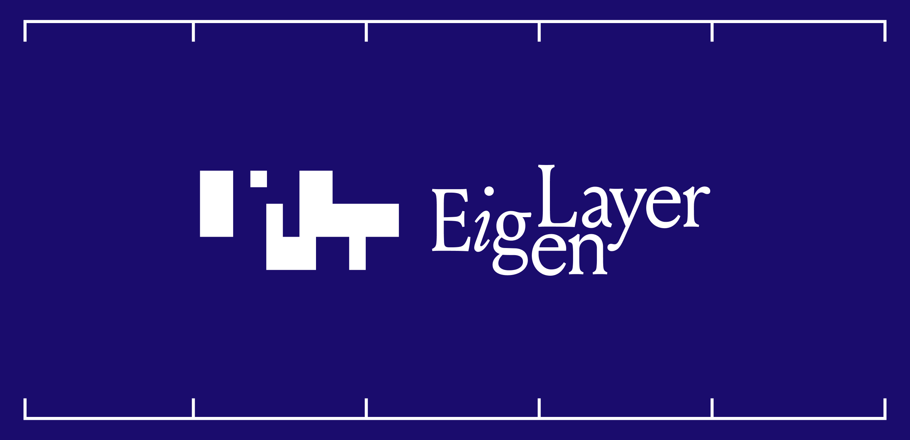

# 🔄 EigenLayer

## 📚 Background

EigenLayer is a set of smart contracts deployed on Ethereum that enable restaking of assets to secure new services. This repo contains the EigenLayer core contracts, whose currently-supported assets include beacon chain ETH and several liquid staking tokens (LSTs). Users use these contracts to deposit and withdraw these assets, as well as delegate them to operators providing services to AVSs.

## 📋 Table of Contents

- [📚 Background](#background)
- [🚀 Getting Started](#getting-started)
  - [🌳 Branching Strategy](#branching-strategy) 
  - [🌐 Deployments](#deployments)
- [📖 Documentation](#documentation)
  - [💡 Basic Concepts](#basic-concepts)
  - [⚙️ Technical Details](#technical-details)
- [🤝 Contributing](#contributing)
- [⚖️ License](#license)

## 🚀 Getting Started

### 🌳 Branching Strategy

**We maintain three main branches:**

- [`dev`](https://github.com/Layr-Labs/eigenlayer-contracts/tree/dev) (default): Contains the latest development code for upcoming releases.
- [`testnet-holesky`](https://github.com/Layr-Labs/eigenlayer-contracts/tree/testnet-holesky): Current testnet deployment on Holesky.
- [`mainnet`](https://github.com/Layr-Labs/eigenlayer-contracts/tree/mainnet): Production deployment on Ethereum mainnet.

### 🌐 Deployments

**Current Deployments:**

- [Mainnet](docs/deployments/MAINNET.md): Production deployment addresses for Ethereum mainnet.
- [Holesky](docs/deployments/HOLESKY.md): Testnet deployment addresses for Holesky network.

## 📖 Documentation

### 💡 Basic Concepts

For an intuitive introduction to EigenLayer's core concepts, we recommend reading ["You Could've Invented EigenLayer"](https://www.blog.eigenlayer.xyz/ycie/), though note that some described features like the Slasher are still in development. If you're looking to get started using EigenLayer, we provide comprehensive guides for both users and operators. The [Restaking User Guide](https://docs.eigenlayer.xyz/eigenlayer/restaking-guides/overview) walks through the process of restaking assets, while the [Operator Guide](https://docs.eigenlayer.xyz/operator-guides/operator-introduction) provides instructions for running an EigenLayer operator node.

### ⚙️ Technical Details

For developers and technical users, we provide extensive [Technical Documentation](/docs) covering the system architecture, contract interactions, and implementation details.

> For hands-on learners, our [Integration Tests](./src/test/integration/) demonstrate real-world usage patterns and showcase how the core contracts work together in practice.

## 🤝 Contributing

We welcome contributions! Please review our [Contributing Guide](CONTRIBUTING.md). The guide provides detailed information about setting up your development environment, running tests, submitting pull requests, and following our coding standards.

## ⚖️ License

EigenLayer is licensed under the Business Source License 1.1 (BUSL-1.1). See [LICENSE](LICENSE) for complete terms.
