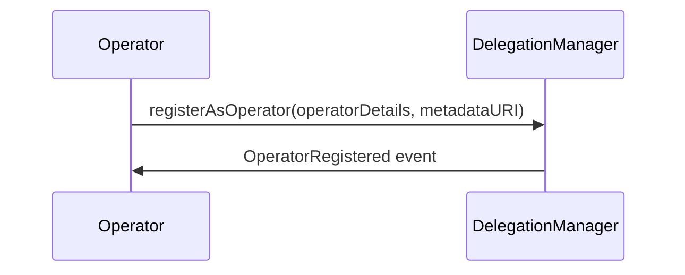
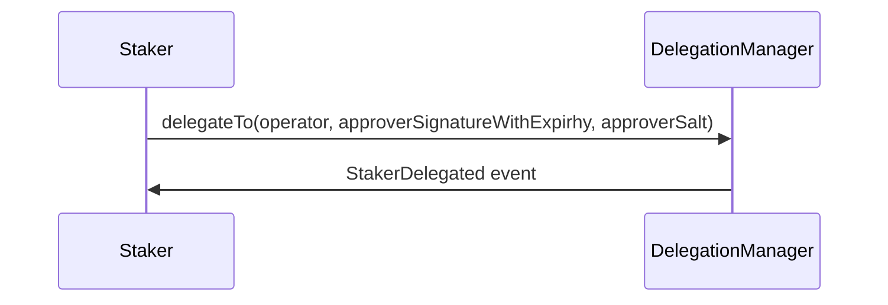
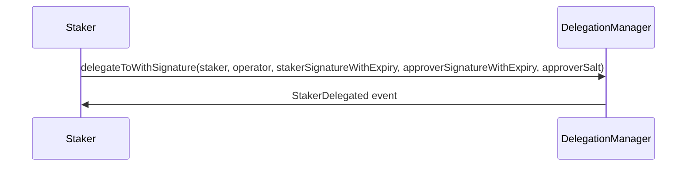

# Delegation Flow

In the delegation flow there are two types of users: Stakers and Operators. Stakers are users who delegate their staked collateral to Operators. Operators receive delegated stakes from Stakers and run services built on top of EigenLayer. While delegating to an operator is designed to be a simple process from the staker's perspective, a lot happens "under the hood".

## Operator Registration

An Operator can register themselves in the system by calling the registerAsOperator function, providing their OperatorDetails which include the earningsReceiver (the address to receive the operator's earnings), delegationApprover (the address that approves delegations to the operator), and stakerOptOutWindowBlocks (the number of blocks for which a staker can opt out of delegating to the operator). In order to be delegated _to_, an operator must have first called `DelegationManager.registerAsOperator`. Once registered, an operator cannot deregister and is considered permanently delegated to themselves.

When an operator registers in EigenLayer, the following flow of calls between contracts occurs:

1. The would-be operator calls `DelegationManager.registerAsOperator`, providing their `OperatorDetails` and an (optional) `metadataURI` string as an input. The DelegationManager contract stores the `OperatorDetails` provided by the operator and emits an event containing the `metadataURI`. The `OperatorDetails` help define the terms of the relationship between the operator and any stakers who delegate to them, and the `metadataURI` can provide additional details about the operator.
   All of the remaining steps (2 and 3) proceed as outlined in the delegation process below;

## Staker Delegation

For a staker to delegate to an operator, the staker must either:

1. Call `DelegationManager.delegateTo` directly
   OR
2. Supply an appropriate ECDSA signature, which can then be submitted by the operator (or a third party) as part of a call to `DelegationManager.delegateToBySignature`

If a staker tries to delegate to someone who has not previously registered as an operator, their transaction will fail.

In either case, the end result is the same, and the flow of calls between contracts looks identical:

1. As outlined above, either the staker themselves calls `DelegationManager.delegateTo`, or the operator (or a third party) calls `DelegationManager.delegateToBySignature`, in which case the DelegationManager contract verifies the provided ECDSA signature
2. The DelegationManager contract calls `Slasher.isFrozen` to verify that the operator being delegated to is not frozen
3. The DelegationManager contract calls `StrategyManager.getDeposits` to get the full list of the staker (who is delegating)'s deposits. It then increases the delegated share amounts of operator (who is being delegated to) appropriately
