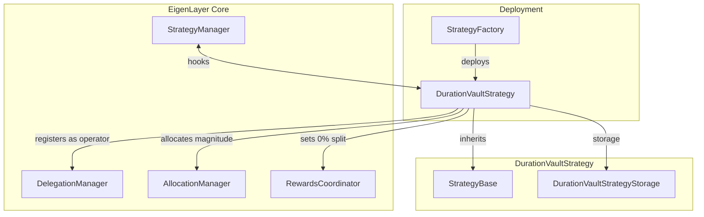
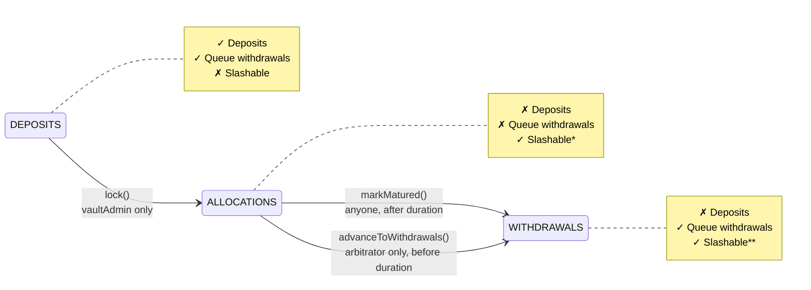

# DurationVaultStrategy

| File | Notes |
| -------- | -------- |
| [`DurationVaultStrategy.sol`](../../src/contracts/strategies/DurationVaultStrategy.sol) | Main implementation |
| [`DurationVaultStrategyStorage.sol`](../../src/contracts/strategies/DurationVaultStrategyStorage.sol) | State variables |
| [`IDurationVaultStrategy.sol`](../../src/contracts/interfaces/IDurationVaultStrategy.sol) | Interface |

Related Contracts:

| File | Notes |
| -------- | -------- |
| [`StrategyFactory.sol`](../../src/contracts/strategies/StrategyFactory.sol) | Deployment of duration vaults |
| [`StrategyBase.sol`](../../src/contracts/strategies/StrategyBase.sol) | Base strategy with hooks |
| [`StrategyManager.sol`](../../src/contracts/core/StrategyManager.sol) | Hook integration for share movements |

## Prior Reading

* [StrategyManager](./StrategyManager.md)
* [AllocationManager](./AllocationManager.md)
* [DelegationManager](./DelegationManager.md)

## Overview

The `DurationVaultStrategy` is a **time-bound, single-use EigenLayer strategy** designed for use cases requiring guaranteed stake commitments (e.g., insurance pools). Unlike standard strategies where stakers delegate to operators, a duration vault **acts as its own operator** — stakers must delegate to the vault before depositing. The vault registers for a single AVS operator set and allocates 100% of its magnitude to that set during a locked period.

### High-Level Flow

1. **AVS creates vault** via `StrategyFactory` with duration, caps, and operator set config
2. **Vault self-registers as operator** — stakers must delegate to the vault before depositing
3. **Stakers deposit** during the open window, subject to per-deposit and total caps
4. **Admin locks the vault** — deposits/withdrawal queuing blocked; full magnitude allocated to operator set
5. **AVS submits rewards** — stakers can claim rewards via normal EigenLayer reward flow 
6. **Vault exits lock**:
   - **Normal exit**: duration elapses and anyone calls `markMatured()` to deallocate and enable withdrawals
   - **Early exit**: arbitrator calls `advanceToWithdrawals()` after lock but before duration elapses
7. **Stakers withdraw** — receive principal minus any slashing that occurred

> **Note**: Duration vaults are **single-use**. Once matured, a vault cannot be re-locked. Deploy a new vault for new duration commitments.

**Table of Contents:**

| Section | Methods |
|---------|---------|
| [Contract Architecture](#contract-architecture) | — |
| [Deployment](#deployment) | [`deployDurationVaultStrategy`](#deployment) |
| [Vault Lifecycle](#vault-lifecycle) | — |
| [Configuration](#configuration) | [`updateTVLLimits`](#updatetvllimits), [`setTVLLimits`](#settvllimits), [`updateMetadataURI`](#updatemetadatauri) |
| [State: DEPOSITS](#state-deposits) | [`beforeAddShares`](#beforeaddshares), [`beforeRemoveShares`](#beforeremoveshares) |
| [State: ALLOCATIONS](#state-allocations) | [`lock`](#lock) |
| [State: WITHDRAWALS](#state-withdrawals) | [`markMatured`](#markmatured), [`advanceToWithdrawals`](#advancetowithdrawals) |

---

## Contract Architecture

The `DurationVaultStrategy` extends `StrategyBase` and integrates with EigenLayer core contracts to act as both a strategy and an operator.



### Vault as Operator

The vault registers itself as an EigenLayer operator on initialization. Stakers must delegate to the vault before depositing. The vault allocates its own magnitude to the configured AVS operator set and sets operator reward split to 0% so 100% of rewards goes to its stakers.

### Strategy Hooks

Previously, strategies had no control over share movements after deposit — shares could be re-delegated, withdrawn, or moved without the strategy's knowledge. To enable lifecycle-aware strategies like duration vaults, two hooks were added:

| Contract | Change |
|----------|--------|
| `StrategyBase` | Added virtual `beforeAddShares` and `beforeRemoveShares` hooks (default no-op) |
| `StrategyManager` | Calls `strategy.beforeAddShares()` in `_addShares()` and `strategy.beforeRemoveShares()` in `_removeDepositShares()` |

The `DurationVaultStrategy` overrides these hooks to enforce deposit/withdrawal constraints based on vault state.

---

## Deployment

Duration strategy vaults deployment is permissionless via `StrategyFactory.deployDurationVaultStrategy()`. Unlike standard strategies (which are 1:1 with tokens), **multiple duration vaults can exist per token**.

```js
/**
 * @notice Deploys a new duration vault strategy backed by the configured beacon.
 */
function deployDurationVaultStrategy(
    IDurationVaultStrategy.VaultConfig calldata config
) external onlyWhenNotPaused(PAUSED_NEW_STRATEGIES) returns (IDurationVaultStrategy newVault)
```

## Configuration

### VaultConfig

```js
struct VaultConfig {
    IERC20 underlyingToken;              // Token stakers deposit
    address vaultAdmin;                   // Address that can lock the vault
    address arbitrator;                  // Address that can advance to withdrawals early (after lock, pre-duration)
    uint32 duration;                      // Lock duration in seconds
    uint256 maxPerDeposit;               // Max deposit per transaction
    uint256 stakeCap;                    // Max total deposits (TVL cap)
    string metadataURI;                  // Vault metadata
    OperatorSet operatorSet;             // Target AVS operator set
    bytes operatorSetRegistrationData;   // Data for AVS registrar
    address delegationApprover;          // Delegation approval address (0x0 for open)
    string operatorMetadataURI;          // Operator metadata for the vault
}
```

*Effects*:
* Deploys a `BeaconProxy` pointing to `durationVaultBeacon`
* Calls `initialize(config)` on the new vault
* Registers the vault in `durationVaultsByToken[token]`
* Whitelists the vault in `StrategyManager` for deposits
* Emits `DurationVaultDeployed` event

*Requirements*:
* Pause status MUST NOT be set: `PAUSED_NEW_STRATEGIES`
* Token MUST NOT be blacklisted
* `vaultAdmin` MUST NOT be zero address
* `arbitrator` MUST NOT be zero address
* `duration` MUST be non-zero and <= `MAX_DURATION` (2 years for now)
* `maxPerDeposit` MUST be <= `stakeCap`
* `operatorSet.avs` MUST NOT be zero address

### `updateTVLLimits`

```js
function updateTVLLimits(
    uint256 newMaxPerDeposit,
    uint256 newStakeCap
) external onlyVaultAdmin
```

Allows the vault admin to update deposit limits.

*Effects*:
* Updates `maxPerDeposit` and `maxTotalDeposits`
* Emits `MaxPerDepositUpdated` and `MaxTotalDepositsUpdated`

*Requirements*:
* Caller MUST be `vaultAdmin`
* State MUST be `DEPOSITS`
* `newMaxPerDeposit` MUST be <= `newStakeCap`

### `setTVLLimits`


```js
function setTVLLimits(
    uint256 newMaxPerDeposit,
    uint256 newMaxTotalDeposits
) external onlyUnpauser
```

Allows the unpauser to update TVL limits (for parity with `StrategyBaseTVLLimits`).

*Effects*:
* Updates `maxPerDeposit` and `maxTotalDeposits`
* Emits `MaxPerDepositUpdated` and `MaxTotalDepositsUpdated`

*Requirements*:
* Caller MUST have unpauser role
* State MUST be `DEPOSITS`
* `newMaxPerDeposit` MUST be <= `newMaxTotalDeposits`

### `updateMetadataURI`

```js
function updateMetadataURI(
    string calldata newMetadataURI
) external onlyVaultAdmin
```

Updates the vault's metadata URI. Can be called at any time.

*Effects*:
* Updates `metadataURI`
* Emits `MetadataURIUpdated(newMetadataURI)`

*Requirements*:
* Caller MUST be `vaultAdmin`


---

## Vault Lifecycle

The vault progresses through three states with forward-only transitions:

---



_* Slashable after allocation delay passes. ** Slashable until deallocation delay passes._

---

| State | Deposits | Queue Withdrawals | Slashable | Trigger | Who |
|-------|:--------:|:-----------------:|:---------:|---------|-----|
| `DEPOSITS` | ✓ | ✓ | ✗ | — | — |
| `ALLOCATIONS` | ✗ | ✗ | ✓* | `lock()` | `vaultAdmin` |
| `WITHDRAWALS` | ✗ | ✓ | ✓** | `markMatured()` / `advanceToWithdrawals()` | Anyone / `arbitrator` |

---

## State: DEPOSITS

The initial state after deployment. Accepts deposits and allows withdrawal queuing.

### `beforeAddShares`

```js
function beforeAddShares(
    address staker,
    uint256 shares
) external view override onlyStrategyManager
```

Called by `StrategyManager` on deposit or when re-adding shares when completing a withdrawal.

*Requirements* (all must pass):
* State *MUST* be `DEPOSITS` (vault not locked)
* Strategy underlying token *MUST NOT* be blacklisted in `StrategyFactory`
* Staker *MUST* be delegated to the vault
* Deposit amount (in underlying) *MUST NOT* exceed `maxPerDeposit`
* Post-deposit total active shares (in underlying) *MUST NOT* exceed `maxTotalDeposits`

> **Note on TVL Cap**: The cap is checked against `operatorShares` which represents active shares delegated to the duration vault at any given time. Withdrawals that have been queued reduce `operatorShares` even though the funds remain in the duration strategy, so they don't count toward the cap.

### `beforeRemoveShares`

```js
function beforeRemoveShares(
    address,
    uint256
) external view override onlyStrategyManager
```

Called when a staker attempts to undelegate or queue a withdrawal.

*Requirements*:
* State MUST NOT be `ALLOCATIONS`

> **Note**: Withdrawals queued during `DEPOSITS` can still be *completed* during `ALLOCATIONS`. The hook only blocks *new* withdrawal queuing.

---

## State: ALLOCATIONS

The locked state where funds are allocated to the AVS operator set and slashable.

### `lock`

```js
function lock() external onlyVaultAdmin
```

Transitions the vault from `DEPOSITS` to `ALLOCATIONS`. This action:
1. Blocks new deposits
2. Blocks new withdrawal queuing
3. Allocates 100% magnitude to the configured operator set

*Effects*:
* Sets `lockedAt` to current timestamp
* Sets `unlockAt` to `lockedAt + duration`
* Transitions state to `ALLOCATIONS`
* Allocates full magnitude (`1e18`) to the operator set
* Emits `VaultLocked(lockedAt, unlockAt)`

*Requirements*:
* Caller MUST be `vaultAdmin`
* State MUST be `DEPOSITS`
* No pending allocation modification may exist

### Allocation Delay Protection

The vault's allocation delay is set to `minWithdrawalDelayBlocks + 1` during initialization. This ensures that stakers who queued withdrawals during `DEPOSITS` won't be subject to slashing.

---

## State: WITHDRAWALS

The matured state where withdrawals are enabled and deposits remain blocked.

### `markMatured`

```js
function markMatured() external
```

Transitions the vault from `ALLOCATIONS` to `WITHDRAWALS`. Callable by anyone once the duration has elapsed.

*Effects*:
* Sets `maturedAt` to current timestamp
* Transitions state to `WITHDRAWALS`
* Attempts to deallocate magnitude to 0 (best-effort)
* Attempts to deregister from operator set (best-effort)
* Emits `VaultMatured(maturedAt)`

*Requirements*:
* State MUST be `ALLOCATIONS`
* `block.timestamp` MUST be >= `unlockAt`

> **NOTE**: Both deallocation and deregistration are wrapped in `try/catch`. If they fail (e.g., `AllocationManager` paused), the function still succeeds. This ensures users can always withdraw after maturity regardless of external conditions.

> **NOTE**: Even after `markMatured()`, the vault **remains slashable** for `DEALLOCATION_DELAY` blocks until the deallocation takes effect on the `AllocationManager`. This is standard EigenLayer behavior for any deallocation.

### `advanceToWithdrawals`

```js
function advanceToWithdrawals() external
```

Transitions the vault from `ALLOCATIONS` to `WITHDRAWALS` **early**, after lock but before `unlockAt`. This is intended for use cases where an external agreement is violated (e.g., premiums not paid) and the vault should allow stakers to exit before the duration elapses.

*Effects*:
* Sets `maturedAt` to current timestamp
* Transitions state to `WITHDRAWALS`
* Attempts to deallocate magnitude to 0 (best-effort)
* Attempts to deregister from operator set (best-effort)
* Emits `VaultAdvancedToWithdrawals(arbitrator, maturedAt)` (and `VaultMatured(maturedAt)`)

*Requirements*:
* Caller MUST be `arbitrator`
* State MUST be `ALLOCATIONS` (i.e., vault must be locked)
* `block.timestamp` MUST be < `unlockAt`

### Withdrawals

After maturity, stakers can queue and complete withdrawals through the standard EigenLayer flow via `DelegationManager`. The `beforeRemoveShares` hook allows withdrawal queuing when state is `WITHDRAWALS`.

### Rewards

Rewards follow the standard EigenLayer flow:
1. AVS submits rewards to `RewardsCoordinator` targeting the operator set
2. Stakers claim rewards normally through `RewardsCoordinator`
3. Operator split is set to 0% at initialization, so 100% of rewards go to stakers
4. Reward claims are **not blocked** by vault state

---

## View Functions

| Function | Returns |
|----------|---------|
| `state()` | Current `VaultState` enum |
| `vaultAdmin()` | Vault administrator address |
| `arbitrator()` | Vault arbitrator address |
| `duration()` | Configured lock duration in seconds |
| `lockedAt()` | Timestamp when vault was locked (0 if not locked) |
| `unlockTimestamp()` | Timestamp when vault matures (0 if not locked) |
| `maturedAt()` | Timestamp when vault was marked matured |
| `isLocked()` | `true` if state != `DEPOSITS` |
| `isMatured()` | `true` if state == `WITHDRAWALS` |
| `depositsOpen()` | `true` if state == `DEPOSITS` |
| `withdrawalsOpen()` | `true` if state != `ALLOCATIONS` |
| `allocationsActive()` | `true` if state == `ALLOCATIONS` |
| `stakeCap()` | Maximum total deposits (alias for `maxTotalDeposits`) |
| `maxPerDeposit()` | Maximum deposit per transaction |
| `maxTotalDeposits()` | Maximum total deposits |
| `getTVLLimits()` | Returns `(maxPerDeposit, maxTotalDeposits)` |
| `metadataURI()` | Vault metadata URI |
| `operatorSetInfo()` | Returns `(avs, operatorSetId)` |
| `operatorIntegrationConfigured()` | Always returns `true` |
| `operatorSetRegistered()` | `true` if in `DEPOSITS` or `ALLOCATIONS` state |
| `delegationManager()` | Reference to `DelegationManager` |
| `allocationManager()` | Reference to `AllocationManager` |
| `rewardsCoordinator()` | Reference to `RewardsCoordinator` |

---

## Parameterization

| Parameter | Value | Description |
|-----------|-------|-------------|
| `FULL_ALLOCATION` | `1e18` | Full magnitude for allocation (1 WAD) |
| `MAX_DURATION` | `2 * 365 days` | Maximum allowable vault duration (~2 years) |
| `allocationDelay` | `minWithdrawalDelayBlocks + 1` | Set during initialization to protect pre-lock withdrawals |
| `operatorSplit` | `0` | Set to 0% so 100% of rewards go to stakers |

---

## Events

| Event | Description |
|-------|-------------|
| `VaultInitialized(vaultAdmin, arbitrator, underlyingToken, duration, maxPerDeposit, stakeCap, metadataURI)` | Vault initialized with configuration |
| `VaultLocked(lockedAt, unlockAt)` | Vault transitioned to `ALLOCATIONS` |
| `VaultMatured(maturedAt)` | Vault transitioned to `WITHDRAWALS` |
| `VaultAdvancedToWithdrawals(arbitrator, maturedAt)` | Vault transitioned to `WITHDRAWALS` early by the arbitrator |
| `MetadataURIUpdated(newMetadataURI)` | Metadata URI changed |
| `MaxPerDepositUpdated(previousValue, newValue)` | Per-deposit cap changed |
| `MaxTotalDepositsUpdated(previousValue, newValue)` | Total deposit cap changed |

---

## Errors

| Error | When Thrown |
|-------|-------------|
| `InvalidVaultAdmin` | Zero-address vault admin in config |
| `InvalidArbitrator` | Zero-address arbitrator in config |
| `InvalidDuration` | Zero or excessive duration (> `MAX_DURATION`) in config |
| `OnlyVaultAdmin` | Non-admin calls admin-only function |
| `OnlyArbitrator` | Non-arbitrator calls arbitrator-only function |
| `VaultAlreadyLocked` | Attempting to lock an already locked vault |
| `DepositsLocked` | Deposit attempted after vault is locked |
| `WithdrawalsLockedDuringAllocations` | Withdrawal queuing attempted during `ALLOCATIONS` state |
| `MustBeDelegatedToVaultOperator` | Staker not delegated to vault before deposit |
| `DurationNotElapsed` | `markMatured()` called before `unlockAt` timestamp |
| `DurationAlreadyElapsed` | `advanceToWithdrawals()` called at/after `unlockAt` timestamp |
| `VaultNotLocked` | `advanceToWithdrawals()` called before the vault is locked |
| `OperatorIntegrationInvalid` | Invalid operator integration config (zero AVS address) |
| `UnderlyingTokenBlacklisted` | Deposit attempted with blacklisted token |
| `PendingAllocation` | `lock()` attempted with pending allocation modification |
| `MaxPerDepositExceedsMax` | `maxPerDeposit > maxTotalDeposits` or deposit exceeds per-deposit cap |
| `BalanceExceedsMaxTotalDeposits` | Post-deposit balance exceeds TVL cap |

---

## Main Invariants

| # | Invariant |
|---|-----------|
| 1 | State only progresses forward: `DEPOSITS → ALLOCATIONS → WITHDRAWALS` |
| 2 | `lockedAt > 0` ⟹ `state ≠ DEPOSITS` |
| 3 | `maturedAt > 0` ⟹ `state == WITHDRAWALS` |
| 4 | `unlockAt == lockedAt + duration` when locked |
| 5 | Any successful deposit requires staker delegated to the vault |
| 6 | Any user with active shares in this strategy MUST be delegated to the vault |
| 7 | Vault shares cannot be delegated to any operator other than the vault itself |
| 8 | Normal deposits cannot exceed `maxPerDeposit` |
| 9 | Post-deposit active shares (in underlying) cannot exceed `maxTotalDeposits` |
| 10 | `maxPerDeposit <= maxTotalDeposits` always |
| 11 | Users can always queue withdrawals before lock or after maturity |
| 12 | Vault delegated shares may only decrease due to slashing during `ALLOCATIONS` |
| 13 | Withdrawals queued before `lockedAt` are not subject to slashing |

---

## Known Issues

### 1. Cap Bypass via Direct Token Transfer

**Issue**: Donations (direct token transfers) to the vault bypass `beforeAddShares()` and inflate the share value without triggering cap checks.

- The `beforeAddShares` hook is only called through the `StrategyManager` deposit flow. Direct ERC20 transfers to the strategy contract increase the underlying balance without minting new shares, which inflates the exchange rate.

- The attacker gains nothing —and they should be the first depositor or they'll be donating value to existing shareholders. While this can be used to exceed the TVL cap in underlying terms, the cap's primary purpose is to limit protocol risk exposure, and donations don't really increase that risk.

---

### 2. Best-Effort Cleanup State Inconsistency

**Issue**: If `_deallocateAll()` or `_deregisterFromOperatorSet()` silently fails during `markMatured()`, the vault transitions to `WITHDRAWALS` state but may still have active allocation/registration on `AllocationManager`.

- These calls are wrapped in `try/catch` to prevent external conditions (e.g., `AllocationManager` paused, AVS already deregistered the vault) from blocking user withdrawals after maturity.

---

### 3. Short Duration Edge Case

**Issue**: The allocation delay is set to `minWithdrawalDelayBlocks + 1` to protect pre-lock withdrawals. If the vault's duration is shorter than this delay, the vault matures before the allocation becomes active.

- AVSs deploying duration vaults should ensure the duration is meaningful for their use case, and stakers can always check the duration of each duration strategy vault.

---

### 4. Front-Run Lock

**Issue**: A depositor can front-run the admin's `lock()` call to queue a withdrawal, causing the vault to lock with less capital than expected.

- During `DEPOSITS` state, withdrawal queuing is allowed (so users aren't trapped if admin never locks). It's the admin's responsibility to avoid front-running and make sure that they lock the strategy with the desired capital.

---

### 5. Admin Can Set Cap Below Current

**Issue**: The `vaultAdmin` or `unpauser` can set the TVL limit to a value less than currently invested funds.

- This is intentional flexibility. Setting a lower cap doesn't affect existing deposits — it only blocks new deposits until withdrawals bring the balance below the new cap.