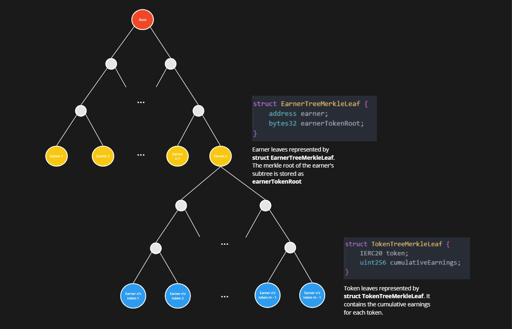

## PaymentCoordinator

| File | Type | Proxy |
| -------- | -------- | -------- |
| [`PaymentCoordinator.sol`](../../src/contracts/core/PaymentCoordinator.sol) | Singleton | Transparent proxy |


<!-- The primary functions of the `PaymentCoordinator` contract are to (i) accept ERC20 payments from AVSs (Actively Validated Services) to their Operators and delegated Stakers for a given time range; (ii) enable the protocol to provide ERC20 tokens to all stakers over a specified time range; and (iii) allow stakers and operators to claim their accumulated earnings. -->

The `PaymentCoordinator` accepts ERC20s from AVSs alongside payment requests made out to Operators who, during a specified time range, were registered to the AVS in the core [`AVSDirectory`](./AVSDirectory.md) contract.

*Off-chain*, the trusted *payment updater* calculates a payment distribution according to (as of the payment's time range): (i) the relative stake weight of each Operator's Stakers and (ii) a globally-defined commission given to the Operator. *On-chain*, the payment updater sends the `PaymentCoordinator` a merkle root of each earner's cumulative earnings. 

Earners provide merkle proofs to the `PaymentCoordinator` to claim payments against these roots.

The typical user flow is as follows:
1. An AVS submits a `RangePayment` to the `PaymentCoordinator` contract, which specifies a time range (`startTimestamp` and `duration`) and payment (`token` and `amount`). The `RangePayment` also specifies the strategies Stakers/Operators should have held over the time range in order to receive the payments (i.e. "pay out to holders of X strategy specifically").
2. Off-chain, `RangePayments` are used to calculate payment distributions, which are periodically consolidated into a merkle tree. 
3. The root of this tree (aka the `DistributionRoot`) is posted on-chain by the *payment updater*. A `DistributionRoot` becomes active for claims after some globally-configured `activationDelay`.
4. Stakers and Operators (or their configured "claimers") can claim their accumulated earnings by providing a merkle proof against any previously-posted `DistributionRoot`.

This entire flow will repeat periodically as AVSs submit `RangePayments`, `DistributionRoots` are submitted, and Stakers/Operators claim their accumulated earnings. Note that `DistributionRoots` contain *cumulative earnings*, meaning Stakers/Operators aren't required to claim against every root - simply claiming against the most recent root will claim anything not yet claimed.

#### High-level Concepts

This document is organized according to the following themes (click each to be taken to the relevant section):
* [Submitting Payment Requests](#submitting-payment-requests)
* [Distributing and Claiming Payments](#distributing-and-claiming-payments)
* [System Configuration](#system-configuration)
* [Payments Merkle Tree Structure](#payments-merkle-tree-structure)
* [Off Chain Calculation](#off-chain-calculation)

#### Important state variables

* `DistributionRoot[] public distributionRoots`: 
    * `distributionRoots` stores historic payment merkle tree roots submitted by the payment updater. For each earner, the payment merkle tree stores cumulative earnings per ERC20 payment token. For more details on merkle tree structure see [Payment Merkle Tree Structure](#payments-merkle-tree-structure) below.
* `mapping(address => address) public claimerFor`: earner => claimer
    * Stakers and Operators can designate a "claimer" who can claim payments via on their behalf via `processClaim`. If a claimer is not set in `claimerFor`, the earner will have to call `processClaim` themselves.
    * Note that the claimer isn't necessarily the payment recipient, but they do have the authority to specify the recipient when calling `processClaim` on the earner's behalf.
* `mapping(address => mapping(IERC20 => uint256)) public cumulativeClaimed`: earner => token => total amount claimed to date
    * Mapping for earners(Stakers/Operators) to track their total claimed earnings per payment token. This mapping is used to calculate the difference between the cumulativeEarnings stored in the merkle tree and the previous total claimed amount. This difference is then transfered to the specified destination address.
* `uint16 public globalOperatorCommissionBips`: *Used off-chain* by the payment updater to calculate an Operator's commission for a specific payment.
    * This is expected to be a flat 10% rate for the initial payments release. Expressed in basis points, this is `1000`.

#### Helpful definitions

* `_checkClaim(PaymentMerkleClaim calldata claim, DistributionRoot memory root)`
    * Checks the merkle inclusion of a claim against a `DistributionRoot`
    * Reverts if any of the following are true:
        * mismatch input param lengths: tokenIndices, tokenTreeProofs, tokenLeaves
        * earner proof reverting from calling `_verifyEarnerClaimProof`
        * any of the token proofs reverting from calling `_verifyTokenClaimProof`
* Wherever AVS (Actively Validated Service) is mentioned, it refers to the contract entity that is submitting payments to the `PaymentCoordinator`. This is assumed to be a customized `ServiceManager` contract of some kind that is interfacing with the EigenLayer protocol. See the `ServiceManagerBase` docs here: [`eigenlayer-middleware/docs/ServiceManagerBase.md`](https://github.com/Layr-Labs/eigenlayer-middleware/blob/dev/docs/ServiceManagerBase.md).

---

### Submitting Payment Requests

AVSs submit payment requests via the following functions:

* [`PaymentCoordinator.payForRange`](#payforrange)
* [`PaymentCoordinator.payAllForRange`](#payallforrange)

#### `payForRange`

```solidity
function payForRange(
    RangePayment[] calldata rangePayments
) 
    external 
    onlyWhenNotPaused(PAUSED_PAY_FOR_RANGE) 
    nonReentrant
```

Called by an AVS to submit a list of `RangePayments` to be distributed across all registered Operators (and Stakers delegated to each Operator). A `RangePayment` consists of the following fields:
* `IERC20 token`: the address of the ERC20 token being used for payment
* `uint256 amount`: amount of `token` to transfer to the `PaymentCoordinator`
* `uint32 startTimestamp`: the start of the payment time range
* `uint32 duration`: the duration of the payment time range, in seconds
* `StrategyAndMultiplier[] strategiesAndMultipliers`: an array of `StrategyAndMultiplier` structs that define a linear combination of EigenLayer strategies the AVS is considering eligible for payment. Each `StrategyAndMultiplier` contains:
    * `IStrategy strategy`: address of the strategy against which a Staker/Operator's relative shares are weighted in order to determine their payment amount
    * `uint96 multiplier`: the relative weighting of the strategy in the linear combination. (Recommended use here is to use 1e18 as the base multiplier and adjust the relative weightings accordingly)

For each submitted `RangePayment`, this method performs a `transferFrom` to transfer the specified payment `token` and `amount` from the caller to the `PaymentCoordinator`.

*Eligibility*:

In order to be eligible to claim a `payForRange` payment, the Operator should be registered for the AVS in the `AVSDirectory` during the time period over which the payment is being made (see docs for [`AVSDirectory.registerOperatorToAVS`](./AVSDirectory.md#registeroperatortoavs)). If an Operator is ineligible, any Stakers delegated to the Operator are also ineligible.

*Payment Distribution*:

The payment distribution amongst the AVS's Operators and delegated Stakers is determined offchain using the strategies and multipliers provided in the `RangePayment` struct as well as the actual shares for those defined strategies over the `RangePayment's` time range. These shares are read from the [`EigenPodManager`](./EigenPodManager.md) (in the case of the Beacon Chain ETH strategy), or the [`StrategyManager`](./StrategyManager.md) for any other strategy. Note that Stakers' shares specifically are what determines payment distribution; Operators earn based on a combination of their own deposited shares and a configured `globalOperatorCommissionBips`.

*Effects*:
* For each `RangePayment` element
    * Transfers `amount` of `token` from the msg.sender (AVS) to the `PaymentCoordinator`
    * Hashes msg.sender(AVS), nonce, and `RangePayment` struct to create a unique payment hash and sets this value to `true` in the `isRangePaymentHash` mapping
    * Increments `paymentNonce[msg.sender]`
    * Emits a `RangePaymentCreated` event

*Requirements*:
* Pause status MUST NOT be set: `PAUSED_PAY_FOR_RANGE`
* Function call is not reentered
* For each `RangePayment` element
    * `isRangePaymentHash[msg.sender][rangePaymentHash]` MUST be false, the hash keccak256(msg.sender[AVS], nonce, and `RangePayment`) should not have been submitted before
    * Requirements from calling internal function `_payForRange()`
        * `rangePayment.strategiesAndMultipliers.length > 0`
        * `rangePayment.amount > 0`
        * `rangePayment.amount <= MAX_PAYMENT_AMOUNT`
        * `rangePayment.duration <= MAX_PAYMENT_DURATION`
        * `rangePayment.duration % calculationIntervalSeconds == 0`
        * `rangePayment.startTimestamp % calculationIntervalSeconds == 0`
        * `block.timestamp - MAX_RETROACTIVE_LENGTH <= rangePayment.startTimestamp`
        * `GENESIS_PAYMENT_TIMESTAMP <= rangePayment.startTimestamp`
        * `rangePayment.startTimestamp <= block.timestamp + MAX_FUTURE_LENGTH`
        * Requirements for `rangePayment.strategiesAndMultipliers`
            * Each `strategy` is whitelisted for deposit in the StrategyManager or is the `beaconChainETHStrategy`
            * `rangePayment.strategiesAndMultipliers` is sorted by ascending strategy address to prevent duplicate strategies
    * `transferFrom` MUST succeed in transferring `amount` of `token` from `msg.sender` to the `PaymentCoordinator`

The text diagram below better visualizes a valid start timestamp for a `RangePayment`
```
Sliding Window for valid RangePayment startTimestamp

Scenario A: GENESIS_PAYMENT_TIMESTAMP IS WITHIN RANGE
        <-----MAX_RETROACTIVE_LENGTH-----> t (block.timestamp) <---MAX_FUTURE_LENGTH--->
            <--------------------valid range for startTimestamp------------------------>
            ^
        GENESIS_PAYMENT_TIMESTAMP


Scenario B: GENESIS_PAYMENT_TIMESTAMP IS OUT OF RANGE
        <-----MAX_RETROACTIVE_LENGTH-----> t (block.timestamp) <---MAX_FUTURE_LENGTH--->
        <------------------------valid range for startTimestamp------------------------>
    ^
GENESIS_PAYMENT_TIMESTAMP
```

#### `payAllForRange`

```solidity
function payAllForRange(
    RangePayment[] calldata rangePayments
) 
    external 
    onlyWhenNotPaused(PAUSED_PAY_ALL_FOR_RANGE)
    onlyPayAllForRangeSubmitter
    nonReentrant
```

This method is identical in function to [`payForRange`](#payforrange) above, except:
* It can only be called by a whitelisted "pay all for range submitter"
* ALL Stakers/Operators are eligible for payment, instead of those specifically registered for a given AVS

*Effects*:
* See [`payForRange`](#payforrange) above. The only differences are that:
    * Each range payment hash is stored in the `isRangePaymentForAllHash` mapping
    * Emits a `RangePaymentForAllCreated` event

*Requirements*:
* See [`payForRange`](#payforrange) above. The only difference is that each calculated range payment hash MUST NOT already exist in the `isRangePaymentForAllHash` mapping.

---

### Distributing and Claiming Payments

The *payment updater* calculates payment distributions and submit claimable roots through the following function:

* [`PaymentCoordinator.submitRoot`](#submitroot)

Earners configure and claim these payments using the following functions: 

* [`PaymentCoordinator.setClaimerFor`](#setclaimerfor)
* [`PaymentCoordinator.processClaim`](#processclaim)

#### `submitRoot`

```solidity
function submitRoot(
    bytes32 root, 
    uint32 paymentCalculationEndTimestamp
) 
    external
    onlyWhenNotPaused(PAUSED_SUBMIT_ROOTS) 
    onlyPaymentUpdater
```

Called only by the `paymentUpdater` address to create a new `DistributionRoot` in the PaymentCoordinator. The `DistributionRoot` struct contains the following fields:
* `bytes32 root`: the merkle root of the payment merkle tree
* `uint32 paymentCalculationEndTimestamp`: the end of the payment time range for which the `DistributionRoot` is being submitted
* `uint32 activatedAt`: the timestamp in seconds when the `DistributionRoot` is activated and can be claimed against

`submitRoot` pushes a new `DistributionRoot` to the `distributionRoots` array. The `DistributionRoot.activatedAt` timestamp is set to `block.timestamp + activationDelay()` to allow for a delay before claims can be processed. Once this delay has passed, the root can be used to verify merkle proofs of payments made out to Stakers/Operators.

*Effects*:
* Pushes a new `DistributionRoot` to the `distributionRoots` array
* Sets `currPaymentCalculationEndTimestamp` to the param `paymentCalculationEndTimestamp`
* Emits a `DistributionRootSubmitted` event

*Requirements*:
* Pause status MUST NOT be set: `PAUSED_SUBMIT_ROOTS`
* `msg.sender` MUST be the `paymentUpdater`
* `paymentCalculationEndTimestamp > currPaymentCalculationEndTimestamp`
* `paymentCalculationEndTimestamp < block.timestamp`

#### `setClaimerFor`

```solidity
function setClaimerFor(address claimer) external
```

Called by an earner (Staker/Operator) to set a claimer address that can call `processClaim` on their behalf. If the claimer is not set (`claimerFor[earner] == address(0)`), the earner themselves can call `processClaim` directly.

*Effects*:
* Sets the `claimerFor[msg.sender]` to the input param `claimer`
* Emits a `ClaimerForSet` event

#### `processClaim`

```solidity
function processClaim(
    PaymentMerkleClaim calldata claim, 
    address recipient
) 
    external
    onlyWhenNotPaused(PAUSED_CLAIM_PAYMENTS) 
    nonReentrant
```

Called an earner (Staker/Operator) to claim their accumulated earnings by providing a merkle proof against a posted `DistributionRoot`. If the earner has configured a claimer (via `setClaimerFor`), the claimer must call this method instead.

The `PaymentMerkleClaim` struct contains the following fields (see [Payments Merkle Tree Structure](#payments-merkle-tree-structure) for further details):
* `uint32 rootIndex`: the index of the `DistributionRoot` in `distributionRoots` to prove against
* `uint32 earnerIndex`: the index of the earner's account root in the merkle tree
* `bytes earnerTreeProof`: the proof of the earner's `EarnerTreeMerkleLeaf` against the `DistributionRoot`
* `EarnerTreeMerkleLeaf earnerLeaf`: the earner's address and token subtree root
    * `address earner`: the address of the earner
    * `bytes32 earnerTokenRoot`: the merkle root of the earner's token merkle tree
* `uint32[] tokenIndices`: the indices of the token leaves in the earner's subtree
* `bytes[] tokenTreeProofs`: the proofs of the token leaves against the earner's `earnerTokenRoot`
* `TokenTreeMerkleLeaf[] tokenLeaves`: the token leaves to be claimed:
    * `IERC20 token`: the ERC20 token to be claimed
    * `uint256 amount`: the amount of the ERC20 token to be claimed

`processClaim` will first call `_checkClaim` to verify the merkle proofs against the `DistributionRoot` at the specified `rootIndex`. This is done by first performing a merkle proof verification of the earner's `EarnerTreeMerkleLeaf` against the `DistributionRoot` and then for each tokenIndex, verifying each token leaf against the earner's `earnerTokenRoot`. 

The caller must be the set claimer address in the `claimerFor` mapping or the earner themselves if the claimer is not set.

After the claim is verified, for each token leaf, the difference between the cumulative earnings in the merkle tree and the previous total claimed amount last stored in the contract is calculated and transferred from the `PaymentCoordinator` contract to the address `recipient`.

*Effects*:
* For each `claim.tokenLeaves`:
    * Calculates `uint claimAmount = tokenLeaf.cumulativeEarnings - cumulativeClaimed[earner][tokenLeaf.token]`
        * Transfers `claimAmount` of `tokenLeaf.token` to the specified `recipient`
    * Updates the `cumulativeClaimed` mapping for the earner and token
    * Emits a `PaymentClaimed` event

*Requirements*:
* Pause status MUST NOT be set: `PAUSED_CLAIM_PAYMENTS`
* The `claim` must have valid proofs against a valid `DistributionRoot`:
    * For the `DistributionRoot` given by `claim.rootIndex`, the root MUST be active (`block.timestamp >= root.activatedAt`)
    * `claim.tokenIndices` MUST equal the lengths of `claim.TokenTreeProofs` AND `claim.tokenLeaves`
    * `claim.earnerTreeProof` MUST validate `claim.earnerLeaf` against the `DistributionRoot`
    * For each `claim.tokenIndices[i]`:
        * `claim.tokenTreeProofs[i]` MUST validate `claim.tokenLeaves[i]` against `claim.earnerLeaf.earnerTokenRoot`
* If the `earner` specified in `claim.earnerLeaf.earner` has a designated `claimer` in `claimerFor[earner]`, `msg.sender` MUST be the `claimer`
    * Otherwise, `msg.sender` MUST be the `earner`
* For each `TokenTreeMerkleLeaf`, 
    * `tokenLeaf.cumulativeEarnings > cumulativeClaimed[earner][token]`: cumulativeEarnings must be gt than cumulativeClaimed. Trying to reclaim with the same proofs will revert because the claimed and earnings values will equal, breaking this requirement.
    * `tokenLeaf.token.safeTransfer(recipient, claimAmount)` MUST succeed

---

### System Configuration

* [`PaymentCoordinator.setActivationDelay`](#setactivationdelay)
* [`PaymentCoordinator.setGlobalOperatorCommission`](#setglobaloperatorcommission)
* [`PaymentCoordinator.setPaymentUpdater`](#setpaymentupdater)
* [`PaymentCoordinator.setPayAllForRangeSubmitter`](#setpayallforrangesubmitter)

#### `setActivationDelay`

```solidity
function setActivationDelay(uint32 _activationDelay) external onlyOwner
```

Allows the Owner to set the global `activationDelay`. The activation delay is the time in seconds after a `DistributionRoot` is submitted before it can be claimed against. This delay is to allow for interested parties to perform verification of the root before claiming begins.

*Effects*:
* Sets the global `activationDelay`
* Emits a `ActivationDelaySet` event

*Requirements*:
* Caller MUST be the Owner

#### `setGlobalOperatorCommission`

```solidity
function setGlobalOperatorCommission(uint16 _globalCommissionBips) external onlyOwner
```

Allows the Owner to set the global operator commission in basis points.

This commission is *used off-chain* when calculating Operator earnings for a given payment distribution. Operator commission is calculated as a percentage of the payment amount made out to each Operator. This commission is deducted from the payment amount, after which the remainder is used to calculate payments made to any Stakers delegated to the Operator.

*Effects*:
* Sets the `globalOperatorCommissionBips`
* Emits a `GlobalCommissionBipsSet` event

*Requirements*:
* Caller MUST be the Owner

#### `setPaymentUpdater`

```solidity
function setPaymentUpdater(address _paymentUpdater) external onlyOwner
```

Allows the Owner to set the `paymentUpdater` address. The `paymentUpdater` is the singleton address that can submit new `DistributionRoots` to the `PaymentCoordinator`. The `paymentUpdater` is a trusted entity that performs the bulk of the calculations and merkle tree structuring described in this document.

*Effects*:
* Sets the global `paymentUpdater` address
* Emits a `PaymentUpdaterSet` event

*Requirements*:
* Caller MUST be the Owner

#### `setPayAllForRangeSubmitter`

```solidity
function setPayAllForRangeSubmitter(address _submitter, bool _newValue) external onlyOwner
```

Allows the Owner to update the `_submitter's` permissions in the `isPayAllForRangeSubmitter` mapping. This mapping is used to determine if a given address is a valid submitter for the `payAllForRange` method.

*Effects*:
* Sets the `isPayAllForRangeSubmitter` mapping for the address `_submitter` to the bool `_newValue`
* Emits a `PayAllForRangeSubmitterSet` event

*Requirements*:
* Caller MUST be the Owner

---

### Payments Merkle Tree Structure

This merkle tree is used to verify the claims against a `DistributionRoot`.

When submitting a new `DistributionRoot`, the payment updater consolidates all `RangePayments` submitted by AVSs since the previously submitted `DistributionRoot` into a merkle tree comprised of earners and their cumulative earnings for their respective payment tokens distributed.

When an earner or their designated claimer calls `processClaim`, they must provide a `PaymentMerkleClaim` struct that contains the necessary information to verify their claim against the latest `DistributionRoot`. The merkle proof verification is done in the internal `_checkClaim` helper function. This function verifies the merkle proof of the earner's `EarnerTreeMerkleLeaf` against the `DistributionRoot` and then for each tokenIndex, verifies each token leaf against the earner's `earnerTokenRoot`.

Claimers can selectively choose which token leaves to prove against and claim accumulated earnings. Each token payment claimed in a `processClaim` call will send tokens to the `recipient` address specified in the call. 

The payment merkle tree is structured in the diagram below:



---

### Off Chain Calculation

Payments are calculated via an off-chain data pipeline. The pipeline takes snapshots of core contract state at the `SNAPSHOT_CADENCE`, currently set to once per day. It then combines these snapshots with any active payments to calculate what the single day payout of an earner is. Every `CALCULATION_INTERVAL_SECONDS` payouts are accumulated up to `lastPaymentTimestamp + CALCULATION_INTERVAL_SECONDS` and posted on-chain by the entity with the `paymentUpdater` role. 

`MAX_PAYMENT_AMOUNT` is set to `1e38-1` given the precision bounds of the off-chain pipeline. 