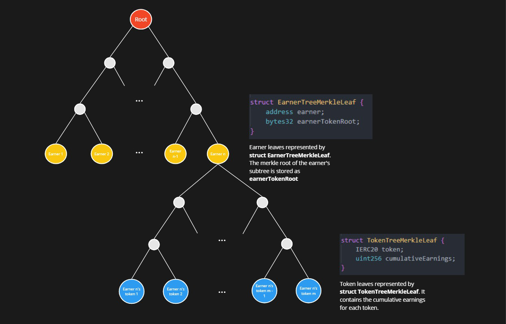

## RewardsCoordinator

| File | Type | Proxy |
| -------- | -------- | -------- |
| [`RewardsCoordinator.sol`](../../src/contracts/core/RewardsCoordinator.sol) | Singleton | Transparent proxy |


<!-- The primary functions of the `RewardsCoordinator` contract are to (i) accept ERC20 rewards from AVSs (Actively Validated Services) to their Operators and delegated Stakers for a given time range; (ii) enable the protocol to provide ERC20 tokens to all stakers over a specified time range; and (iii) allow stakers and operators to claim their accumulated earnings. -->

The `RewardsCoordinator` accepts ERC20s from AVSs alongside rewards submission requests made out to Operators who, during a specified time range, were registered to the AVS in the core [`AllocationManager`](./AllocationManager.md) contract.

There are two forms of rewards:
* Rewards v1, also known as rewards submissions.
* Rewards v2, also known as operator-directed rewards submissions. See the [ELIP](https://github.com/eigenfoundation/ELIPs/blob/main/ELIPs/ELIP-001.md) for additional context on this rewards type.

*Off-chain*, the trusted *rewards updater* calculates a rewards distribution over some rewards submission's time range, depending on the rewards type. For a **v1 rewards submission**, it is based on: (i) the relative stake weight of each Operator's Stakers and (ii) a default split given to the Operator. For a **v2 rewards submission**, it is based on: (i) an AVS's custom rewards logic, (ii) the per-operator splits.

*On-chain*, the rewards updater sends the `RewardsCoordinator` a merkle root of each earner's cumulative earnings. Earners provide merkle proofs to the `RewardsCoordinator` to claim rewards against these roots.

The typical user flow is as follows:
1. An AVS submits a *rewards submission*, either a `RewardsSubmission` (v1) or `OperatorDirectedRewardsSubmission` (v2), to the `RewardsCoordinator` contract, which specifies a time range (`startTimestamp` and `duration`) and `token`. The rewards submission also specifies the relative reward weights of strategies (i.e. "distribute 80% out to holders of X strategy, and 20% to holders of strategy Y").
   * Note that **v1 rewards** specify a total `amount`, whereas **v2 rewards** specify a per-operator reward (due to customizable rewards logic). **v2 rewards** also allow for adding a `description` of the rewards submission's purpose.
2. Off-chain, the rewards submissions are used to calculate reward distributions, which are periodically consolidated into a merkle tree.
3. The root of this tree (aka the `DistributionRoot`) is posted on-chain by the *rewards updater*. A `DistributionRoot` becomes active for claims after some globally-configured `activationDelay`.
4. Stakers and Operators (or their configured "claimers") can claim their accumulated earnings by providing a merkle proof against any previously-posted `DistributionRoot`.

This entire flow will repeat periodically as AVSs submit rewards submissions, `DistributionRoots` are submitted, and Stakers/Operators claim their accumulated earnings. Note that `DistributionRoots` contain *cumulative earnings*, meaning Stakers/Operators aren't required to claim against every root - simply claiming against the most recent root will claim anything not yet claimed.

#### High-level Concepts

This document is organized according to the following themes (click each to be taken to the relevant section):
* [Submitting Rewards Requests](#submitting-rewards-requests)
* [Distributing and Claiming Rewards](#distributing-and-claiming-rewards)
* [System Configuration](#system-configuration)
* [Rewards Merkle Tree Structure](#rewards-merkle-tree-structure)
* [Off Chain Calculation](#off-chain-calculation)

#### Important state variables

* `DistributionRoot[] public distributionRoots`:
    * `distributionRoots` stores historic reward merkle tree roots submitted by the rewards updater. For each earner, the rewards merkle tree stores cumulative earnings per ERC20 reward token. For more details on merkle tree structure see [Rewards Merkle Tree Structure](#rewards-merkle-tree-structure) below.
* `mapping(address => address) public claimerFor`: earner => claimer
    * Stakers and Operators can designate a "claimer" who can claim rewards via on their behalf via `processClaim`. If a claimer is not set in `claimerFor`, the earner will have to call `processClaim` themselves.
    * Note that the claimer isn't necessarily the reward recipient, but they do have the authority to specify the recipient when calling `processClaim` on the earner's behalf.
* `mapping(address => mapping(IERC20 => uint256)) public cumulativeClaimed`: earner => token => total amount claimed to date
    * Mapping for earners(Stakers/Operators) to track their total claimed earnings per reward token. This mapping is used to calculate the difference between the cumulativeEarnings stored in the merkle tree and the previous total claimed amount. This difference is then transferred to the specified destination address.
* `uint16 public defaultOperatorSplitBips`: *Used off-chain* by the rewards updater to calculate an Operator's split for a specific reward.
    * This is expected to be a flat 10% rate for the initial rewards release. Expressed in basis points, this is `1000`.
* `mapping(address => mapping(address => OperatorSplit)) internal _operatorAVSSplitBips`: operator => AVS => `OperatorSplit`
  * Operators specify their custom split for a given AVS for each `OperatorDirectedRewardsSubmission`, where Stakers receive a relative proportion (by stake weight) of the remaining amount.
* `mapping(address => OperatorSplit) internal _operatorPISplitBips`: operator => `OperatorSplit`
  * Operators may also specify their custom split for [programmatic incentives](https://www.blog.eigenlayer.xyz/introducing-programmatic-incentives-v1/), where Stakers similarly receive a relative proportion (by stake weight) of the remaining amount.
* `mapping(address operator => mapping(bytes32 operatorSetKey => OperatorSplit split)) internal _operatorSetSplitBips`: operator => Operator Set Key => `OperatorSplit`
  * Operators may specify their custom split for a given Operator Set, which is more granular than an overarching AVS split

#### Helpful definitions

* **AVS** (Autonomous Verifiable Service) refers to the contract entity that is submitting rewards to the `RewardsCoordinator`.
  * This is assumed to be a customized `ServiceManager` contract of some kind that is interfacing with the EigenLayer protocol. See the `ServiceManagerBase` docs here: [`eigenlayer-middleware/docs/ServiceManagerBase.md`](https://github.com/Layr-Labs/eigenlayer-middleware/blob/dev/docs/ServiceManagerBase.md).
* An **Operator Set** refers to a collection of registered operators and strategies. See [ELIP-002](https://github.com/eigenfoundation/ELIPs/blob/main/ELIPs/ELIP-002.md#operator-sets) for more details.
* An **Operator Set Key** describes the tuple of an AVS address and an ID that uniquely identifies an Operator Set. See the [AllocationManager](./AllocationManager.md#operator-sets) for details.
* A **rewards submission** includes, unless specified otherwise, both the v1 `RewardsSubmission` and the v2 `OperatorDirectedRewardsSubmission` types.
* The internal function `_checkClaim(RewardsMerkleClaim calldata claim, DistributionRoot memory root)` checks the merkle inclusion of a claim against a `DistributionRoot`
    * It reverts if any of the following are true:
        * mismatch input param lengths: tokenIndices, tokenTreeProofs, tokenLeaves
        * earner proof reverting from calling `_verifyEarnerClaimProof`
        * any of the token proofs reverting from calling `_verifyTokenClaimProof`

---

### Submitting Rewards Requests

Rewards are initially submitted to the contract to be distributed to Operators and Stakers by the following functions:

* [`RewardsCoordinator.createAVSRewardsSubmission`](#createavsrewardssubmission)
* [`RewardsCoordinator.createRewardsForAllSubmission`](#createrewardsforallsubmission)
* [`RewardsCoordinator.createRewardsForAllEarners`](#createrewardsforallearners)
* [`RewardsCoordinator.createOperatorDirectedAVSRewardsSubmission`](#createoperatordirectedavsrewardssubmission)
* [`RewardsCoordinator.createOperatorDirectedOperatorSetRewardsSubmission`](#createoperatordirectedoperatorsetrewardssubmission)

#### `createAVSRewardsSubmission`

```solidity
function createAVSRewardsSubmission(
    RewardsSubmission[] calldata RewardsSubmissions
)
    external
    onlyWhenNotPaused(PAUSED_AVS_REWARDS_SUBMISSION)
    nonReentrant
```

Called by an AVS to submit a list of `RewardsSubmission`s to be distributed across all registered Operators (and Stakers delegated to each Operator). A `RewardsSubmission` consists of the following fields:
* `IERC20 token`: the address of the ERC20 token being used for reward submission
* `uint256 amount`: amount of `token` to transfer to the `RewardsCoordinator`
* `uint32 startTimestamp`: the start of the submission time range
* `uint32 duration`: the duration of the submission time range, in seconds
* `StrategyAndMultiplier[] strategiesAndMultipliers`: an array of `StrategyAndMultiplier` structs that define a linear combination of EigenLayer strategies the AVS is considering eligible for rewards. Each `StrategyAndMultiplier` contains:
    * `IStrategy strategy`: address of the strategy against which a Staker/Operator's relative shares are weighted in order to determine their reward amount
    * `uint96 multiplier`: the relative weighting of the strategy in the linear combination. (Recommended use here is to use 1e18 as the base multiplier and adjust the relative weightings accordingly)

For each submitted `RewardsSubmission`, this method performs a `transferFrom` to transfer the specified reward `token` and `amount` from the caller to the `RewardsCoordinator`.

*Eligibility*:

In order to be eligible to claim a `createAVSRewardsSubmission` reward, the Operator should be registered for the AVS in the `AVSDirectory` during the time period over which the reward is being made (see docs for [`AVSDirectory.registerOperatorToAVS`](./AVSDirectory.md#registeroperatortoavs)). If an Operator is ineligible, any Stakers delegated to the Operator are also ineligible.

In addition, the AVS ServiceManager contract must also implement the interfaces `ServiceManager.getRestakeableStrategies` and `ServiceManager.getOperatorRestakedStrategies` to have their rewards be successfully distributed as these view functions are called offchain as part of the rewards distribution process. This is by default implemented in the `ServiceManagerBase` contract but is important to note if the base contract is not being inherited from.
See the `ServiceManagerBase` abstract contract here: [`ServiceManagerBase.sol`](https://github.com/Layr-Labs/eigenlayer-middleware/blob/dev/src/ServiceManagerBase.sol)

*Rewards Distribution*:

The rewards distribution amongst the AVS's Operators and delegated Stakers is determined offchain using the strategies and multipliers provided in the `RewardsSubmission` struct as well as the actual shares for those defined strategies over the `RewardsSubmission`'s time range. These shares are read from the [`EigenPodManager`](./EigenPodManager.md) (in the case of the Beacon Chain ETH strategy), or the [`StrategyManager`](./StrategyManager.md) for any other strategy. Note that Stakers' shares specifically are what determines rewards distribution; Operators earn based on a combination of their own deposited shares and a configured `defaultOperatorSplitBips`.

*Effects*:
* For each `RewardsSubmission` element
    * Transfers `amount` of `token` from the msg.sender (AVS) to the `RewardsCoordinator`
    * Hashes msg.sender(AVS), nonce, and `RewardsSubmission` struct to create a unique rewards hash and sets this value to `true` in the `isAVSRewardsSubmissionHash` mapping
    * Increments `submissionNonce[msg.sender]`
    * Emits a `AVSRewardsSubmissionCreated` event

*Requirements*:
* Pause status MUST NOT be set: `PAUSED_AVS_REWARDS_SUBMISSION`
* Function call is not reentered
* For each `RewardsSubmission` element
    * Requirements from calling internal function `_validateRewardsSubmission()`
        * `rewardsSubmission.strategiesAndMultipliers.length > 0`
        * `rewardsSubmission.amount > 0`
        * `rewardsSubmission.amount <= MAX_REWARDS_AMOUNT`
        * `rewardsSubmission.duration <= MAX_REWARDS_DURATION`
        * `rewardsSubmission.duration % calculationIntervalSeconds == 0`
        * `rewardsSubmission.duration > 0`
        * `rewardsSubmission.startTimestamp % calculationIntervalSeconds == 0`
        * `block.timestamp - MAX_RETROACTIVE_LENGTH <= rewardsSubmission.startTimestamp`
        * `GENESIS_REWARDS_TIMESTAMP <= rewardsSubmission.startTimestamp`
        * `rewardsSubmission.startTimestamp <= block.timestamp + MAX_FUTURE_LENGTH`
        * Requirements for `rewardsSubmission.strategiesAndMultipliers`
            * Each `strategy` is whitelisted for deposit in the StrategyManager or is the `beaconChainETHStrategy`
            * `rewardsSubmission.strategiesAndMultipliers` is sorted by ascending strategy address to prevent duplicate strategies
    * `transferFrom` MUST succeed in transferring `amount` of `token` from `msg.sender` to the `RewardsCoordinator`

The text diagram below better visualizes a valid start timestamp for a `RewardsSubmission`
```
Sliding Window for valid RewardsSubmission startTimestamp

Scenario A: GENESIS_REWARDS_TIMESTAMP IS WITHIN RANGE
        <-----MAX_RETROACTIVE_LENGTH-----> t (block.timestamp) <---MAX_FUTURE_LENGTH--->
            <--------------------valid range for startTimestamp------------------------>
            ^
        GENESIS_REWARDS_TIMESTAMP


Scenario B: GENESIS_REWARDS_TIMESTAMP IS OUT OF RANGE
        <-----MAX_RETROACTIVE_LENGTH-----> t (block.timestamp) <---MAX_FUTURE_LENGTH--->
        <------------------------valid range for startTimestamp------------------------>
    ^
GENESIS_REWARDS_TIMESTAMP
```

#### `createRewardsForAllSubmission`

```solidity
function createRewardsForAllSubmission(
    RewardsSubmission[] calldata RewardsSubmissions
)
    external
    onlyWhenNotPaused(PAUSED_REWARDS_FOR_ALL_SUBMISSION)
    onlyRewardsForAllSubmitter
    nonReentrant
```

This method is identical in function to [`createAVSRewardsSubmission`](#createavsrewardssubmission) above, except:
* It can only be called by a whitelisted "rewards for all submitter"
* ALL Stakers are eligible for rewards, instead of those specifically registered for a given AVS

*Effects*:
* See [`createAVSRewardsSubmission`](#createavsrewardssubmission) above. The only differences are that:
    * Each rewards submission hash is stored in the `isRewardsSubmissionForAllHash` mapping
    * A `RewardsSubmissionForAllCreated` event is emitted

*Requirements*:
* See [`createAVSRewardsSubmission`](#createavsrewardssubmission) above. The only difference is that each calculated rewards submission hash MUST NOT already exist in the `isRewardsSubmissionForAllHash` mapping.

#### `createRewardsForAllEarners`

```solidity
function createRewardsForAllEarners(
    RewardsSubmission[] calldata RewardsSubmissions
)
    external
    onlyWhenNotPaused(PAUSED_REWARDS_FOR_ALL_SUBMISSION)
    onlyRewardsForAllSubmitter
    nonReentrant
```

This method is identical in function to [`createAVSRewardsSubmission`](#createavsrewardssubmission) above, except:
* It can only be called by a whitelisted "rewards for all submitter"
* Only operators who have opted into at least one AVS and the operator's delegated stakers are eligible for rewards

*Effects*:
* See [`createAVSRewardsSubmission`](#createavsrewardssubmission) above. The only differences are that:
    * Each rewards submission hash is stored in the `isRewardsSubmissionForAllEarnersHash` mapping
    * Emits a `RewardsSubmissionForAllEarnersCreated` event

*Requirements*:
* See [`createAVSRewardsSubmission`](#createavsrewardssubmission) above. The only difference is that each calculated rewards submission hash MUST NOT already exist in the `isRewardsSubmissionForAllEarnersHash` mapping.

#### `createOperatorDirectedAVSRewardsSubmission`

```solidity
function createOperatorDirectedAVSRewardsSubmission(
    address avs,
    OperatorDirectedRewardsSubmission[] calldata operatorDirectedRewardsSubmissions
)
    external
    onlyWhenNotPaused(PAUSED_OPERATOR_DIRECTED_AVS_REWARDS_SUBMISSION)
    checkCanCall(avs)
    nonReentrant
```

AVS may make Rewards v2 submissions by calling `createOperatorDirectedAVSRewardsSubmission()` with any custom on-chain or off-chain logic to determine their rewards distribution strategy. This can be custom to the work performed by Operators during a certain period of time, can be a flat reward rate, or some other structure based on the AVS’s economic model. This would enable AVSs' flexibility in rewarding different operators for performance and other variables while maintaining the same easily calculable reward rate for stakers delegating to the same operator and strategy. The AVS can submit multiple performance-based rewards denominated in different tokens for even more flexibility.

*Effects*:
* For each `OperatorDirectedRewardsSubmission` element
  * Transfers `amount` of `token` from `msg.sender` to the `RewardsCoordinator`
  * Hashes `AVS`, `nonce`, and `OperatorDirectedRewardsSubmission` struct to create a unique rewards hash and sets this value to `true` in the `isOperatorDirectedAVSRewardsSubmissionHash` mapping
  * Increments `submissionNonce[avs]`
  * Emits an `OperatorDirectedAVSRewardsSubmissionCreated` event

*Requirements*:
* Pause status MUST NOT be set: `PAUSED_OPERATOR_DIRECTED_AVS_REWARDS_SUBMISSION`
* Caller MUST be authorized, either as the AVS itself or an admin/appointee (see [`PermissionController.md`](../permissions/PermissionController.md))
* Function call is not reentered
* For each `OperatorDirectedRewardsSubmission` element:
  * Requirements from calling internal function `_validateOperatorDirectedRewardsSubmission()`
    * `operatorDirectedRewardsSubmission.strategiesAndMultipliers.length > 0`
    * `operatorDirectedRewardsSubmission.duration <= MAX_REWARDS_DURATION`
    * `operatorDirectedRewardsSubmission.duration % calculationIntervalSeconds == 0`
    * `operatorDirectedRewardsSubmission.duration > 0`
    * `operatorDirectedRewardsSubmission.startTimestamp % calculationIntervalSeconds == 0`
    * `block.timestamp - MAX_RETROACTIVE_LENGTH <= operatorDirectedRewardsSubmission.startTimestamp`
    * `GENESIS_REWARDS_TIMESTAMP <= operatorDirectedRewardsSubmission.startTimestamp`
    * For each `operatorDirectedRewardsSubmission.strategiesAndMultipliers` element:
      * Each `strategy` is whitelisted for deposit in the StrategyManager or is the `beaconChainETHStrategy`
      * `rewardsSubmission.strategiesAndMultipliers` is sorted by ascending strategy address to prevent duplicate strategies
    * `operatorDirectedRewardsSubmission.operatorRewards.length > 0`
    * For each `operatorDirectedRewardsSubmission.operatorRewards` element:
      * `operatorReward.operator != address(0)`
      * `currOperatorAddress < operatorReward.operator`
      * `operatorReward.amount > 0`
    * `totalAmount <= MAX_REWARDS_AMOUNT`, where `totalAmount` is the sum of every `operatorReward.amount`
    * `operatorDirectedRewardsSubmission.startTimestamp + operatorDirectedRewardsSubmission.duration < block.timestamp`, enforcing strictly retoractive rewards submissions
  * `transferFrom` MUST succeed in transferring `amount` of `token` from `msg.sender` to the `RewardsCoordinator`

#### `createOperatorDirectedOperatorSetRewardsSubmission`

```solidity
function createOperatorDirectedOperatorSetRewardsSubmission(
    OperatorSet calldata operatorSet,
    OperatorDirectedRewardsSubmission[] calldata operatorDirectedRewardsSubmissions
)
    external
    onlyWhenNotPaused(PAUSED_OPERATOR_DIRECTED_OPERATOR_SET_REWARDS_SUBMISSION)
    checkCanCall(operatorSet.avs)
    nonReentrant
```

This function allows AVSs to make rewards submissions to specific operator sets, allowing for more granularly targeted rewards based on tasks assigned to a specific operator set, or any other custom AVS logic. Its functionality is almost identical to [`createOperatorDirectedAVSRewardsSubmission`](#createoperatordirectedavsrewardssubmission), save for some operator-set specific requirements, state variables, and events.

Note that an AVS must specify an operator set registered to the AVS; in other words, an operator set belonging to a different AVS, or an unregistered operator set, will cause this function to revert.

Also note that making this reward submission with a duration extending prior to the slashing release will result in those reward snapshots, prior to the slashing release, being refunded to the AVS (This is handled in the Sidecar rewards calculation logic).

*Effects*:
* See [`createOperatorDirectedAVSRewardsSubmission`](#createoperatordirectedavsrewardssubmission) above. The only differences are that:
  * Each rewards submission is stored in the `isOperatorDirectedOperatorSetRewardsSubmissionHash` mapping
  * An `OperatorDirectedOperatorSetRewardsSubmissionCreated` event is emitted

*Requirements*:
* See [`createOperatorDirectedAVSRewardsSubmission`](#createoperatordirectedavsrewardssubmission) above. The only differences are that:
  * `operatorSet` MUST be a [registered operator set](./AllocationManager.md#createoperatorsets) for the given AVS as according to `allocationManager.isOperatorSet()`
  * Pause status is instead: `PAUSED_OPERATOR_DIRECTED_OPERATOR_SET_REWARDS_SUBMISSION`

---

### Distributing and Claiming Rewards

The *rewards updater* calculates rewards distributions and submit claimable roots through the following function `submitRoot`. They can also disable the root if it has not yet been activated:

* [`RewardsCoordinator.submitRoot`](#submitroot)
* [`RewardsCoordinator.disableRoot`](#disableroot)

Earners configure and claim these rewards using the following functions:

* [`RewardsCoordinator.setClaimerFor`](#setclaimerfor)
* [`RewardsCoordinator.processClaim`](#processclaim)
* [`RewardsCoordinator.processClaims`](#processclaims)

#### `submitRoot`

```solidity
function submitRoot(
    bytes32 root,
    uint32 rewardsCalculationEndTimestamp
)
    external
    onlyWhenNotPaused(PAUSED_SUBMIT_DISABLE_ROOTS)
    onlyRewardsUpdater
```

Called only by the `rewardsUpdater` address to create a new `DistributionRoot` in the RewardsCoordinator. The `DistributionRoot` struct contains the following fields:
* `bytes32 root`: the merkle root of the rewards merkle tree
* `uint32 rewardsCalculationEndTimestamp`: the end of the rewards time range for which the `DistributionRoot` is being submitted
* `uint32 activatedAt`: the timestamp in seconds when the `DistributionRoot` is activated and can be claimed against

`submitRoot` pushes a new `DistributionRoot` to the `distributionRoots` array. The `DistributionRoot.activatedAt` timestamp is set to `block.timestamp + activationDelay()` to allow for a delay before claims can be processed. Once this delay has passed, the root can be used to verify merkle proofs of rewards made out to Stakers/Operators.

*Effects*:
* Pushes a new `DistributionRoot` to the `distributionRoots` array
* Sets `currRewardsCalculationEndTimestamp` to the param `rewardsCalculationEndTimestamp`
* Emits a `DistributionRootSubmitted` event

*Requirements*:
* Pause status MUST NOT be set: `PAUSED_SUBMIT_DISABLE_ROOTS`
* `msg.sender` MUST be the `rewardsUpdater`
* `rewardsCalculationEndTimestamp > currRewardsCalculationEndTimestamp`
* `rewardsCalculationEndTimestamp < block.timestamp`

#### `disableRoot`

```solidity
function disableRoot(
    uint32 rootIndex
)
    external
    onlyWhenNotPaused(PAUSED_SUBMIT_DISABLE_ROOTS)
    onlyRewardsUpdater
```

Called only by the `rewardsUpdater` address to disable a pending `DistributionRoot` that has not yet been activated (activatedAt timestamp hasn't been reached yet) in the RewardsCoordinator. Once the activatedAt timestamp has been reached, a root can no longer be disabled and is deemed finalized and claimable against.
This is to add additional measures to prevent invalid roots posted to the contract, either from error or potentially malicious roots posted.

*Effects*:
* Sets the `disabled` field to True for the corresponding `DistributionRoot`
* `DistributionRoot` can no longer be claimed against in `processClaim`
* Emits a `DistributionRootDisabled` event

*Requirements*:
* Pause status MUST NOT be set: `PAUSED_SUBMIT_DISABLE_ROOTS`
* `msg.sender` MUST be the `rewardsUpdater`
* `rootIndex < distributionRoots.length`
* `root.disabled == False`
* `block.timestamp < root.activatedAt`
* `rewardsCalculationEndTimestamp < block.timestamp`


#### `setClaimerFor`

```solidity
function setClaimerFor(address claimer) external
```

Called by an earner (Staker/Operator) to set a claimer address that can call `processClaim` on their behalf. If the claimer is not set (`claimerFor[earner] == address(0)`), the earner themselves can call `processClaim` directly.

*Effects*:
* Sets the `claimerFor[msg.sender]` to the input param `claimer`
* Emits a `ClaimerForSet` event

#### `processClaim`

```solidity
function processClaim(
    RewardsMerkleClaim calldata claim,
    address recipient
)
    external
    onlyWhenNotPaused(PAUSED_PROCESS_CLAIM)
    nonReentrant
```

Called an earner (Staker/Operator) to claim their accumulated earnings by providing a merkle proof against a posted `DistributionRoot`. If the earner has configured a claimer (via `setClaimerFor`), the claimer must call this method instead.

The `RewardsMerkleClaim` struct contains the following fields (see [Rewards Merkle Tree Structure](#rewards-merkle-tree-structure) for further details):
* `uint32 rootIndex`: the index of the `DistributionRoot` in `distributionRoots` to prove against
* `uint32 earnerIndex`: the index of the earner's account root in the merkle tree
* `bytes earnerTreeProof`: the proof of the earner's `EarnerTreeMerkleLeaf` against the `DistributionRoot`
* `EarnerTreeMerkleLeaf earnerLeaf`: the earner's address and token subtree root
    * `address earner`: the address of the earner
    * `bytes32 earnerTokenRoot`: the merkle root of the earner's token merkle tree
* `uint32[] tokenIndices`: the indices of the token leaves in the earner's subtree
* `bytes[] tokenTreeProofs`: the proofs of the token leaves against the earner's `earnerTokenRoot`
* `TokenTreeMerkleLeaf[] tokenLeaves`: the token leaves to be claimed:
    * `IERC20 token`: the ERC20 token to be claimed
    * `uint256 amount`: the amount of the ERC20 token to be claimed

`processClaim` is a simple wrapper function which calls out to the internal function `_processClaim`, which holds all of the necessary logic.

`_processClaim` will first call `_checkClaim` to verify the merkle proofs against the `DistributionRoot` at the specified `rootIndex`. This is done by first performing a merkle proof verification of the earner's `EarnerTreeMerkleLeaf` against the `DistributionRoot` and then for each tokenIndex, verifying each token leaf against the earner's `earnerTokenRoot`.

The caller must be the set claimer address in the `claimerFor` mapping or the earner themselves if the claimer is not set.

After the claim is verified, for each token leaf, the difference between the cumulative earnings in the merkle tree and the previous total claimed amount last stored in the contract is calculated and transferred from the `RewardsCoordinator` contract to the address `recipient`.

*Effects*:
* For each `claim.tokenLeaves`:
    * Calculates `uint claimAmount = tokenLeaf.cumulativeEarnings - cumulativeClaimed[earner][tokenLeaf.token]`
        * Transfers `claimAmount` of `tokenLeaf.token` to the specified `recipient`
    * Updates the `cumulativeClaimed` mapping for the earner and token
    * Emits a `RewardsClaimed` event

*Requirements*:
* Pause status MUST NOT be set: `PAUSED_PROCESS_CLAIM`
* The `claim` must have valid proofs against a valid `DistributionRoot`:
    * For the `DistributionRoot` given by `claim.rootIndex`, the root MUST be active (`block.timestamp >= root.activatedAt`)
    * `claim.tokenIndices` MUST equal the lengths of `claim.TokenTreeProofs` AND `claim.tokenLeaves`
    * `claim.earnerTreeProof` MUST validate `claim.earnerLeaf` against the `DistributionRoot`
    * For each `claim.tokenIndices[i]`:
        * `claim.tokenTreeProofs[i]` MUST validate `claim.tokenLeaves[i]` against `claim.earnerLeaf.earnerTokenRoot`
* If the `earner` specified in `claim.earnerLeaf.earner` has a designated `claimer` in `claimerFor[earner]`, `msg.sender` MUST be the `claimer`
    * Otherwise, `msg.sender` MUST be the `earner`
* For each `TokenTreeMerkleLeaf`,
    * `tokenLeaf.cumulativeEarnings > cumulativeClaimed[earner][token]`: cumulativeEarnings must be gt than cumulativeClaimed. Trying to reclaim with the same proofs will revert because the claimed and earnings values will equal, breaking this requirement.
    * `tokenLeaf.token.safeTransfer(recipient, claimAmount)` MUST succeed

#### `processClaims`

```solidity
function processClaims(
        RewardsMerkleClaim[] calldata claims,
        address recipient
)
    external
    onlyWhenNotPaused(PAUSED_PROCESS_CLAIM)
    nonReentrant
```

`processClaims` is a simple wrapper function around `_processClaim`, calling it once for each claim provided.

*Effects*:
* For each `RewardsMerkleClaim` element: see [`processClaim`](#processclaim) above.

*Requirements*
* See [`processClaim`](#processclaim) above.

---

### System Configuration

* [`RewardsCoordinator.setActivationDelay`](#setactivationdelay)
* [`RewardsCoordinator.setDefaultOperatorSplit`](#setdefaultoperatorsplit)
* [`RewardsCoordinator.setRewardsUpdater`](#setrewardsupdater)
* [`RewardsCoordinator.setRewardsForAllSubmitter`](#setrewardsforallsubmitter)
* [`RewardsCoordinator.setOperatorAVSSplit`](#setoperatoravssplit)
* [`RewardsCoordinator.setOperatorPISplit`](#setoperatorpisplit)
* [`RewardsCoordinator.setOperatorSetSplit`](#setoperatorsetsplit)

#### `setActivationDelay`

```solidity
function setActivationDelay(uint32 _activationDelay) external onlyOwner
```

Allows the Owner to set the global `activationDelay`. The activation delay is the time in seconds after a `DistributionRoot` is submitted before it can be claimed against. This delay is to allow for interested parties to perform verification of the root before claiming begins.

*Effects*:
* Sets the global `activationDelay`
* Emits a `ActivationDelaySet` event

*Requirements*:
* Caller MUST be the Owner

#### `setDefaultOperatorSplit`

```solidity
function setDefaultOperatorSplit(uint16 split) external onlyOwner
```

Allows the Owner to set the default operator split in basis points.

This split is *used off-chain* when calculating Operator earnings for a given rewards distribution. Operator split is calculated as a percentage of the reward amount made out to each Operator. This split is deducted from the reward amount, after which the remainder is used to calculate rewards made to any Stakers delegated to the Operator.

*Effects*:
* Sets the `defaultOperatorSplitBips`
* Emits a `DefaultOperatorSplitBipsSet` event

*Requirements*:
* Caller MUST be the Owner

#### `setRewardsUpdater`

```solidity
function setRewardsUpdater(address _rewardsUpdater) external onlyOwner
```

Allows the Owner to set the `rewardsUpdater` address. The `rewardsUpdater` is the singleton address that can submit new `DistributionRoots` to the `RewardsCoordinator`. The `rewardsUpdater` is a trusted entity that performs the bulk of the calculations and merkle tree structuring described in this document.

*Effects*:
* Sets the global `rewardsUpdater` address
* Emits a `RewardsUpdaterSet` event

*Requirements*:
* Caller MUST be the Owner

#### `setRewardsForAllSubmitter`

```solidity
function setRewardsForAllSubmitter(address _submitter, bool _newValue) external onlyOwner
```

Allows the Owner to update the `_submitter's` permissions in the `isRewardsForAllSubmitter` mapping. This mapping is used to determine if a given address is a valid submitter for the `createRewardsForAllSubmission` method.

*Effects*:
* Sets the `isRewardsForAllSubmitter` mapping for the address `_submitter` to the bool `_newValue`
* Emits a `RewardsForAllSubmitterSet` event

*Requirements*:
* Caller MUST be the Owner

#### `setOperatorAVSsplit`

```solidity
function setOperatorAVSSplit(
    address operator,
    address avs,
    uint16 split
)
    external
    onlyWhenNotPaused(PAUSED_OPERATOR_AVS_SPLIT)
    checkCanCall(operator)
```

An Operator may, for a given AVS, set a split which will determine what percent of their attributed rewards are allocated to themselves. The remaining percentage will go to Stakers.

The split will take effect after an `activationDelay` set by the contract owner. Note that once an operator initiates a split update, the `activationDelay` must pass before a new split update can be initiated.

*Effects*:
* Updates `operatorSplit.activatedAt` to `block.timestamp + activationDelay`
* If the operator has not initialized yet, sets  `operatorSplit.oldSplitBips` to `defaultOperatorSplitBips`. Else sets `operatorSplit.oldSplitBips` to the current `newSplitBips`
* Updates `operatorSplit.newSplitBips` to `split`
* Emits an `OperatorAVSSplitBipsSet` event

*Requirements*:
* Caller MUST be authorized, either as the operator itself or an admin/appointee (see [`PermissionController.md`](../permissions/PermissionController.md))
* Split MUST BE <= 10,000 bips (100%)
* Current `block.timestamp` MUST BE greater than current `operatorSplit.activatedAt`.
  * Any pending split must have already completed prior to setting a new split.

#### `setOperatorPIsplit`

```solidity
function setOperatorPISplit(
    address operator,
    uint16 split
)
    external
    onlyWhenNotPaused(PAUSED_OPERATOR_PI_SPLIT)
    checkCanCall(operator)
```

Similar to [`setOperatorAVSSplit`](#setoperatoravssplit), Operators may set their split for [programmatic incentives](https://www.blog.eigenlayer.xyz/introducing-programmatic-incentives-v1/), allowing them to specify what percent of these rewards they will maintain and what percent will go to their Stakers. The `allocationDelay` also applies here, as well as the inability to reinitiate a split update before the delay passes.

*Effects*:
* See [`setOperatorAVSSplit`](#setoperatoravssplit) above. The only differences are that:
  * The split is stored within `_operatorPISplitBips` instead of `_operatorAVSSplitBips`.
  * An `OperatorPISplitBipsSet` event is emitted

*Requirements*:
* See [`setOperatorAVSSplit`](#setoperatoravssplit) above. The only difference is that:
  * Pause status is instead: `PAUSED_OPERATOR_PI_SPLIT`

#### `setOperatorSetSplit`

```solidity
function setOperatorSetSplit(
    address operator,
    OperatorSet calldata operatorSet,
    uint16 split
) 
    external 
    onlyWhenNotPaused(PAUSED_OPERATOR_SET_SPLIT) 
    checkCanCall(operator)
```

*Effects*:
* See [`setOperatorAVSSplit`](#setoperatoravssplit) above. The only difference is that:
  * The split is stored within `_operatorSetSplitBips` instead of `_operatorAVSSplitBips`
  * An `OperatorSetSplitBipsSet` event is emitted 

*Requirements*:
* See [`setOperatorAVSSplit`](#setoperatoravssplit) above. The only differences are that:
  * `operatorSet` MUST be a [registered operator set](./AllocationManager.md#createoperatorsets) for the given AVS as according to `allocationManager.isOperatorSet()`
  * Pause status is instead: `PAUSED_OPERATOR_SET_SPLIT`

---

### Rewards Merkle Tree Structure

This merkle tree is used to verify the claims against a `DistributionRoot`.

When submitting a new `DistributionRoot`, the rewards updater consolidates all `RewardsSubmissions` submitted by AVSs since the previously submitted `DistributionRoot` into a merkle tree comprised of earners and their cumulative earnings for their respective reward tokens distributed.

When an earner or their designated claimer calls `processClaim`, they must provide a `RewardsMerkleClaim` struct that contains the necessary information to verify their claim against the latest `DistributionRoot`. The merkle proof verification is done in the internal `_checkClaim` helper function. This function verifies the merkle proof of the earner's `EarnerTreeMerkleLeaf` against the `DistributionRoot` and then for each tokenIndex, verifies each token leaf against the earner's `earnerTokenRoot`.

Claimers can selectively choose which token leaves to prove against and claim accumulated earnings. Each token reward claimed in a `processClaim` call will send tokens to the `recipient` address specified in the call.

The rewards merkle tree is structured in the diagram below:



---

### Off Chain Calculation

Rewards are calculated via an off-chain data pipeline. The pipeline takes snapshots of core contract state at the `SNAPSHOT_CADENCE`, currently set to once per day. It then combines these snapshots with any active rewards to calculate what the single daily reward of an earner is. Every `CALCULATION_INTERVAL_SECONDS` rewards are accumulated up to `lastRewardsTimestamp + CALCULATION_INTERVAL_SECONDS` and posted on-chain by the entity with the `rewardsUpdater` role.

`MAX_REWARDS_AMOUNT` is set to `1e38-1` given the precision bounds of the off-chain pipeline. An in-depth overview of the off-chain calculation can be found [here](https://hackmd.io/Fmjcckn1RoivWpPLRAPwBw)