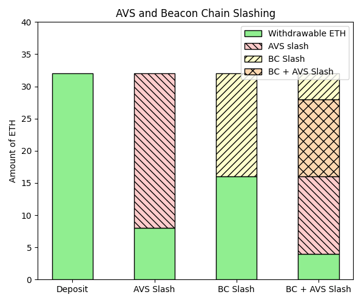

# Dual Slashing Edge Case

This document describes edge cases surrounding the slashing of a staker for native ETH by the beacon chain (BC) and an AVS. 

## Prior Reading

* [ELIP-002: Slashing via Unique Stake and Operator Sets](https://github.com/eigenfoundation/ELIPs/blob/main/ELIPs/ELIP-002.md)
* [ELIP-004: Slashing-Aware EigenPods](https://github.com/eigenfoundation/ELIPs/blob/main/ELIPs/ELIP-004.md)
* [Shares Accounting](./SharesAccounting.md)

## Scenario

Consider a staker, Alice who is in the following state:

1. Alice has verified a validator. `withdrawable: 32 ETH`
2. Alice's operator is slashed for 75%. `withdrawable: 8 ETH`
    

    
Calculation

    * `depositShares: 32` 
    * `maxMagnitude: 0.25`
    * `BCSF: 1`
    * `DSF: 1`
    * `withdrawable = 32 * 0.25 * 1 * 1 = 8 ETH`
    

3. Alice is slashed by 16 ETH on the beacon chain

## Restaking

We define restaking as **reusing staked ETH as security for AVSs. Thus, the same Native ETH that is securing the BC (beacon chain) can also be slashed by an AVS, with priority burning rights going to the BC.**

In the above scenario, let's say the Alice now proves a checkpoint.

4. A checkpoint of BC state is proven. `withdrawable: 4 ETH`
    

    
Calculation

    * `depositShares: 16`
    * `maxMagnitude: 0.25`
    * `BCSF: 1`
    * `DSF: 1`
    * `withdrawable = 16 * 0.25 * 1 * 1 = 4 ETH`
    

The checkpoint slash has devalued Alice's currently withdrawable assets by 50%. The AVS slashes from what's left due to the BC getting priority burning rights. Thus, AVSs must factor Native ETH (or an LST) being slashed by the beacon chain when designing their slashing conditions. The below diagram illustrates this behavior:

|  |
|:--:|
| *Diagram showing how AVS slashing is applied after Beacon Chain slashing, with BC having priority burning rights* |

Note that the portion that is marked as BC Slash and BC + AVS Slash has priority burning rights by the beacon chain. 12 ETH has been slashed "twice", but this is by design given our definition of restaking.

The behavior of BC and AVS slashings for Native ETH mimics the behavior of slashings for an LST in isolation (see below for an additional edge case). This ensures that Native ETH security is not disadvantaged compared to LST security. ELIP-004 explains this in [more detail](https://github.com/eigenfoundation/ELIPs/blob/main/ELIPs/ELIP-004.md#why-do-eigenpods-need-to-upgrade).

## Ordering of EigenPod Actions

**When an AVS slashes, its attributable slashed amount is between 0 and the originally slashed amount. The attributable slashed amount decreases in the event of BC slashes.** We see this behavior in the above example, where the 12 ETH that was attributed to the AVS is less than the original 24 ETH that was slashed. 

However, given the asynchronous nature of the EigenPod proof system, Alice may have a different number of withdrawable shares depending on the ordering of her actions. Note that even in this case, **assets are not overslashed**.

Let's start with our above scenario. 

Scenario A:

4. Alice verifies another validator. `withdrawable: 40 ETH`
    

    
Calculation

    * `depositShares: 64`
    * `maxMagnitude: 0.25`
    * `BCSF: 1`
    * `DSF = 40 / (32 + 32) / 0.25 = 2.5`
    * `withdrawable = 64 * 0.25 * 1 * 2.5 = 40 ETH`
    

5. Alice checkpoints all her pods. `withdrawable: 30 ETH`
    

    
Calculation

    * `depositShares: 64`
    * `maxMagnitude: 0.25`
    * `BCSF = 48 / 64 = 0.75`
    * `DSF: 2.5`
    * `withdrawable = 64 * 0.25 * 0.75 * 2.5 = 30 ETH`
    

In this scenario, 25% of Alice's currently proven assets are slashed. Similarly, the AVSs attributable slashed amount has been decreased by 25% (24 → 18 ETH). 

Scenario B:

4. Alice checkpoints her pod. `withdrawable: 4 ETH`
    

    
Calculation

    * `depositShares: 32`
    * `maxMagnitude: 0.25`
    * `BCSF = 16 / 32 = 0.5`
    * `DSF: 1`
    * `withdrawable = 32 * 0.25 * 0.5 * 1 = 4 ETH`
    

5. Alice verifies another validator. `withdrawable: 40 ETH`
    

    
Calculation

    * `depositShares: 64`
    * `maxMagnitude: 0.25`
    * `BCSF: 0.5`
    * `DSF = 36 / (32 + 32) / 0.125 = 4.5`
    * `withdrawable = 64 * 0.25 * 0.5 * 4.5 = 36 ETH`
    

In scenario B, 50% of Alice's currently proven assets are slashed, along with a commensurate decrease in the AVSs attributable slashed amount. In both cases Alice's withdrawable shares and the AVSs attributable slashed amount decrease by the same percentage.

We acknowledge this edge case. A benefit of this system is that stakers are incentivized to immediately prove BC slashed. Eigen Labs runs an off-chain process (EigenPod Health Checker) that monitors BC slashings and starts checkpoints as needed. Conversely, when Native-ETH burning is implemented, AVSs are incentivized to immediately exit stakers from the BC to recoup the maximum possible attributable slashed amount.  

This edge case also applies if Alice undelegates after being slashed on the beacon chain, and then continues along with Scenario A, exiting her position fully. See below for details:

Scenario

1. Alice verifies a validator: `withdrawable: 32 ETH`
2. Alice's operator is slashed for 100%. `withdrawable: 0 ETH` 
3. Alice is slashed by 16 ETH on the beacon chain. 
4. Alice undelegates. `depositShares = 0` 
5. Alice verifies another validator. `withdrawable: 32 ETH`. `depositShares: 32 ETH` 
6. Alice checkpoints her slash from step 3. `withdrawable: 24 ETH`
    - `restakedExecutionLayerGwei = 16`. This is the AVSs attributable slashed amount, but it increases once Alice completely exits. 
    - `BCSF= 48/64 = 0.75`
7. Alice completes her withdrawal as shares from undelegation. No affect since the operator's magnitude was 0
8. Alice exits her validator from step 5. `withdrawable: 24 ETH`
    - `restakedExecutionLayerGwei = 48` 
9. Alice queues a withdrawal for all shares. `scaledShares = 32` 
10. Alice completes her withdrawal. Alice receives 24 ETH
    - `scaledShares * slashingFactor = 32 * 0.75 = 24` 
11. There is 24 ETH locked up in the pod. 

