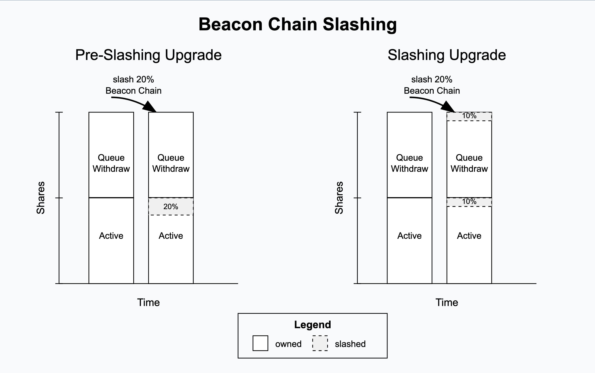

[elip-002]: https://github.com/eigenfoundation/ELIPs/blob/main/ELIPs/ELIP-002.md

# Shares Accounting

This document outlines the changes to the staker and operator Shares accounting resulting from the Slashing Upgrade. There are several introduced variables such as the _deposit scaling factor_ ($k_n$), _max magnitude_ ($m_n$), and _beacon chain slashing factor_ ($l_n$). How these interact with the operator and staker events like deposits, slashing, withdrawals will all be described below.

## Prior Reading

* [ELIP-002: Slashing via Unique Stake and Operator Sets](https://github.com/eigenfoundation/ELIPs/blob/main/ELIPs/ELIP-002.md)

## Pre-Slashing Upgrade

We'll look at the "shares" model as historically defined prior to the Slashing upgrade. Pre-slashing, stakers could receive shares for deposited assets, delegate those shares to operators, and withdraw those shares from the protocol. We can write this a bit more formally:

#### Staker Level

$s_n$ - The amount of shares in the storage of the `StrategyManager`/`EigenPodManager` at time n.

#### Operator Level

$op_n$ - The operator shares in the storage of the `DelegationManager` at time n which can also be rewritten as \
$op_n = \sum_{i=1}^{k} s_{n,i}$ where the operator has $k$ number of stakers delegated to them.


#### Staker Deposits 

Upon each staker deposit of amount $d_n$ at time $n$, the staker's shares and delegated operator's shares are updated as follows:

$$
 s_{n+1} = s_{n} + d_{n}
$$

$$
 op_{n+1} = op_{n} + d_{n}
$$

#### Staker Withdrawals 

Similarly for staker withdrawals, given an amount $w_n$ to withdraw at time $n$, the staker and operator's shares are decremented at the point of the withdrawal being queued:

$$
 s_{n+1} = s_{n} - w_{n}
$$

$$  
 op_{n+1} = op_{n} - w_{n}
$$

Later after the withdrawal delay has passed, the staker can complete their withdrawal to withdraw the full amount $w_n$ of shares. 

---

## Slashing Upgrade Changes

The remaining portions of this document will assume understanding of Allocations/Deallocations, Max Magnitudes, and Operator Sets as described in [ELIP-002][elip-002].

### Terminology

The word "shares" in EigenLayer has historically referred to the amount of shares a staker receives upon depositing assets through the `StrategyManager` or `EigenPodManager`. Outside of some conversion ratios in the `StrategyManager` to account for rebasing tokens, shares roughly correspond 1:1 with deposit amounts (i.e. 1e18 shares in the `beaconChainETHStrategy` corresponds to 1 ETH of assets). When delegating to an operator or queueing a withdrawal, the `DelegationManager` reads deposit shares from the `StrategyManager` or `EigenPodManager` to determine how many shares to delegate (or undelegate).

With the slashing release, there is a need to differentiate "classes" of shares.

**Deposit shares**: 

Formerly known as "shares," these are the same shares used before the slashing release. They continue to be managed by the `StrategyManager` and `EigenPodManager`, and roughly correspond 1:1 with deposited assets.

**Withdrawable shares**: 

When an operator is slashed, the slash is applied to their stakers _asynchronously_ (otherwise, slashing would require iterating over each of an operator's stakers; this is prohibitively expensive). 

The `DelegationManager` must find a common representation for the deposit shares of many stakers, each of which may have experienced different amounts of slashing depending on which operator they are delegated to, and when they delegated. This common representation is achieved in part through a value called the `depositScalingFactor`: a per-staker, per-strategy value that scales a staker's deposit shares as they deposit assets over time.

When a staker does just about anything (changing their delegated operator, queueing/completing a withdrawal, depositing new assets), the `DelegationManager` converts their _deposit shares_ to _withdrawable shares_ by applying the staker's `depositScalingFactor` and the current _slashing factor_ (a per-strategy scalar primarily derived from the amount of slashing an operator has received in the `AllocationManager`).

These _withdrawable shares_ are used to determine how many of a staker's deposit shares are actually able to be withdrawn from the protocol, as well as how many shares can be delegated to an operator. An individual staker's withdrawable shares are not reflected anywhere in storage; they are calculated on-demand.

**Operator shares**:

_Operator shares_ are derivative of _withdrawable shares_. When a staker delegates to an operator, they are delegating their _withdrawable shares_. Thus, an operator's _operator shares_ represent the sum of all of their stakers' _withdrawable shares_. Note that when a staker first delegates to an operator, this is a special case where _deposit shares_ == _withdrawable shares_. If the staker deposits additional assets later, this case will not hold if slashing was experienced in the interim.

---

Each of these definitions can also be applied to the pre-slashing share model, but with the caveat that for all stakers, _withdrawable shares equal deposit shares_. After the slashing upgrade this is not necessarily the case - a staker may not be able to withdraw the amount they deposited if their operator got slashed.

Now let's look at these updated definitions in detail and how the accounting math works with deposits, withdrawals, and slashing.

### Stored Variables

Note that these variables are all defined within the context of a single Strategy. Also note that the concept of "1" used within these equations is represented in the code by the constant `1 WAD`, or `1e18`.

#### Staker Level

$s_n$ - The amount of deposit shares in the storage of the `StrategyManager`/`EigenPodManager` at time $n$. In storage: `StrategyManager.stakerDepositShares` and `EigenPodManager.podOwnerDepositShares`

$k_n$ - The staker's “deposit scaling factor” at time $n$. This is initialized to 1. In storage: `DelegationManager.depositScalingFactor`

$l_n$ - The staker's "beacon chain slashing factor" at time $n$. This is initialized to 1. For any equations concerning non-native ETH strategies, this can be assumed to be 1. In storage: `EigenPodManager.beaconChainSlashingFactor`

#### Operator Level

$m_n$ - The operator magnitude at time n. This is initialized to 1.

$op_n$ - The operator shares in the storage of the `DelegationManager` at time n. In storage: `DelegationManager.operatorShares`

### Conceptual Variables

$a_n = s_n k_n l_n m_n$ - The withdrawable shares that the staker owns at time $n$. Read from view function `DelegationManager.getWithdrawableShares`

Note that $op_n = \sum_{i=1}^{k} a_{n,i}$.

---

### Deposits

For an amount of newly deposited shares $d_n$,

#### Staker Level

Conceptually, the staker's deposit shares and withdrawable shares both increase by the deposited amount $d_n$. Let's work out how this math impacts the deposit scaling factor $k_n$.

$$
a_{n+1} = a_n + d_n
$$

$$
s_{n+1} = s_n +d_n
$$

$$
l_{n+1} = l_n
$$

$$
m_{n+1} = m_n
$$

Expanding the $a_{n+1}$ calculation

$$
s_{n+1} k_{n+1} l_{n+1} m_{n+1} = s_n k_n l_n m_n + d_n
$$

Simplifying yields:

$$
k_{n+1} = \frac{s_n k_n l_n m_n + d_n}{s_{n+1} l_{n+1} m_{n+1}}=\frac{s_n k_n l_n m_n + d_n}{(s_n+d_n)l_nm_n}
$$

Updating the slashing factor is implemented in `SlashingLib.update`.

#### Operator Level

For the operator (if the staker is delegated), the delegated operator shares should increase by the exact amount
the staker just deposited. Therefore $op_n$ is updated as follows:

$$
op_{n+1} = op_n+d_n
$$

See implementation in:
* [`StrategyManager.depositIntoStrategy`](../../../src/contracts/core/StrategyManager.sol)
* [`EigenPodManager.recordBeaconChainETHBalanceUpdate`](../../../src/contracts/pods/EigenPodManager.sol)


---

### Delegation

Suppose we have an undelegated staker who decides to delegate to an operator.
We have the following properties that should be preserved.

#### Operator Level

Operator shares should be increased by the amount of delegatable shares the staker has, this is synonymous to their withdrawable shares $a_n$. Therefore,

$$
op_{n+1} = op_{n} + a_n
$$

$$
= op_{n} + s_n k_n l_n m_n
$$


#### Staker Level

withdrawable shares should remain unchanged

$$
a_{n+1} = a_n
$$

deposit shares should remain unchanged

$$
s_{n+1} = s_n
$$

beaconChainSlashingFactor and maxMagnitude should also remain unchanged. In this case, since the staker is not delegated, then their maxMagnitude should by default be equal to 1.

$$
l_{n+1} = l_n
$$

Now the question is what is the new depositScalingFactor equal to?

$$
a_{n+1} = a_n
$$

$$
=> s_{n+1} k_{n+1} l_{n+1} m_{n+1} = s_n k_n l_n m_n
$$

$$
=> s_{n} k_{n+1} l_{n} m_{n+1} = s_n k_n l_n m_n
$$

$$
=> k_{n+1} = \frac {k_n m_n} { m_{n+1} }
$$

Notice how the staker variables that update $k_{n+1}$ and $m_{n+1}$ do not affect previously queued withdrawals and shares received upon withdrawal completion. This is because the maxMagnitude that is looked up is dependent on the operator at the time of the queued withdrawal and the $k_n$ is effectively stored in the scaled shares field.

---

### Slashing

Given a proportion to slash $p_n = \frac {m_{n+1}}{m_n}$ ,

#### Operator Level

From a conceptual level, operator shares should be decreased by the proportion according to the following:

$$
 op_{n+1} = op_n p_n
$$

$$
 => op_{n+1} = op_n \frac {m_{n+1}} {m_n}
$$ 

Calculating the amount of $sharesToDecrement$:

$$
 sharesToDecrement = op_n - op_{n+1}
$$

$$
 = op_n - op_n \frac {m_{n+1}} {m_n}
$$

This calculation is performed in `SlashingLib.calcSlashedAmount`.

#### Staker Level

From the conceptual level, a staker's withdrawable shares should also be proportionally slashed so the following must be true:

$$
a_{n+1} = a_n p_n
$$

We don't want to update storage at the staker level during slashing as this would be computationally too expensive given an operator has a 1-many relationship with its delegated stakers. Therefore we want to prove $a_{n+1} = a_n p_n$ since withdrawable shares are slashed by $p_n$.

Given the following:

$l_{n+1} = l_n$ \
$k_{n+1} = k_n$ \
$s_{n+1} = s_n$

Expanding the $a_{n+1}$ equation:

$$
a_{n+1} = s_{n+1} k_{n+1} l_{n+1} m_{n+1}
$$

$$
=> s_{n} k_{n} l_{n} m_{n+1}
$$

We know that  $p_n = \frac {m_{n+1}}{m_n}$ =>  $m_{n+1} = m_n p_n$ 

$$
=>  s_n k_n l_n m_n p_n
$$

$$
=> a_n p_n
$$

This means that a staker's withdrawable shares are immediately affected upon their operator's maxMagnitude being decreased via slashing.

---

### Queue Withdrawal

Withdrawals are queued by inputting a `depositShares` amount $x_n <= s_n$. The actual withdrawable amount $w_n$ corresponding to $x_n$ is given by the following:

$$
 w_n = x_n k_n l_n m_n
$$

This conceptually makes sense as the amount being withdrawn $w_n$ is some amount <= $a_n$ which is the total withdrawable shares amount for the staker. 


#### Operator Level

When a staker queues a withdrawal, their operator's shares are reduced accordingly:

$$
 op_{n+1} = op_n - w_n
$$


#### Staker Level

$$
 a_{n+1} = a_n - w_n
$$

$$
 s_{n+1} = s_n - x_n
$$

This means that when queuing a withdrawal, the staker inputs a `depositShares` amount $x_n$. The `DelegationManager` calls the the `EigenPodManager`/`StrategyManager` to decrement their `depositShares` by this amount. Additionally, the `depositShares` are converted to a withdrawable amount $w_n$, which are decremented from the operator's shares.

We want to show that the total withdrawable shares for the staker are decreased accordingly such that $a_{n+1} = a_n - w_n$.

Given the following:

$l_{n+1} = l_n$ \
$k_{n+1} = k_n$ \
$s_{n+1} = s_n$

Expanding the $a_{n+1}$ equation:

$$
 a_{n+1} = s_{n+1} k_{n+1} l_{n+1} m_{n+1}
$$


$$
 =>  (s_{n} - x_n) k_{n+1} l_{n+1} m_{n+1}
$$

$$
 =  (s_{n} - x_n) k_n l_n m_n
$$

$$
 = s_n k_n l_n m_n - x_n k_n l_n m_n
$$

$$
 = a_n - w_n
$$

Note that when a withdrawal is queued, a `Withdrawal` struct is created with _scaled shares_ defined as $q_t = x_t k_t$ where $t$ is the time of the queuing. The reason we define and store scaled shares like this will be clearer in [Complete Withdrawal](#complete-withdrawal) below.

Additionally, we reset the depositScalingFactor when a user queues a withdrawal for all their shares, either through un/redelegation or directly. This is because the DSF at the time of withdrawal is stored in the scaled shares, and any "new" deposits or delegations by the staker should be considered as new. Note that withdrawal completion is treated as a kind of deposit when done as shares, which again will be clearer below.

See implementation in:
* `DelegationManager.queueWithdrawals`
* `SlashingLib.scaleForQueueWithdrawal`

<br>

---

### Complete Withdrawal

Now the staker completes a withdrawal $(q_t, t)$ which was queued at time $t$.

#### Operator Level

If the staker completes the withdrawal _as tokens_, any operator shares remain unchanged. The original operator's shares were decremented when the withdrawal was queued, and a new operator does not receive shares if the staker is withdrawing assets ("as tokens").

However, if the staker completes the withdrawal _as shares_, the shares are added to the staker's current operator according to the formulae in [Deposits](#deposits).

#### Staker Level

<!-- There are no storage updates for the staker outside of needing to calculate the shares to send the staker. -->

Recall from [Queue Withdrawal](#queue-withdrawal) that, when a withdrawal is queued, the `Withdrawal` struct stores _scaled shares_, defined as $q_t = x_t k_t$ where $x_t$ is the deposit share amount requested for withdrawal and $t$ is the time of the queuing.

And, given the formula for calculating withdrawable shares, the withdrawable shares given to the staker are $w_t$:

$$
w_t = q_t m_t l_t = x_t k_t l_t m_t
$$

However, the staker's shares in their withdrawal may have been slashed while the withdrawal was in the queue. Their operator may have been slashed by an AVS, or, if the strategy is the `beaconChainETHStrategy`, the staker's validators may have been slashed/penalized.

The amount of shares they actually receive is proportionally the following:

$$
    \frac{m_{t+delay} l_{now} }{m_t l_t}
$$

So the actual amount of shares withdrawn on completion is calculated to be:

$$
sharesWithdrawn = w_t (\frac{m_{t+delay} l_{now}}{m_t l_t} )
$$

$$ 
= x_t k_t l_t m_t (\frac{m_{t+delay} l_{now}}{m_t l_t} )
$$

$$ 
= x_t k_t m_{t+delay} l_{now}
$$

Now we know that $q_t = x_t k_t$ so we can substitute this value in here. 

$$ 
= q_t m_{t+delay} l_{now}
$$

From the above equations the known values we have during the time of queue withdrawal is $x_t k_t$ and we only know $m_{t+delay} l_{now}$ when the queued withdrawal is completable. This is why we store scaled shares as $q_t = x_t k_t$. The other term ($m_{t+delay} l_{now}$) is read during the completing transaction of the withdrawal.

Note: Reading $m_{t+delay}$ is performed by a historical Snapshot lookup of the max magnitude in the `AllocationManager` while $l_{now}$, the current beacon chain slashing factor, is done through the `EigenPodManager`. Recall that if the strategy in question is not the `beaconChainETHStrategy`, $l_{now}$ will default to "1".

The definition of scaled shares is used solely for handling withdrawals and accounting for slashing that may have occurred (both on EigenLayer and on the beacon chain) during the queue period.

See implementation in:
* `DelegationManager.completeQueuedWithdrawal`
* `SlashingLib.scaleForCompleteWithdrawal`

---

### Handling Beacon Chain Balance Decreases in EigenPods

Beacon chain balance decreases are handled differently after the slashing upgrade with the introduction of $l_n$ the beacon chain slashing factor. 

Prior to the upgrade, any decreases in an `EigenPod` balance for a staker as a result of completing a checkpoint immediately decrements from the staker's shares in the `EigenPodManager`. As an edge case, this meant that a staker's shares could go negative if, for example, they queued a withdrawal for all their shares and then completed a checkpoint on their `EigenPod` showing a balance decrease.

With the introduction of the beacon chain slashing factor, beacon chain balance decreases no longer result in a decrease in deposit shares. Instead, the staker's beacon chain slashing factor is decreased, allowing the system to realize that slash in any existing shares, as well as in any existing queued withdrawals. Effectively, this means that beacon chain slashing is accounted for similarly to EigenLayer-native slashing; _deposit shares remain the same, while withdrawable shares are reduced:_



Now let's consider how beacon chain balance decreases are handled when they represent a negative share delta for a staker's EigenPod.

#### Added Definitions

$welw$ is `withdrawableExecutionLayerGwei`. This is purely native ETH in the `EigenPod`, attributed via checkpoint and considered withdrawable by the pod (but without factoring in any EigenLayer-native slashing). `DelegationManager.getWithdrawableShares` can be called  to account for both EigenLayer and beacon chain slashing.

$before\text{ }start$ is time just before a checkpoint is started

<!-- $before\text{ }complete$ is time just before a checkpoint is completed -->

$after\text{ }complete$ is the time just after a checkpoint is completed 

As a checkpoint is completed, the total assets represented by the pod's native ETH and beacon chain balances _before_ and _after_ are given by:

$g_n = welw_{before\text{ }start}+\sum_i validator_i.balance_{before\text{ }start}$ \
$h_n = welw_{after\text{ }complete}+\sum_i validator_i.balance_{after\text{ }complete}$

#### Staker Level

Conceptually, the above logic specifies that we decrease the staker's withdrawable shares proportionally to the balance decrease:

$$
a_{n+1} = \frac{h_n}{g_n}a_n
$$

We implement this by setting

$$
l_{n+1}=\frac{h_n}{g_n}l_n
$$

Given:

$m_{n+1}=m_n$ (staker beacon chain slashing does not affect its operator's magnitude)
$s_{n+1} = s_n$ (no subtraction of deposit shares)
$k_{n+1}=k_n$

Then, plugging into the formula for withdrawable shares:

$$
a_{n+1} = s_{n+1}k_{n+1}l_{n+1}m_{n+1}
$$

$$
=s_nk_n\frac{h_n}{g_n}l_nm_n
$$

$$
= \frac{h_n}{g_n}a_n
$$

#### Operator Level

Now we want to update the operator's shares accordingly. At a conceptual level $op_{n+1}$ should be the following:

$$
 op_{n+1} = op_n - a_n + a_{n+1}
$$

We can simplify this further


$$
 =op_{n}-s_nk_nl_nm_n + s_nk_nl_{n+1}m_n
$$


$$
 = op_{n}+s_nk_nm_n(l_{n+1}-l_n)
$$

See implementation in:
* `EigenPodManager.recordBeaconChainETHBalanceUpdate`
* `DelegationManager.decreaseDelegatedShares`

---

## Implementation Details

In practice, we can’t actually have floating values so we will substitute all $k_n, l_n, m_n$ terms with $m_n$/1e18  $\frac{k_n}{1e18},\frac{l_n}{1e18} ,\frac{m_n}{1e18}$ respectively where $k_n, l_n, m_n$ are the values in storage, all initialized to 1e18. This allows us to conceptually have values in the range $[0,1]$.

We make use of OpenZeppelin's Math library and `mulDiv` for calculating $floor(\frac{x \cdot y}{denominator})$ with full precision. Sometimes for specific rounding edge cases, $ceiling(\frac{x \cdot y}{denominator})$ is explicitly used.

#### Multiplication and Division Operations
For all the equations in the above document, we substitute any product operations of $k_n, l_n, m_n$ with the `mulWad` pure function.
```solidity
function mulWad(uint256 x, uint256 y) internal pure returns (uint256) {
    return x.mulDiv(y, WAD);
}
```

Conversely, for any divisions of $k_n, l_n, m_n$ we use the `divWad` pure function.

```solidity
function divWad(uint256 x, uint256 y) internal pure returns (uint256) {
    return x.mulDiv(WAD, y);
}
```
