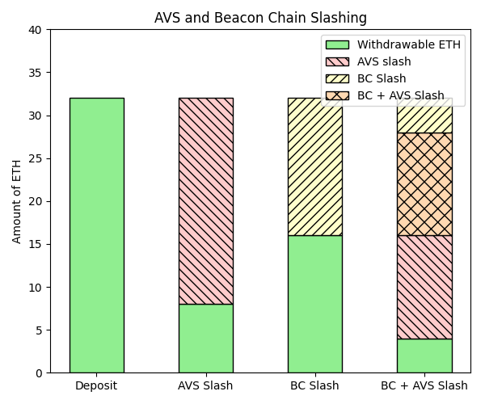

# Dual Slashing Edge Case

This document describes edge cases surrounding the slashing of a staker for native ETH by the beacon chain (BC) and an AVS. 

## Prior Reading

* [ELIP-002: Slashing via Unique Stake and Operator Sets](https://github.com/eigenfoundation/ELIPs/blob/main/ELIPs/ELIP-002.md)
* [ELIP-004: Slashing-Aware EigenPods](https://github.com/eigenfoundation/ELIPs/blob/main/ELIPs/ELIP-004.md)
* [Shares Accounting](./SharesAccounting.md)

## Scenario

Consider a staker, Alice who is in the following state:

1. Alice has verified a validator. `withdrawble: 32 ETH`
2. Alice's operator is slashed for 75%. `withdrawable: 8 ETH`
    a. `depositShares: 32` 
    b. `maxMagnitude: 0.25`
    c. `BCSF: 1`
    d. `DSF: 1`
    e. `withdrawable = 32 * 0.25 * 1 * 1 = 8 ETH`
3. Alice is slashed by 16 ETH on the beacon chain

## Restaking

We define restaking as **reusing staked ETH as security for AVSs. Thus, the same Native ETH that is securing the BC (beacon chain) can also be slashed by an AVS, with priority burning rights going to the BC.**

In the above scenario, let's say the Alice now proves a checkpoint.

4. A checkpoint of BC state is proven. `withdrawable: 4 ETH`
    a. `depositShares: 16`
    b. `maxMagnitude: 0.25`
    c. `BCSF: 1`
    d. `DSF: 1`
    e. `withdrawable = 16 * 0.25 * 1 * 1 = 4 ETH`

The checkpoint slash has devalued Alice's currently withdrawable assets by 50%. The AVS slashes from what's left due to the BC getting priority burning rights. Thus, AVSs must factor Native ETH (or an LST) being slashed by the beacon chain when designing their slashing conditions. The below diagram illustrates this behavior:

<figure>

<figcaption>Note that the portion that is marked as BC Slash and BC + AVS Slash has priority burning rights by the beacon chain. 12 ETH has been slashed “twice”, but this is by design given our definition of restaking. </figcaption>
</figure>

The behavior of BC and AVS slashings for Native ETH mimics the behavior of slashings for an LST in isolation (see below for an additional edge case). This ensures that Native ETH security is not disadvantaged compared to LST security. ELIP-004 explains this in [more detail](https://github.com/eigenfoundation/ELIPs/blob/main/ELIPs/ELIP-004.md#why-do-eigenpods-need-to-upgrade).

## Asynchronous Proofs

