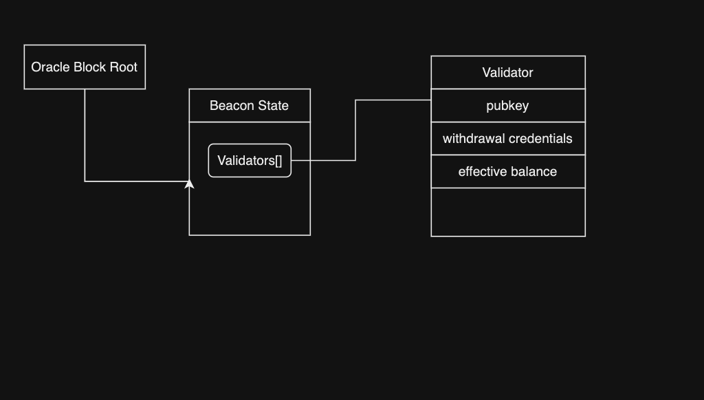
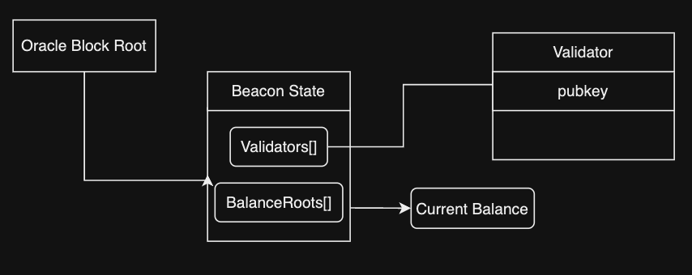
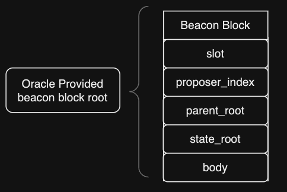
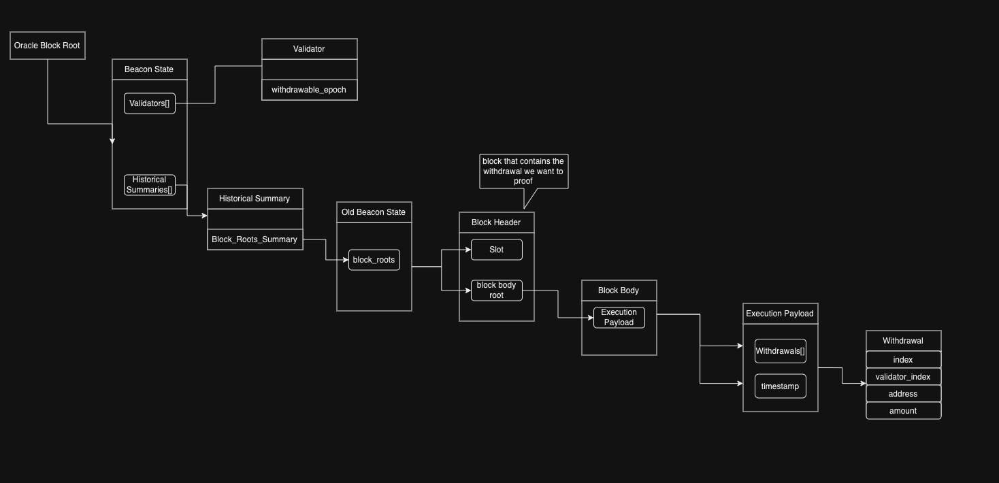

### Important Details About Proofs
#### How Indices Are Calculated
To prove a leaf in a merkle tree, you need several things - A proof, the leaf, the index of that leaf in a list of leaves and the root you are proving against.  The beacon state can be represented as several merkle trees stacked on top of each other, i.e., each leaf in the topmost tree is a root of another tree and so on.  This means that theoretically, proving most things about the beacon state involves making multiple proofs about each of the merkle trees that are stacked on top of each other.  

However there is a way we can combine these proofs into a single proof.  This is by concatenating each of the individual proofs into one large proof and proving that against the topmost root.  However, how do we calculate the "index" for this mega-proof?

The idea is simple, in a Merkle tree, every node has two children: left (or 0) and right (or 1). Starting from the root and moving down to a specific leaf, you can interpret each bit in the binary representation of the leaf's index as an instruction to traverse left (for 0) or right (for 1).  The length of a binary representation of an index is just `log(num_leaves) = height_of_the tree`.  

Taking an example, lets say I had one merkle tree A who's Nth leaf was the root of merkle tree B.  So to calculate the index for the Mth leaf in B against the root of A, the index would be:
`index_B_against_A = N << height_of_merkle_tree_B | M`.  


#### `BeaconChainProofs.verifyValidatorFields`

```solidity
 function verifyValidatorFields(
        bytes32 beaconStateRoot,
        bytes32[] calldata validatorFields,
        bytes calldata validatorFieldsProof,
        uint40 validatorIndex
    ) internal
```
Verifies the proof of a provided [validator container](https://github.com/ethereum/consensus-specs/blob/dev/specs/phase0/beacon-chain.md#validator) against the beacon state root.  This proof can be used to verify any field in the validator container.  Below is a diagram that illustrates exactly how the proof is structured relative to the [beacon state object](https://github.com/ethereum/consensus-specs/blob/dev/specs/capella/beacon-chain.md#beaconstate).  




#### `BeaconChainProofs.verifyValidatorBalance`

```solidity
function verifyValidatorBalance(
        bytes32 beaconStateRoot,
        bytes32 balanceRoot,
        bytes calldata validatorBalanceProof,
        uint40 validatorIndex
    ) internal
```
Verifies the proof of a [validator's](https://github.com/ethereum/consensus-specs/blob/dev/specs/phase0/beacon-chain.md#validator) balance against the beacon state root.  Validator's balances are stored separately in "balances" field of the [beacon state object](https://github.com/ethereum/consensus-specs/blob/dev/specs/capella/beacon-chain.md#beaconstate), with each entry corresponding to the appropriate validator, based on index.  Below is a diagram that illustrates exactly how the proof is structured relative to the [beacon state object](https://github.com/ethereum/consensus-specs/blob/dev/specs/capella/beacon-chain.md#beaconstate).  



#### `BeaconChainProofs.verifyStateRootAgainstLatestBlockRoot`

```solidity
function verifyStateRootAgainstLatestBlockRoot(
        bytes32 latestBlockRoot,
        bytes32 beaconStateRoot,
        bytes calldata stateRootProof
    ) internal
```
Verifies the proof of a beacon state root against the oracle provded block root.  Every [beacon block](https://github.com/ethereum/consensus-specs/blob/dev/specs/phase0/beacon-chain.md#beaconblock) in the beacon state contains the state root corresponding with that block.  Thus to prove anything against a state root, we must first prove the state root against the corresponding oracle block root.




#### `BeaconChainProofs.verifyWithdrawal`

```solidity
function verifyWithdrawal(
        bytes32 beaconStateRoot,
        bytes32[] calldata withdrawalFields,
        WithdrawalProof calldata withdrawalProof
    ) internal
```
Verifies a withdrawal, either [full or partial](https://eth2book.info/capella/part2/deposits-withdrawals/withdrawal-processing/#partial-and-full-withdrawals), of a validator.  There are a maximum of 16 withdrawals per block in the consensus layer.  This proof proves the inclusion of a given [withdrawal](https://github.com/ethereum/consensus-specs/blob/dev/specs/capella/beacon-chain.md#withdrawal) in the block for a given slot.  

One important note is that we use [`historical_summaries`](https://github.com/ethereum/consensus-specs/blob/dev/specs/capella/beacon-chain.md#historical-summaries-updates) to prove the blocks that contain withdrawals.  Each new [historical summary](https://github.com/ethereum/consensus-specs/blob/dev/specs/capella/beacon-chain.md#historicalsummary) is added every 8192 slots, i.e., if `slot % 8192 = 0`, then `slot.state_roots` and `slot.block_roots` are merkleized and are used to create the latest `historical_summaries` entry.  




