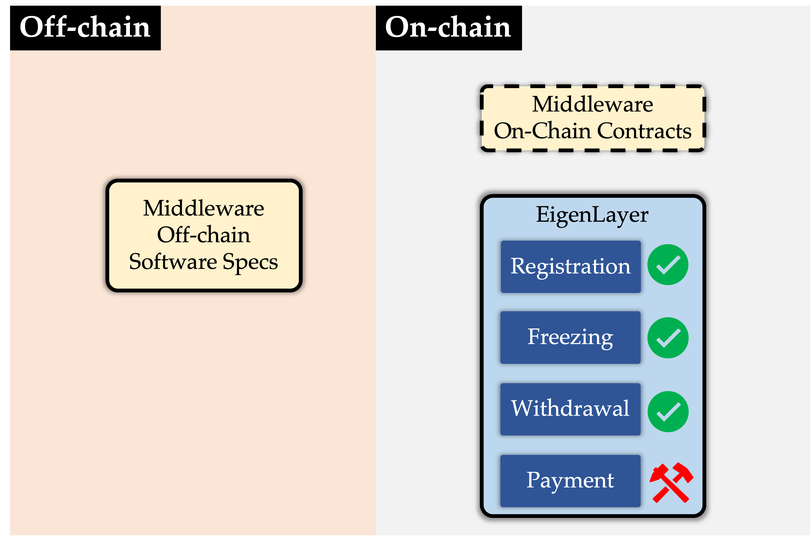
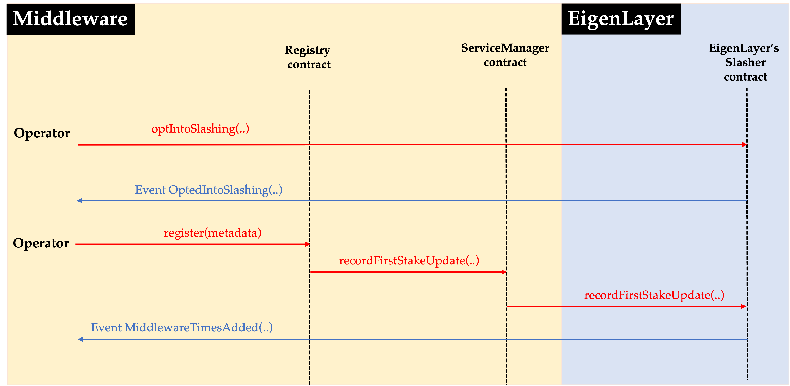
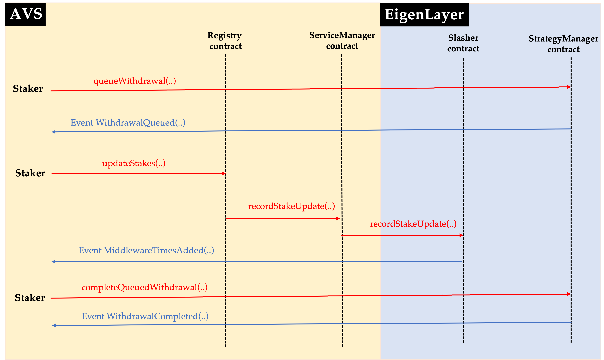

[middleware-folder-link]: https://github.com/Layr-Labs/eigenlayer-contracts/tree/master/src/contracts/middleware
[middleware-guide-link]: https://github.com/Layr-Labs/eigenlayer-contracts/blob/master/docs/AVS-Guide.md#quick-start-guide-to-build-avs-contracts
# Purpose
This document aims to describe and summarize how actively validated services (AVSs) building on EigenLayer interact with the core EigenLayer protocol. Currently, this doc explains how AVS developers can use the current** APIs for: 
- enabling operators to opt-in to the AVS,
- enabling operators to opt-out (withdraw stake) from the AVS,
- enabling operators to continuously update their commitments to middlewares, and
- enabling AVS to freeze operators for the purpose of slashing (the corresponding unfreeze actions are determined by the veto committee).

<b>
🚧 ** The Slasher contract is under active development and its interface is expected to change. We recommend writing slashing logic without integrating with the Slasher at this point in time. 🚧
</b>

We are currently in the process of implementing the API for rewards flow from AVSs to operators in EigenLayer. Details of this API will be added to this document in the near future.

The following figure summarizes the scope of this document: 

# Introduction
In designing EigenLayer, the EigenLabs team aspired to make minimal assumptions about the structure of AVSs built on top of it. If you are getting started looking at EigenLayer's codebase, the `Slasher.sol` contains most of the logic that actually mediates the interactions between EigenLayer and AVSs. Additionally, there is a general-purpose [/middleware/ folder][middleware-folder-link], which contains code that can be extended, used directly, or consulted as a reference in building an AVS on top of EigenLayer. Note that there will be a single, EigenLayer-owned, `Slasher.sol` contract, but all the `middleware` contracts are AVS-specific and need to be deployed separately by AVS teams.

## Important Terminology
- **Tasks** - A task in EigenLayer is the smallest unit of work that operators commit to perform when serving an AVS. These tasks may be associated with one or more slashing conditions applicable to the AVS. 
- **Strategies** - A strategy in EigenLayer is a contract that holds staker deposits, i.e. it controls one or more asset(s) that can be restaked. At launch EigenLayer will feature only simple strategies which may hold a single token. However, EigenLayer's strategy design is flexible and open, and in the future strategies could be deployed which implement more complex logic, including DeFi integrations. 
- **Quorums** - A quorum in EigenLayer is a grouping of specific kinds of stake who opt into an AVS while satisfying a particular trait. Examples of such traits could be stETH stakers or native stakers.  The purpose of having a quorum is that an AVS can customize the makeup of their security offering by choosing which kinds of stake/security they would like to utilize.  

# Key Design Considerations
1. *Decomposition into "Tasks"*:  
    EigenLayer assumes that an AVS manages tasks that are executed over time by a registered operator. Each task is associated with the time period during which the AVS's operators' stakes are placed "at stake", i.e. potentially subject to slashing. Examples of tasks could be:
    - Hosting and serving a “DataStore” in the context of EigenDA
    - Posting a state root of another blockchain for a bridge service

2. *Stake is "At Stake" on Tasks for a Finite Duration*:  
    It is assumed that every task (eventually) resolves. Each operator places their stake in EigenLayer “at stake” on the tasks that they perform. In order to “release” the stake (e.g. so the operator can withdraw their funds), these tasks need to eventually resolve. It is RECOMMENDED, but not required that a predefined duration is specified in the AVS contract for each task. As a guideline, the EigenLabs team believes that the duration of a task should be aligned with the longest reasonable duration that would be acceptable for an operator to keep funds “at stake”. An AVS builder should recognize that extending the duration of a task may impose significant negative externalities on the stakers of EigenLayer, and may disincentivize operators from opting-in to serving their application (so that they can attract more delegated stake).

3. *Services Slash Only Objectively Attributable Behavior*:  
    EigenLayer is built to support slashing as a result of an on-chain-checkable, objectively attributable action. An AVS SHOULD slash in EigenLayer only for such provable and attributable behavior. It is expected that operators will be very hesitant to opt-in to services that slash for other types of behavior, and other services may even choose to exclude operators who have opted-in to serving one or more AVSs with such “subjective slashing conditions”, as these slashing conditions present a significant challenge for risk modeling, and may be perceived as more dangerous in general. Some examples of on-chain-checkable, objectively attributable behavior: 
    - double-signing a block in Ethereum, but NOT inactivity leak; 
    - proofs-of-custody in EigenDA, but NOT a node ceasing to serve data; 
    - a node in a light-node-bridge AVS signing an invalid block from another chain.

4. *Single Point-of-Interaction for Services and EigenLayer*:  
    It is assumed that services have a single contract that coordinates the service’s communications sent to EigenLayer. This contract – referred to as the ServiceManager – informs EigenLayer of operator registration, updates, and deregistration, as well as signaling to EigenLayer when an operator should be slashed (frozen). An AVS has full control over how it splits the actual logic involved, but is expected to route all calls to EigenLayer through a single contract. While technically possible, an AVS SHOULD NOT use multiple contracts to interact with EigenLayer. An AVS architecture using multiple contracts to interact with EigenLayer will impose additional burden on stakers in EigenLayer when withdrawing stake.

## Integration with EigenLayer Contracts:
In this section, we will explain various API interfaces that EigenLayer provides which are essential for AVSs to integrate with EigenLayer. 

### *Operators Opting into AVS*
In order for any EigenLayer operator to be able to opt-in to an AVS, EigenLayer provides two interfaces: `optIntoSlashing(..)` and `recordFirstStakeUpdate(..)`. The sequential flow for opting into an AVS using these functions is as follows:
1. The operator first opts into slashing by calling  `Slasher.optIntoSlashing(..)`, where it has to specify the address of the AVS's ServiceManager contract in the argument. This step results in the operator giving permission to the AVS's ServiceManager contract to slash the operator via EigenLayer, if the operator is ever proven to have engaged in adversarial behavior while responding to the AVS's task. A successful call to  `Slasher.optIntoSlashing(..)` emits the `OptedIntoSlashing(..)` event.
2. Next, the operator needs to register with the AVS on chain via an AVS-specific registry contract (see [this][middleware-guide-link] section for examples). To integrate with EigenLayer, the AVS's Registry contract provides a registration endpoint that calls on the AVS's `ServiceManager.recordFirstStakeUpdate(..)` which in turn calls `Slasher.recordFirstStakeUpdate(..)`. On successful execution of this function call, the event `MiddlewareTimesAdded(..)` is emitted and the operator has to start serving the tasks from the AVS.

The following figure illustrates the above flow: 

### *Staker Delegation to an Operator: Which Opts-In to AVSs*

A staker does not restake into AVSs. A staker delegates to an operator and it is the operator that registers for new AVSs (with the staker having option to opt-out).

By delegating to a specific operator, stakers are implicitly agreeing to the AVSs they support. If desired, operators can pursue off-chain consensus with stakers prior to modifying their AVSs. Moreover, stakers will have a grace period to withdraw their delegation should an operator introduce an AVS that doesn't align with their objectives. This grace period is configurable on an operator level.

### *AVS Visibility and Control*

An AVS registration function can blacklist another AVS contract and during registration check that the operator is not registered in that AVS. Or it can check that the operator has not given permission to that AVS's service manager to slash it.

An AVS registry contract should define quorums (eth LST quorum, erc20 quorum, etc.) and allow (or prefer) operators having a minimum amount of restaked assets in each of those quorums to register with the AVS.

### *Recording Stake Updates*
EigenLayer is a dynamic system where stakers and operators are constantly adjusting amounts of stake delegated via the system. It is therefore imperative for an AVS to be aware of any changes to stake delegated to its operators. In order to facilitate this, EigenLayer offers the `Slasher.recordStakeUpdate(..)`.

Let us illustrate the usage of this facility with an example: A staker has delegated to an operator, who has opted-in to serving an AVS. Whenever the staker withdraws some or all of its stake from EigenLayer, this withdrawal affects all the AVSs uniformly that the staker's delegated operator is participating in. The series of steps for withdrawing stake is as follows:
 - The staker queues their withdrawal request with EigenLayer. The staker can place this request by calling  `StrategyManager.queueWithdrawal(..)`.
 - The operator, noticing an upcoming change in their delegated stake, notifies the AVS about this change. To do this, the operator triggers the AVS to call the `ServiceManager.recordStakeUpdate(..)` which in turn accesses `Slasher.recordStakeUpdate(..)`.  On successful execution of this call, the event `MiddlewareTimesAdded(..)` is emitted.
- The AVS provider now is aware of the change in stake, and the staker can eventually complete their withdrawal.  Refer [here](https://github.com/Layr-Labs/eigenlayer-contracts/blob/master/docs/EigenLayer-withdrawal-flow.md) for more details

The following figure illustrates the above flow: 

### *Deregistering from AVS*
In order for any EigenLayer operator to be able to de-register from an AVS, EigenLayer provides the interface `Slasher.recordLastStakeUpdateAndRevokeSlashingAbility(..)`. Essentially, in order for an operator to deregister from an AVS, the operator has to call `Slasher.recordLastStakeUpdateAndRevokeSlashingAbility(..)`  via the AVS's ServiceManager contract. It is important to note that the latest block number until which the operator is required to serve tasks for the service must be known by the service and included in the ServiceManager's call to `Slasher.recordLastStakeUpdateAndRevokeSlashingAbility`.

The following figure illustrates the above flow in which the operator calls the `deregister(..)` function in a sample Registry contract.

### *Slashing*
As mentioned above, EigenLayer is built to support slashing as a result of an on-chain-checkable, objectively attributable action. In order for an AVS to be able to slash an operator in an objective manner, the AVS needs to deploy a DisputeResolution contract which anyone can call to raise a challenge against an EigenLayer operator for its adversarial action. On successful challenge, the DisputeResolution contract calls `ServiceManager.freezeOperator(..)`; the ServiceManager in turn calls `Slasher.freezeOperator(..)` to freeze the operator in EigenLayer. EigenLayer's Slasher contract emits a `OperatorFrozen(..)` event whenever an operator is (successfully) frozen

The following figure illustrates the above flow: 

## Quick Start Guide to Build AVS Contracts:
The EigenLayer team has built a set of reusable and extensible contracts for use in AVSs built on top of EigenLayer. These are contained in the general-purpose [/middleware/ folder][middleware-folder-link], which contains code that can be extended, used directly, or consulted as a reference in building AVS on top of EigenLayer. There are several basic contracts that all AVS-specific contracts can be built on:
- The *VoteWeigherBase contract* tracks an operator’s “weight” in a given quorum, across all strategies that are associated with that quorum.  This contract also manages which strategies are in each quorum - this includes functionalities for both adding and removing strategies, as well as changing strategy weights.  
- The *RegistryBase contract* is a basic registry contract that can be used to track operators opted-into running an AVS.  Importantly, this base registry contract assumes a maximum of two quorums, where each quorum represents an aggregation of a certain type of stake. 

Furthermore, it’s expected that many AVSs will require a quorum of registered operators to sign on commitments.  To this end, the EigenLabs team has developed a set of contracts designed to optimize the cost of checking signatures through the use of a BLS aggregate signature scheme:
### BLSPublicKeyCompendium
This contract allows each Ethereum address to register a unique BLS public key; a single BLSPublicKeyCompendium contract can be shared amongst all AVSs using BLS signatures.  
### BLSRegistry
This contract builds upon lower-level (RegistryBase and VoteWeigherBase) contracts, to allow users of EigenLayer to register as operators for a single AVS. Each AVS’s BLSRegistry keeps a historic record of the Aggregate Public Key (APK) of all operators of the AVS. To allow proper encoding of data and aggregation of signatures while avoiding race conditions (e.g. from operators registering or deregistering, causing the current APK to change), each task defines a referenceBlockNumber, which may be briefly in the past. The BLSRegistry defines an optional whitelister role, which controls whether or not the whitelist is enabled and can edit the whitelist. If the whitelist is enabled, then only addresses that have been whitelisted may opt-in to serving the AVS.     

In addition, the BLSRegistry (technically the lower-level RegistryBase which the BLSRegistry inherits from) defines a “minimum stake” for the quorum(s). An operator can only register for the AVS if they meet the minimum requirement for at least one quorum. By default the `ServiceManager.owner()` has the ability to change the minimum stake requirement(s). Each BLSRegistry defines one or two “quorums”; each operator for the AVS may have stake in EigenLayer that falls into either (or both) quorum(s). Each quorum is essentially defined by two vectors: a vector of “Strategies” of interest (in practice this ends up being tokens of interest) and a vector of “weights” or “multipliers”, which define whether certain strategies are weighed more heavily than others within the quorum (e.g. if the AVS desires to give 2x power to a specific token over another token). In the contract code these vectors are condensed into a single array of `StrategyAndWeightingMultiplier` structs. The `ServiceManager.owner()` has the ability to edit these arrays at will.

### BLSSignatureChecker
When signatures have been aggregated, they can be submitted to the BLSSignatureChecker, an optimized contract designed expressly for verifying quorums of BLS signers. The caller MUST provide a small amount of data corresponding to the task to be confirmed, the aggregate signature itself, and a bit of data for each non-signer, that is, the caller MUST provide data for each operator registered for the service for whom their signature has not been aggregated. The BLSSignatureChecker ultimately returns both the total stake that was present at the specified block number (i.e. the sum of all operator’s stakes) and the total stake that signed; these amounts can then be checked against a quorum condition (e.g. requiring ⅔ stake to sign) before the task is ultimately confirmed.

