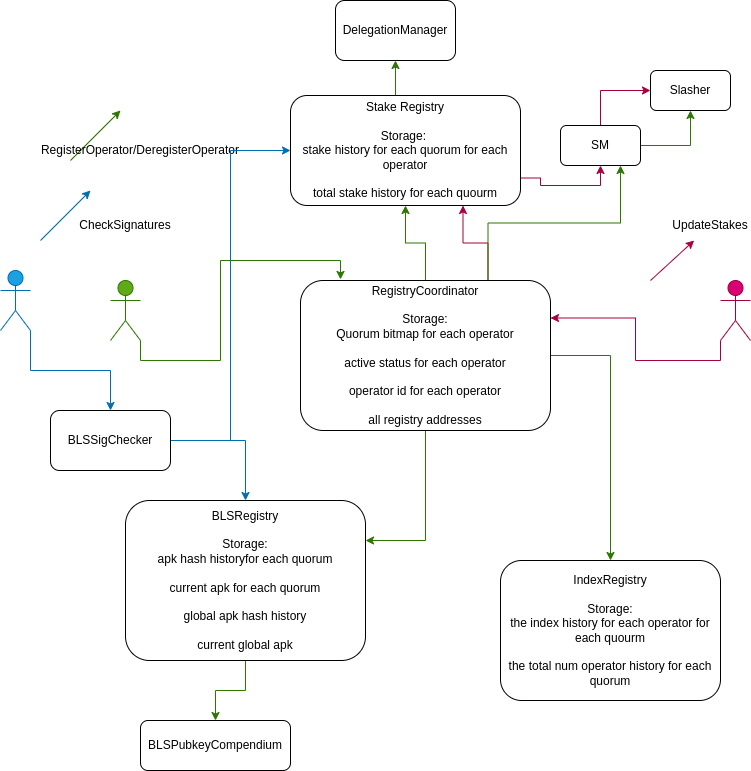

# AVS Smart Contract Architecture

## Introduction

EigenLayer AVSs are a new type of protocol that makes use of EigenLayer’s restaking primitive. AVSs are different from current chains and other smart contract protocols in that they are validated by EigenLayer operators. There are 3 specific types of conditions that AVSs implement in smart contracts onchain:
- Registration/Deregistration conditions: What requirements do operators need to have in order to register for/deregister from the AVS?
- Payment conditions: How much does a certain operator deserve to be paid for their validation? In what form are they paid?
- Slashing conditions: What behavior is not allowed of operators by the AVS? What exact mechanism should be used to determine this behavior onchain?

The EigenLabs dev team has been building out a smart contract architecture for AVSs to provide a base for AVSs to build on top of for their specific use case. They have been using it internally for the first AVS on EigenLayer: EigenDA.

## The Registry Coordinator and Registries 



There are two things that matter in terms of operators’ onchain interaction with AVS contracts:
- What qualities of operators need to be kept track of onchain? (e.g. stake, BLS pubkeys, etc.)
- Registration/Deregistration conditions

These two points have been addressed through the Registry Coordinator/Registry Architecture.

### Definitions

#### Quorums

Quorums are the different divisions of the operator set for an AVS. One can think of a quorum being defined by the token staked for that quorum, although [it is slightly more complicated than that](./StakeRegistry.md#definitions). One often wants to make trust assumptions on quorums, but wants many quorums for the same AVS. 

One example of the quorum concept is in EigenDA, where we have a single ETH quorum for which LSTs and native beacon chain ETH are accepted as stake and another quorum for each rollup that wants to stake their own token for security.

### RegistryCoordinator
The Registry Coordinator is a contract that is deployed by each AVS. It handles
- Keeping track of what quorums operators are a part of
- Handling operator churn (registration/deregistration)
- Communicating to registries
The current implementation of this contract is the [BLSRegistryCoordinatorWithIndices](./BLSRegistryCoordinatorWithIndices.md).


### Registries
The registries are contracts that keep track of the attributes of individual operators. For example, we have initially built the 
- [StakeRegistry](./StakeRegistry.md) which keeps track of the stakes of different operators for different quorums at different times
- [BLSPubkeyRegistry](./BLSPubkeyRegistry.md) which keeps track of the aggregate public key of different quorums at different times. Note that the AVS contracts use [BLS aggregate signatures](#bls-signature-checker) due to their favorable scalability to large operator sets. 
- [IndexRegistry](./IndexRegistry.md) which keeps track of an ordered list of the operators in each quorum at different times. (note that this behavior is likely only needed for EigenDA)
Registries are meant to be read from and indexed by offchain AVS actors (operators and AVS coordinators). 

A registry coordinator has 1 or more registries connected to it and all of them are called when an operator registers or deregisters. They are a plug and play system that are meant to be added to the RegistryCoordinator as needed. AVSs should create registries they need for their purpose.

### Note on (active) block ranges

Note that the registry contract implementations use lists structs similar to the following type (with the `Value` type altered):
```solidity
struct ValueUpdateA {
    Value value;
    uint32 updateBlockNumber; // when the value started being valid
    uint32 nextUpdateBlockNumber; // then the value stopped being valid or 0, if the value is still valid
}
```
or
```solidity
struct ValueUpdateB {
    Value value;
    uint32 toBlockNumber; // when the value expired
}
```

These structs, consecutively, are a history of the `Value` over certain ranges of blocks. These are (aptly) called block ranges, and *active* block ranges for the `ValueUpdate` that contains the current block number.

## TODO: Service Manager

## BLS Signature Checker

At the core of many AVSs on EigenLayer (almost all except those that affect Ethereum block production) is the verification of a quorum signature of an AVS's operator set on a certain message and slashing if some quality of that message and other state is true. The registry architecture is optimized for making this signature as cheap as possible to verify (it is still relatively expensive).

The current implementation of this contract is the [BLSSignatureChecker](./BLSSignatureChecker.md).

## Further reading

More detailed functional docs have been written on the AVS architecture implemented in the middleware contracts. The recommended order for reading the other docs in this folder is 

1. [BLSRegistryCoordinatorWithIndices](./BLSRegistryCoordinatorWithIndices.md)
2. [BLSPublicKeyCompendium](./BLSPublicKeyCompendium.md) and [BLSPublicKeyRegistry](./BLSPubkeyRegistry.md)
3. [StakeRegistry](./StakeRegistry.md)
4. [IndexRegistry](./IndexRegistry.md)
5. [BLSOperatorStateRetriever](./BLSOperatorStateRetriever.md)
6. [BLSSignatureChecker](./BLSSignatureChecker.md)


