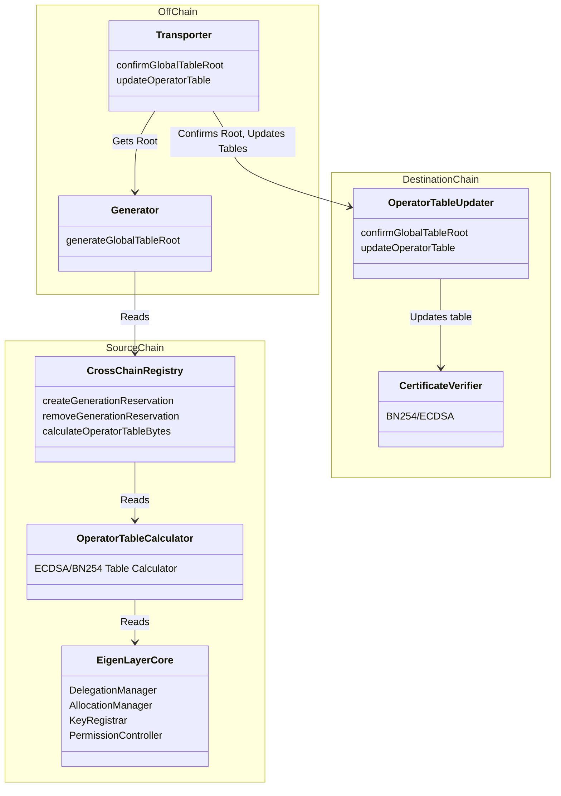
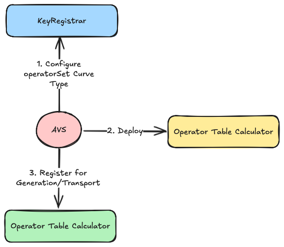

[elip-007]: https://github.com/eigenfoundation/ELIPs/blob/main/ELIPs/ELIP-007.md

## Multichain Docs

The EigenLayer multichain protocol enables *consumption* of EigenLayer L1 stake on supported destination chains. For launch the source chain is Ethereum Mainnet and the destination chains are Ethereum Mainnet and Base. 

This document provides an overview of system components, contracts, and user roles and is up-to-date with the latest [ELIP-007][elip-007]. Further documentation on the specific contracts can be found in this folder. 

#### Contents

* [System Diagram](#system-diagram)
* [Source Chain](#source-chain)
    * [`CrossChainRegistry`](#cross-chain-registry)
    * [`OperatorTableCalculator`](#operator-table-calculator)
* [Destination Chain](#destination-chain)
    * [`OperatorTableUpdater`](#operator-table-updater)
    * [`CertificateVerifier`](#certificate-verifier)
* [Roles and Actors](#roles-and-actors)
* [Common User Flows](#common-user-flows)
    * [Register for Generation/Transport](#registering-for-generationtransport)

### System Diagram

---

### Source Chain

Source chain contracts are deployed to Ethereum Mainnet. 

#### Cross Chain Registry

| File | Type | Proxy |
| -------- | -------- | -------- |
| [`CrossChainRegistry.sol`](../../src/contracts/multichain/CrossChainRegistry.sol) | Singleton | Transparent proxy |

This contract enables AVSs to register to have their stakes transported to supported destination chains:
* For a given operatorSet, an AVS denotes its operator table calculator and global configuration
* The offchain service calculates and transports each operator table from this contract at a pre-defined cadence

See full documentation in [`/source/CrossChainRegistry.md`](./source/CrossChainRegistry.md). 

#### Operator Table Calculator

| File | Type |
| -------- | -------- |
| [`BN254TableCalculatorBase.sol`](../../src/contracts/multichain/BN254TableCalculatorBase.sol) | Abstract Contract |
| [`ECDSATableCalculatorBase.sol`](../../src/contracts/multichain/BN254TableCalculatorBase.sol) | Abstract Contract |

These contracts are **deployed by an AVS** and define custom stake weights of operators in an operatorSet. The contracts are segmented by supported key-type (ECDSA & BN254). 

See full documentation in [`/source/OperatorTableCalculator.md`](./source/OperatorTableCalculator.md).

---

### Destination Chain

Destination chain contracts receive transported stake weights from an offchain service. The supported destination chains are Mainnet and Base. 

#### Operator Table Updater

| File | Type | Proxy |
| -------- | -------- | -------- |
| [`OperatorTableUpdater.sol`](../../src/contracts/multichain/OperatorTableUpdater.sol) | Singleton | Transparent proxy |

The `operatorTableUpdater` carries out two basic functions:
* Updates of the `globalTableRoot` via a signed certificate from the *off-chain* `generator`
* Updating operator tables via merkle proofs against the `globalTableRoot`

See full documentation in [`/destination/OperatorTableUpdater.md`](./destination/OperatorTableUpdater.md). 

#### Certificate Verifier

| File | Type | Proxy |
| -------- | -------- | -------- |
| [`BN254CertificateVerifier`](../../src/contracts/multichain/BN254CertificateVerifier.sol) | Singleton | Transparent proxy |
| [`ECDSACertificateVerifier`](../../src/contracts/multichain/ECDSACertificateVerifier.sol) | Singleton | Transparent proxy |

See full documentation in [`/destination/CertificateVerifier.md`](./destination/CertificateVerifier.md). 

---

### Roles and Actors

#### AVS

An AVS is an entity that uses delegated or slashable security from operators to execute off-chain tasks. Consumers of an AVS utilize the `CertificateVerifier` to validate tasks. 

*Flows:*
* AVSs **register** for transporting their stakes via the `CrossChainRegistry`
* AVSs **deploy** an OperatorTableCalculator for each of their operatorSets

#### Generator

The `Generator` is an EigenLabs-operated entity that calculates and signs off on the `GlobalTableRoot` for all operatorSets that have requested to be transported to a `DestinationChain`. For the pilot program, there is no stake backing the `Generator` and it is not slashable. 

*Offchain Flows:*
* The generator **calculates** and **signs** the `GlobalTableRoot`

#### Transporter

The `Transporter` serves two purposes: 
* **Transport** the `GlobalTableRoot` to all destination chains
* **Transport** operator tables to all destination chains

Note: The Transport of the `GlobalTableRoot` and Operator Tables is *permissionless*. Any entity can transport the `GlobalTableRoot` with a valid certificate from the `Generator`. In addition, any entity can update the table with a valid merkle proof. See the [sidecar](https://github.com/Layr-Labs/sidecar) for how to run a transporter. 

---

### Common User Flows

#### Registering for Generation/Transport

Registering for generation/transport is done by the AVS. The AVS *MUST* set the `KeyType` in the `KeyRegistrar`, even if it is not using the `KeyRegistrar` for storing operator keys. 

