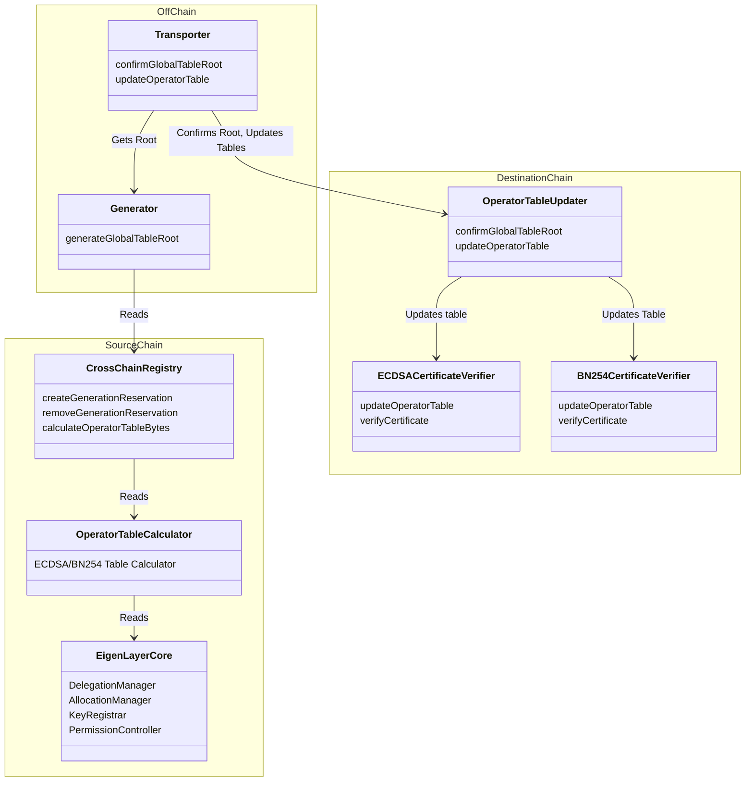

[elip-007]: https://github.com/eigenfoundation/ELIPs/blob/main/ELIPs/ELIP-007.md

## Multichain Docs

The EigenLayer multichain protocol enables *consumption* of EigenLayer L1 stake on supported destination chains.  This document provides an overview of system components, contracts, and user roles and is up-to-date with the latest [ELIP-007][elip-007]. Further documentation on the specific contracts can be found in this folder. 

#### Contents

* [System Diagram](#system-diagram)

### System Diagram

### System Contents

#### Cross Chain Registry

#### 