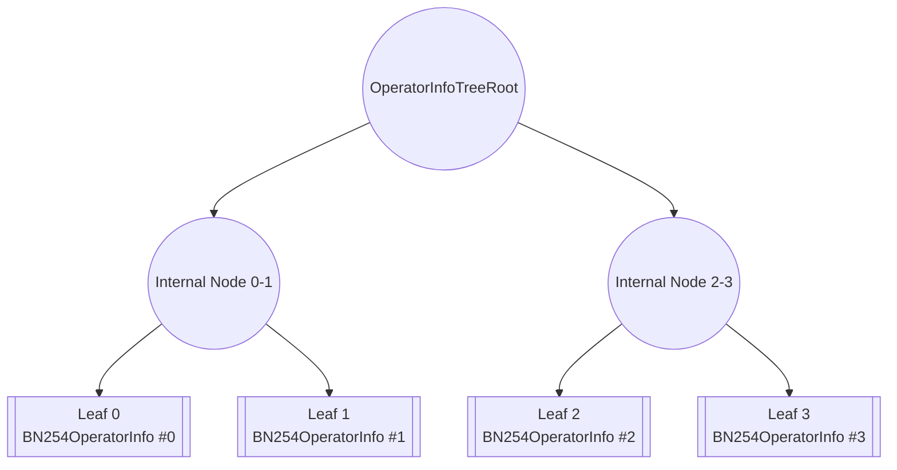
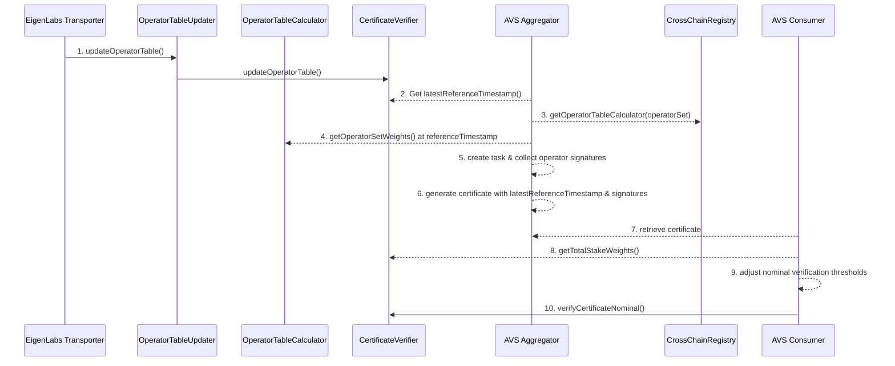

## CertificateVerifier

| File | Type | Proxy |
| -------- | -------- | -------- |
| [`ECDSACertificateVerifier.sol`](../../../src/contracts/multichain/ECDSACertificateVerifier.sol) | Singleton | Transparent proxy |
| [`BN254CertificateVerifier.sol`](../../../src/contracts/multichain/BN254CertificateVerifier.sol) | Singleton | Transparent proxy |
| [`IBaseCertificateVerifier.sol`](../../../src/contracts/interfaces/IBaseCertificateVerifier.sol) | Base interface for all verifiers | |

Libraries and Mixins:

| File | Used By | Notes |
| -------- | -------- | -------- |
| [`ECDSA.sol`](https://github.com/OpenZeppelin/openzeppelin-contracts/blob/v4.9.0/contracts/utils/cryptography/ECDSA.sol) | ECDSACertificateVerifier | ECDSA signature recovery |
| [`SignatureUtilsMixin.sol`](../../../src/contracts/mixins/SignatureUtilsMixin.sol) | ECDSACertificateVerifier | EIP-712 and signature validation |
| [`BN254.sol`](../../../src/contracts/libraries/BN254.sol) | BN254CertificateVerifier | BN254CertificateVerifier |
| [`BN254SignatureVerifier.sol`](../../../src/contracts/libraries/BN254SignatureVerifier.sol) | BN254CertificateVerifier | BLS signature verification |
| [`Merkle.sol`](../../../src/contracts/libraries/Merkle.sol) | BN254CertificateVerifier | Merkle proof verification |
| [`SemVerMixin.sol`](../../../src/contracts/mixins/SemVerMixin.sol) | BN254CertificateVerifier | Semantic versioning |
| [`OperatorSetLib.sol`](../../../src/contracts/libraries/OperatorSetLib.sol) | Both | Operator set key encoding |

---

## Overview

The CertificateVerifier contracts are responsible for verifying certificates from an offchain task, on-chain. The operatorSet tables are configured by the [`OperatorTableUpdater`](./OperatorTableUpdater.md) and updated in the `CertificateVerifier` by an offchain process. These contracts support two signature schemes: ECDSA for individual signatures and BN254 for aggregated signatures.

Certificates can be created at any time, but must contain a `referenceTimestamp`, which informs the contract of which operator table for the `operatorSet` to use. Both certificate verifiers implement staleness checks based on a `maxStalenessPeriod` to ensure certificates are not verified against outdated operator information. 

**Note: Setting a max staleness period to 0 enables certificates to be confirmed against any `referenceTimestamp`. In addition, setting a `maxStalenessPeriod` that is greater than 0 and less than the frequency of table updates (daily on testnet, weekly on mainnet) is impossible due bounds enfroced by the [`CrossChainRegistry`](../source/CrossChainRegistry.md#parameterization).** See the [staleness period](#staleness-period) in the appendix for some examples. 

---

## ECDSACertificateVerifier

The `ECDSACertificateVerifier` implements ECDSA signature verification where each operator signs individually. For a given operatorSet, it stores the list of all operators and their corresponding weights. 


### Update Table
The `operatorTableUpdater` will update the via a merkle proof of the table against the `globalTableRoot`. See [`operatorTableUpdater`](./OperatorTableUpdater.md#updateoperatortable) for more information. 

#### `updateOperatorTable`

```solidity
/**
 * @notice A struct that contains information about a single operator for an ECDSA signing key
 * @param pubkey The address of the signing ECDSA key of the operator and not the operator address itself.
 * @param weights The weights of the operator for a single operatorSet
 *
 * @dev The `weights` array can be defined as a list of arbitrary stake types. For example,
 *      it can be [slashable_stake, delegated_stake, strategy_i_stake, ...]. Each stake type is an element in the array.
 *      The stake weights are defined by the operatorSet's `OperatorTableCalculator` and transported by the multichain protocol
 * 
 * @dev An AVS defines the `weights` array based on the criteria it wants to use for distribution and verification of off-chain tasks. 
 *      For example, a slashable that wants to distribute some tasks based on `EIGEN` stake and other based on `stETH` stake would 
 *      use [slashable_EIGEN_stake, slashable_stETH_stake] as the `weights` array
 *
 * @dev It is up to the AVS to define the `weights` array, which is used by the `IECDSACertificateVerifier` to verify Certificates
 *
 * @dev For each operator, the `weights` array should be the same length and composition, otherwise verification issues can arise
 */
struct ECDSAOperatorInfo {
    address pubkey;
    uint256[] weights;
}

/**
 * @notice updates the operatorSet with the operator table (i.e. stake weights) and its configuration
 * @param operatorSet the operatorSet to update the operator table for
 * @param referenceTimestamp the timestamp at which the operatorInfos (i.e. operator table) was sourced
 * @param operatorInfos the operatorInfos to update the operator table with.
 *        See `IOperatorTableCalculator.ECDSAOperatorInfo` for more details    
 * @param operatorSetConfig the configuration of the operatorSet, which includes the owner and max staleness period
 * @dev This function can only be called by the `OperatorTableUpdater` contract, which is itself permissionless to call
 * @dev The `referenceTimestamp` must correspond to a reference timestamp for a globalTableRoot stored in the `OperatorTableUpdater`
 *      In addition, it must be greater than the latest reference timestamp for the given operatorSet
 * @dev Reverts for:
 *      - OnlyTableUpdater: Caller is not the operatorTableUpdater
 *      - TableUpdateStale: The referenceTimestamp is not greater than the latest reference timestamp
 * @dev Emits the following events:
 *      - TableUpdated: When the operator table is successfully updated
 */
function updateOperatorTable(
    OperatorSet calldata operatorSet,
    uint32 referenceTimestamp,
    ECDSAOperatorInfo[] calldata operatorInfos,
    OperatorSetConfig calldata operatorSetConfig
) external;
```

Updates the operator table with new `operatorInfos` and `operatorSetConfig`. All operators and weights are written to storage. 

Note that updating operator tables for a `referenceTimestamp` that is less than the latest reference timestamp is not possible. Thus, operator tables cannot be updated retroactively. AVS developers should keep this in mind when building their off-chain signature aggregation logic. 

*Effects*:
* Stores the number of operators at `_numOperators[operatorSetKey][referenceTimestamp]`
* Stores each operator info at `_operatorInfos[operatorSetKey][referenceTimestamp][index]`
* Updates `_latestReferenceTimestamps[operatorSetKey]` to `referenceTimestamp`
* Updates `_operatorSetOwners[operatorSetKey]` to `operatorSetConfig.owner`
* Updates `_maxStalenessPeriods[operatorSetKey]` to `operatorSetConfig.maxStalenessPeriod`
* Updates `_isReferenceTimestampSet[operatorSetKey][referenceTimestamp]` to `true`
* Emits a `TableUpdated` event

*Requirements*:
* Caller MUST be the `operatorTableUpdater`
* The `referenceTimestamp` MUST be greater than the latest reference timestamp


### Certificate Verification
The contract supports 3 verification patterns:
1. [Basic verification](#verifycertificate) - Returns the signed stakes for further processing
2. [Proportional verification](#verifycertificateproportion) - Verifies against percentage-based thresholds
3. [Nominal verification](#verifycertificatenominal) - Verifies against absolute stake thresholds

For the `msgHash`, it is up to the off-chain AVS software to add relevant metadata to ensure that the `Certificate` cannot be reused across the same tasks. For example, an AVS can include a UID on the message hash for every task it creates. 

#### `verifyCertificate`

```solidity
/**
 * @notice A Certificate used to verify a set of ECDSA signatures
 * @param referenceTimestamp a reference timestamp that corresponds to a timestamp at which an operator table was updated for the operatorSet.
 * @param messageHash the hash of the message that was signed by the operators. 
 * The messageHash should be calculated using `calculateCertificateDigest`
 * @param sig the concatenated signature of each signing operator, in ascending order of signer address
 * @dev ECDSA certificates DO NOT support smart contract signatures
 */
struct ECDSACertificate {
    uint32 referenceTimestamp;
    bytes32 messageHash;
    bytes sig;
}

/**
 * @notice verifies a certificate against the operator table for a given reference timestamp
 * @param operatorSet the operatorSet that the certificate is for
 * @param cert a certificate
 * @return totalSignedStakeWeights total stake weight that signed the certificate for each stake type. Each
 * index corresponds to a stake type in the `weights` array in the `ECDSAOperatorInfo` struct
 * @return signers array of addresses that signed the certificate
 * @dev This function DOES NOT support smart contact signatures
 * @dev The `referenceTimestamp` in the `ECDSACertificate` is used to determine the operator table to use for the verification
 * @dev AVS' are responsible for managing potential race conditions when certificates are signed close to operator table updates. Some examples include:
 *      a. An in-flight certificate for a past reference timestamp and an operator table update for a newer reference timestamp. The AVS should decide whether it
 *         wants to only confirm tasks against the *latest* certificate
 *      b. An in-flight certificate against a stake table with a majority-stake operator that has been slashed or removed from the operatorSet
 * @dev Reverts for:
 *      - CertificateStale: The certificate's referenceTimestamp is too stale with respect to the maxStalenessPeriod of the operatorSet
 *      - ReferenceTimestampDoesNotExist: The root at referenceTimestamp does not exist
 *      - RootDisabled: The root at referenceTimestamp is not valid
 *      - InvalidSignatureLength: Signatures are not proper length
 *      - InvalidSignature: Each signature is not valid
 *      - SignersNotOrdered: Signatures are not ordered by signer address ascending
 *      - ReferenceTimestampDoesNotExist: The operatorSet has not been updated for the referenceTimestamp
 *      - OperatorCountZero: There are zero operators for the referenceTimestamp
 *      - VerificationFailed: Any signer is not a registered operator
 */
function verifyCertificate(
    OperatorSet calldata operatorSet,
    ECDSACertificate memory cert
) external returns (uint256[] memory signedStakes, address[] memory signers);
```

Verifies an ECDSA certificate by checking individual signatures from operators. Each individual operator must sign off on a `signableDigest` given by [`calculateCertificateDigest`](#calculatecertificatedigest). **The `referenceTimestamp` of the certificate is the time at which the operator table for a given certificate was sourced. It is not the timestamp at which the certificate was created.**

*Process*:
* Validates the certificate timestamp against staleness requirements
* Computes the EIP-712 digest for the certificate
* Parses concatenated signatures and recovers signers
* For each recovered signer:
  * Verifies the signer is a registered operator
  * Adds the operator's weights to signed stakes
* Returns the total signed stakes

*Requirements*:
* The certificate MUST NOT be stale (based on `maxStalenessPeriod`)
* The root at `referenceTimestamp` MUST exist
* The root at `referenceTimestamp` MUST be valid
* Signatures MUST be proper length
* Each signature MUST be valid
* Signatures MUST be ordered by signer address (ascending)
* The operatorSet MUST be updated for the `referenceTimestamp`
* There must be a nonzero number of operators for the `referenceTimestamp`
* All signers MUST be registered operators

#### `verifyCertificateProportion`

```solidity
/**
 * @notice verifies a certificate and makes sure that the signed stakes meet
 * provided portions of the total stake weight on the AVS
 * @param operatorSet the operatorSet to verify the certificate for
 * @param cert a certificate
 * @param totalStakeProportionThresholds the proportion, in BPS, of total stake weight that
 * the signed stake of the certificate should meet. Each index corresponds to
 * a stake type in the `weights` array in the `ECDSAOperatorInfo`
 * @return Whether or not the certificate is valid and meets thresholds
 * @return signers array of addresses that signed the certificate
 * @dev This function DOES NOT support smart contact signatures
 * @dev The `referenceTimestamp` in the `ECDSACertificate` is used to determine the operator table to use for the verification
 * @dev AVS' are responsible for managing potential race conditions when certificates are signed close to operator table updates. Some examples include:
 *      a. An in-flight certificate for a past reference timestamp and an operator table update for a newer reference timestamp. The AVS should decide whether it
 *         wants to only confirm tasks against the *latest* certificate
 *      b. An in-flight certificate against a stake table with a majority-stake operator that has been slashed or removed from the operatorSet
 * @dev Reverts for:
 *      - All requirements from verifyCertificate
 *      - ArrayLengthMismatch: signedStakes.length does not equal totalStakeProportionThresholds.length
 */
function verifyCertificateProportion(
    OperatorSet calldata operatorSet,
    ECDSACertificate memory cert,
    uint16[] memory totalStakeProportionThresholds
) external view returns (bool, address[] memory signers);
```

Verifies that a certificate meets specified proportion thresholds as a percentage of total stake for each stake type.

*Process*:
* Performs the same verification as `verifyCertificate` to get signed stakes
* Calculates the total stakes for the operator set
* Compares signed stakes against proportion thresholds
* Returns true only if all thresholds are met

*Requirements*:
* All requirements from `verifyCertificate`
* `signedStakes.length` MUST equal `totalStakeProportionThresholds.length`

#### `verifyCertificateNominal`

```solidity
/**
 * @notice verifies a certificate and makes sure that the signed stakes meet
 * provided nominal stake thresholds
 * @param operatorSet the operatorSet that the certificate is for
 * @param cert a certificate
 * @param totalStakeNominalThresholds the nominal amount of total stake weight that
 * the signed stake of the certificate should meet. Each index corresponds to
 * a stake type in the `weights` array in the `ECDSAOperatorInfo`
 * @return Whether or not the certificate is valid and meets thresholds
 * @return signers array of addresses that signed the certificate
 * @dev This function DOES NOT support smart contact signatures
 * @dev The `referenceTimestamp` in the `ECDSACertificate` is used to determine the operator table to use for the verification
 * @dev AVS' are responsible for managing potential race conditions when certificates are signed close to operator table updates. Some examples include:
 *      a. An in-flight certificate for a past reference timestamp and an operator table update for a newer reference timestamp. The AVS should decide whether it
 *         wants to only confirm tasks against the *latest* certificate
 *      b. An in-flight certificate against a stake table with a majority-stake operator that has been slashed or removed from the operatorSet
 * @dev Reverts for:
 *      - All requirements from verifyCertificate
 *      - ArrayLengthMismatch: signedStakes.length does not equal totalStakeNominalThresholds.length
 */
function verifyCertificateNominal(
    OperatorSet calldata operatorSet,
    ECDSACertificate memory cert,
    uint256[] memory totalStakeNominalThresholds
) external returns (bool, address[] memory signers);
```

Verifies that a certificate meets specified nominal (absolute) stake thresholds for each stake type.

*Process*:
* Performs the same verification as `verifyCertificate` to get signed stakes
* Compares signed stakes against absolute thresholds
* Returns true only if all thresholds are met

*Requirements*:
* All requirements from `verifyCertificate`
* `signedStakes.length` MUST equal `totalStakeNominalThresholds.length`

### Utility Functions

#### `domainSeparator`

```solidity
/**
 * @notice Override domainSeparator to not include chainId
 * @return The domain separator hash without chainId
 * @dev This function overrides the base domainSeparator to not include chainId to replay
 *      certificates across multiple destination chains
 */
function domainSeparator() external view returns (bytes32);
```

The ECDSA Certificate Verifier uses a modified domain separator that intentionally **excludes the chainId**. This design choice enables cross-chain certificate reuse. 


#### `calculateCertificateDigest`

```solidity
/**
 * @notice Calculate the EIP-712 digest for a certificate, returning the hash of the digest
 * @param referenceTimestamp The reference timestamp
 * @param messageHash The message hash of the task
 * @return The EIP-712 digest
 * @dev EIP-712 is a standard ECDSA signature verification framework. See https://eips.ethereum.org/EIPS/eip-712 for more details
 * @dev This function is public to allow offchain tools to calculate the same digest
 * @dev Note: This does not support smart contract based signatures for multichain
 * @dev This is a chain-agnostic digest, so it can be used to verify certificates across
 *      multiple destination chains
 */
function calculateCertificateDigest(
    uint32 referenceTimestamp,
    bytes32 messageHash
) external view returns (bytes32);
```

Computes the EIP-712 structured data hash for ECDSA certificate signing. This digest is what operators must sign to create a valid certificate.

**Multichain Design**: This function creates a chain-agnostic digest by using a domain separator that doesn't include the chainId. This allows the same certificate to be verified across multiple destination chains without requiring separate signatures.

*Returns*:
* EIP-712 digest using domain separator (without chainId) and certificate type hash

---

## BN254CertificateVerifier

The `BN254CertificateVerifier` implements BN254 signature verification. BN254 signatures enable signature aggreagtion for larger operatorSets. It uses merkle proofs to cache nonsigners to for efficient stake table transport.

### Update Table
The `operatorTableUpdater` will update the table via a merkle proof against the `globalTableRoot`. Unlike ECDSA which stores individual operators, BN254 stores aggregated data and a merkle root of operator stakes.

#### `updateOperatorTable`

```solidity
/**
 * @notice A struct that contains information about a single operator for a given BN254 operatorSet
 * @param pubkey The G1 public key of the operator
 * @param weights The weights of the operator for a single operatorSet
 *
 * @dev The `weights` array is as a list of arbitrary stake types. For example,
 *      it can be [slashable_stake, delegated_stake, strategy_i_stake, ...]. Each stake type is an element in the array.
 *      The stake weights are defined by the operatorSet's `OperatorTableCalculator` and transported by the multichain protocol
 * 
 * @dev An AVS defines the `weights` array based on the criteria it wants to use for distribution and verification of off-chain tasks. 
 *      For example, a slashable that wants to distribute some tasks based on `EIGEN` stake and other based on `stETH` stake would 
 *      use [slashable_EIGEN_stake, slashable_stETH_stake] as the `weights` array
 *
 * @dev It is up to the AVS to define the `weights` array, which is used by the `IBN254CertificateVerifier` to verify Certificates
 *
 * @dev For each operator, the `weights` array should be the same length and composition, otherwise verification issues can arise
 */
struct BN254OperatorInfo {
    BN254.G1Point pubkey;
    uint256[] weights;
}

/**
 * @notice A struct that contains information about all operators for a given BN254OperatorSet
 * @param operatorInfoTreeRoot The root of the operatorInfo tree
 * @param numOperators The number of operators in the operatorSet
 * @param aggregatePubkey The aggregate G1 public key of the operators in the operatorSet
 * @param totalWeights The total stake weights of the operators in the operatorSet
 *
 * @dev The operatorInfoTreeRoot is the root of a merkle tree that contains the operatorInfos for each operator in the operatorSet.
 *      It is calculated on-chain by the `BN254TableCalculator` and used by the `IBN254CertificateVerifier` to verify stakes against the non-signing operators
 *
 * @dev Retrieval of the `aggregatePubKey` depends on maintaining a key registry contract, see `KeyRegistrar` for an example implementation
 *
 * @dev The `totalWeights` array should be the same length and composition as each individual `weights` array in `BN254OperatorInfo`.
 *      For example, if there are 3 operators with individual weights arrays with composition of  [delegated_stake, slashable_stake]
 *      of [100, 200], [300, 400], and [500, 600], the `totalWeights` array would be [900, 1200]
 */
struct BN254OperatorSetInfo {
    bytes32 operatorInfoTreeRoot;
    uint256 numOperators;
    BN254.G1Point aggregatePubkey;
    uint256[] totalWeights;
}

/**
 * @notice updates the operatorSet with the operator table (i.e. stake weights) and its configuration
 * @param operatorSet the operatorSet to update the operator table for
 * @param referenceTimestamp the timestamp at which the operatorSetInfo (i.e. operator table) was sourced
 * @param operatorSetInfo the operator table for this operatorSet. This includes the `totalWeights`, `operatorInfoTreeRoot`, `aggregatePubkey`, and `numOperators`.
 *        See `IOperatorTableCalculator.BN254OperatorSetInfo` for more details
 * @param operatorSetConfig the configuration of the operatorSet, which includes the owner and max staleness period
 * @dev This function can only be called by the `OperatorTableUpdater` contract, which is itself permissionless to call
 * @dev The `referenceTimestamp` must correspond to a reference timestamp for a globalTableRoot stored in the `OperatorTableUpdater`
 *      In addition, it must be greater than the latest reference timestamp for the given operatorSet
 */
function updateOperatorTable(
    OperatorSet calldata operatorSet,
    uint32 referenceTimestamp,
    BN254OperatorSetInfo memory operatorSetInfo,
    OperatorSetConfig calldata operatorSetConfig
) external onlyTableUpdater;
```

Updates the operator table with new `operatorSetInfo` and `operatorSetConfig`. 

Note that updating operator tables for a `referenceTimestamp` that is less than the latest reference timestamp is not possible. Thus, operator tables cannot be updated retroactively. AVS developers should keep this in mind when building their off-chain signature aggregation logic. 

*Effects*:
* Stores `operatorSetInfo` at `_operatorSetInfos[operatorSetKey][referenceTimestamp]` containing:
  * `operatorInfoTreeRoot` - Merkle root of all operator information, each leaf is a `BN254OperatorInfo`
  * `numOperators` - Total number of operators
  * `aggregatePubkey` - Aggregate BN254 public key
  * `totalWeights` - Sum of all operator weights
* Updates `_latestReferenceTimestamps[operatorSetKey]` to `referenceTimestamp`
* Updates `_operatorSetOwners[operatorSetKey]` to `operatorSetConfig.owner`
* Updates `_maxStalenessPeriods[operatorSetKey]` to `operatorSetConfig.maxStalenessPeriod`
* Updates `_isReferenceTimestampSet[operatorSetKey][referenceTimestamp]` to `true`
* Emits a `TableUpdated` event

*Requirements*:
* Caller MUST be the `operatorTableUpdater`
* The `referenceTimestamp` MUST be greater than the latest reference timestamp

### Certificate Verification
The contract supports 3 verification patterns:
1. [Basic verification](#verifycertificate-1) - Returns the signed stakes for further processing
2. [Proportional verification](#verifycertificateproportion-1) - Verifies against percentage-based thresholds
3. [Nominal verification](#verifycertificatenominal-1) - Verifies against absolute stake thresholds

#### `verifyCertificate`

```solidity
/**
 * @notice A struct that contains information about a single operator for a given BN254 operatorSet
 * @param pubkey The G1 public key of the operator
 * @param weights The weights of the operator for a single operatorSet
 *
 * @dev The `weights` array is as a list of arbitrary stake types. For example,
 * it can be [slashable_stake, delegated_stake, strategy_i_stake, ...]
 *
 * @dev It is up to the AVS to define the `weights` array, which is used by the `IBN254CertificateVerifier` to verify Certificates
 */
struct BN254Certificate {
    uint32 referenceTimestamp;
    bytes32 messageHash;
    BN254.G1Point signature;
    BN254.G2Point apk;
    BN254OperatorInfoWitness[] nonSignerWitnesses;
}

/**
 * @notice verifies a certificate against the operator table for a given reference timestamp
 * @param operatorSet the operatorSet that the certificate is for
 * @param cert a certificate
 * @return totalSignedStakeWeights total stake weight that signed the certificate for each stake type. Each
 *         index corresponds to a stake type in the `weights` array in the `BN254OperatorSetInfo` struct
 * @dev The `referenceTimestamp` in the `BN254Certificate` is used to determine the operator table to use for the verification
 * @dev AVS' are responsible for managing potential race conditions when certificates are signed close to operator table updates. Some examples include:
 *      a. An in-flight certificate for a past reference timestamp and an operator table update for a newer reference timestamp. The AVS should decide whether it
 *         wants to only confirm tasks against the *latest* certificate
 *      b. An in-flight certificate against a stake table with a majority-stake operator that has been slashed or removed from the operatorSet
 * @dev Reverts if the certificate's `referenceTimestamp` is too stale with respect to the `maxStalenessPeriod` of the operatorSet
 * @dev This function is *non-view* because it caches non-signing operator info upon a successful certificate verification. See `getNonsignerOperatorInfo` for more details
 */
function verifyCertificate(
    OperatorSet memory operatorSet,
    BN254Certificate memory cert
) external returns (uint256[] memory totalSignedStakeWeights);
```

Verifies a BN254 certificate by checking the aggregated signature against the operator set's aggregate public key. *Note: This function is non-view because the non-signers are cached in storage.*. See [cachingMechanism](#caching-mechanism) for more information. **The `referenceTimestamp` of the certificate is the time at which the operator table for a given certificate was sourced. It is not the timestamp at which the certificate was created.**

*Process*:
* Validates the certificate timestamp against staleness requirements
* Initializes signed stakes with total stakes from the operator set
* Processes non-signer witnesses:
  * Verifies merkle proofs for non-signers (or uses cached data)
  * Subtracts non-signer stakes from total signed stakes
  * Aggregates non-signer public keys
* Calculates signer aggregate public key by subtracting non-signers from total
* Verifies the BLS signature using pairing checks

*Requirements*:
* The certificate MUST NOT be stale (based on `maxStalenessPeriod`)
* The root at the `referenceTimestamp` MUST exist
* The root at the `referenceTimestamp` MUST not be disabled
* The operator set info MUST exist for the `referenceTimestamp`
* The `operatorIndex` must be valid for the non signer
* All merkle proofs for nonsigners MUST be valid
* The BLS signature MUST verify correctly

#### `verifyCertificateProportion`

```solidity
/**
 * @notice verifies a certificate and makes sure that the signed stakes meet
 * provided portions of the total stake weight on the AVS
 * @param operatorSet the operatorSet that the certificate is for
 * @param cert the certificate
 * @param totalStakeProportionThresholds the proportion, in BPS, of total stake weight that
 *        the signed stake of the certificate should meet. Each index corresponds to
 *        a stake type in the `totalWeights` array in the `BN254OperatorSetInfo`
 * @return Whether or not certificate is valid and meets proportion thresholds
 * @dev The `referenceTimestamp` in the `BN254Certificate` is used to determine the operator table to use for the verification
 * @dev AVS' are responsible for managing potential race conditions when certificates are signed close to operator table updates. Some examples include:
 *      a. An in-flight certificate for a past reference timestamp and an operator table update for a newer reference timestamp. The AVS should decide whether it
 *         wants to only confirm tasks against the *latest* certificate
 *      b. An in-flight certificate against a stake table with a majority-stake operator that has been slashed or removed from the operatorSet
 * @dev Reverts if the certificate's `referenceTimestamp` is too stale with respect to the `maxStalenessPeriod` of the operatorSet
 * @dev This function is *non-view* because it caches non-signing operator info upon a successful certificate verification. See `getNonsignerOperatorInfo` for more details
 */
function verifyCertificateProportion(
    OperatorSet memory operatorSet,
    BN254Certificate memory cert,
    uint16[] memory totalStakeProportionThresholds
) external returns (bool);
```

Verifies that a certificate meets specified proportion thresholds as a percentage of total stake for each stake type.

*Process*:
* Performs the same verification as `verifyCertificate` to get signed stakes
* Retrieves the total stakes from the stored operator set info
* Compares signed stakes against proportion thresholds
* Returns true only if all thresholds are met

*Requirements*:
* All requirements from `verifyCertificate`
* `signedStakes.length` MUST equal `totalStakeProportionThresholds.length`
* For each stake type: `signedStakes[i] >= (totalStakes[i] * totalStakeProportionThresholds[i]) / 10000`

*Note*: This function has state-changing effects due to non-signer caching

#### `verifyCertificateNominal`

```solidity
/**
 * @notice verifies a certificate and makes sure that the signed stakes meet
 * provided nominal stake thresholds
 * @param operatorSet the operatorSet that the certificate is for
 * @param cert the certificate
 * @param totalStakeNominalThresholds the nominal amount of stake that
 *        the signed stake of the certificate should meet. Each index corresponds to
 *        a stake type in the `totalWeights` array in the `BN254OperatorSetInfo`
 * @return Whether or not certificate is valid and meets nominal thresholds
 * @dev The `referenceTimestamp` in the `BN254Certificate` is used to determine the operator table to use for the verification
 * @dev AVS' are responsible for managing potential race conditions when certificates are signed close to operator table updates. Some examples include:
 *      a. An in-flight certificate for a past reference timestamp and an operator table update for a newer reference timestamp. The AVS should decide whether it
 *         wants to only confirm tasks against the *latest* certificate
 *      b. An in-flight certificate against a stake table with a majority-stake operator that has been slashed or removed from the operatorSet
 * @dev Reverts if the certificate's `referenceTimestamp` is too stale with respect to the `maxStalenessPeriod` of the operatorSet
 * @dev This function is *non-view* because it caches non-signing operator info upon a successful certificate verification. See `getNonsignerOperatorInfo` for more details
 */
function verifyCertificateNominal(
    OperatorSet memory operatorSet,
    BN254Certificate memory cert,
    uint256[] memory totalStakeNominalThresholds
) external returns (bool);
```

Verifies that a certificate meets specified nominal (absolute) stake thresholds for each stake type.

*Process*:
* Performs the same verification as `verifyCertificate` to get signed stakes
* Compares signed stakes against absolute thresholds
* Returns true only if all thresholds are met

*Requirements*:
* All requirements from `verifyCertificate`
* `signedStakes.length` MUST equal `totalStakeNominalThresholds.length`
* For each stake type: `signedStakes[i] >= totalStakeNominalThresholds[i]`

*Note*: This function has state-changing effects due to non-signer caching

### Caching Mechanism

```solidity
/**
 * @notice A witness for an operator, used to identify the non-signers for a given certificate
 * @param operatorIndex the index of the nonsigner in the `BN254OperatorInfo` tree
 * @param operatorInfoProofs merkle proof of the nonsigner at the index.
 *        Leave empty if the non-signing operator is already stored from a previous verification at the same `referenceTimestamp`
 * @param operatorInfo the `BN254OperatorInfo` for the operator.
 *        Leave empty if the non-signing operator is already stored from a previous verification at the same `referenceTimestamp`
 * @dev Non-signing operators are stored in the `BN254CertificateVerifier` upon the first successful certificate verification that includes a merkle proof for the non-signing operator.
 *      This is done to avoid the need to provide proofs for non-signing operators for each certificate with the same `referenceTimestamp`
 */
struct BN254OperatorInfoWitness {
    uint32 operatorIndex;
    bytes operatorInfoProof;
    BN254OperatorInfo operatorInfo;
}
```

The `BN254CertificateVerifier` requires merkle proofs of nonSigning operators. When an operator is proven against an `operatorInfoTreeRoot` for the first time, it will be stored in the `operatorInfos` mapping so it doesn't need to be proven for future `referenceTimestamps`. Caching the non-signer decreases the verification costs for certificates at a given reference timestamp, since merkle proofs for non-signing operators do not have to be re-supplied. Once cached, future `certificates` do not need to pass in a proof for the `nonSigner`. 



---

## Appendix

### Staleness Period

For the below examples, let's assume that the operator table is updated on Day 1

#### Eg. 1: Normal Functioning
Assume the the staleness period is 10 days and the `referenceTimestamp` of a certificate is Day 1. 

1. Day 1: Table Updated
2. Day 9: Certificate passes
3. Day 10: Certificate passes
4. Day 11: Certificate verification *fails*

#### Eg. 2: Low staleness period
The operator table is updated every 10 days. The staleness period is 5 days. The `referenceTimestamp` of a certificate is Day 1. 

1. Day 1: Table updated
2. Day 2: Certificate passes
3. Day 6: Certificate verification *fails*
4. Day 7: A new certificate is generated. However, this will fail as the `referenceTimestamp` would still be Day 1 given that was the latest table update

Note that we cannot re-generate a certificate on Day 7. This is why we prevent the `stalenessPeriod` from being less than 10 days in the `CrossChainRegistry`.

## Consumption Patterns

### Introspection

Both the `BN254CertificateVerifier` and `ECDSACertificateVerifier` share the following view functions

```solidity
/**
 * @notice The latest reference timestamp of the operator table for a given operatorSet. This value is
 *         updated each time an operator table is updated
 * @param operatorSet The operatorSet to get the latest reference timestamp of
 * @return The latest reference timestamp, 0 if the operatorSet has never been updated
 * @dev The latest reference timestamp is set when the operator table is updated
 * @dev The reference timestamp denotes the timestamp at which the operator table was calculated by the multichain protocol
 */
function latestReferenceTimestamp(
    OperatorSet memory operatorSet
) external view returns (uint32);

/**
 * @notice Whether the operator table has been updated for a given reference timestamp
 * @param operatorSet The operatorSet to check
 * @param referenceTimestamp The reference timestamp to check
 * @return Whether the reference timestamp has been updated
 * @dev The reference timestamp is set when the operator table is updated
 */
function isReferenceTimestampSet(
    OperatorSet memory operatorSet,
    uint32 referenceTimestamp
) external view returns (bool);

/**
 * @notice Get the total stake weights for all operators at a given reference timestamp
 * @param operatorSet The operator set to calculate stakes for
 * @param referenceTimestamp The reference timestamp
 * @return The sum of stake weights for each stake type, empty if the operatorSet has not been updated for the given reference timestamp
 * @dev The stake weights are defined in the AVS's `OperatorTableCalculator` and transported by the multichain protocol. An example
 *      of this can be [slashable_stake, delegated_stake, strategy_i_stake, ...], where each stake type is an element in the array
 * @dev For ECDSA, this function *reverts* if the reference timestamp is not set or the number of operators is 0
 * @dev For BN254, this function returns empty array if the reference timestamp is not set or the number of operators is 0
 */
function getTotalStakeWeights(
    OperatorSet memory operatorSet,
    uint32 referenceTimestamp
) external view returns (uint256[] memory);

/**
 * @notice Get the number of operators at a given reference timestamp
 * @param operatorSet The operator set to get the number of operators for
 * @param referenceTimestamp The reference timestamp
 * @return The number of operators
 * @dev Returns 0 if the reference timestamp is not set or the number of operators is 0
 */
function getOperatorCount(
    OperatorSet memory operatorSet,
    uint32 referenceTimestamp
) external view returns (uint256);
```

The `getTotalStakeWeights` function should be read by consumers before passing in expected proportional or nominal amounts into the `verifyCertificateProportion` or `verifyCertificateNominal` respectively. 

The `latestReferenceTimestamp` should be called by AVSs offchain aggregator to pass in a `referenceTimestasmp` into the `Certificate`

To retrieve the operators and their weights from an operatorSet, the AVS offchain aggregator can call the following function on the operatorSet's `OperatorTableCalculator`, which can be retrieved from the `CrossChainRegistry`.

```solidity
/**
 * @notice Get the operator stake weights for a given operatorSet
 * @param operatorSet The operatorSet to get the stake weights for
 * @return operators The addresses of the operators in the operatorSet
 * @return weights The stake weights for each operator in the operatorSet, this is a 2D array where the first index is the operator
 * and the second index is the stake weight
 */
function getOperatorSetWeights(
    OperatorSet calldata operatorSet
) external view returns (address[] memory operators, uint256[][] memory weights);
```

### End to End Verification

The below diagram describes an end to end verification process for verifying a certificate with nominal thresholds. Solid lines are on-chain write interactions. Dashed lines are read operations, either on- or off- chain. 




