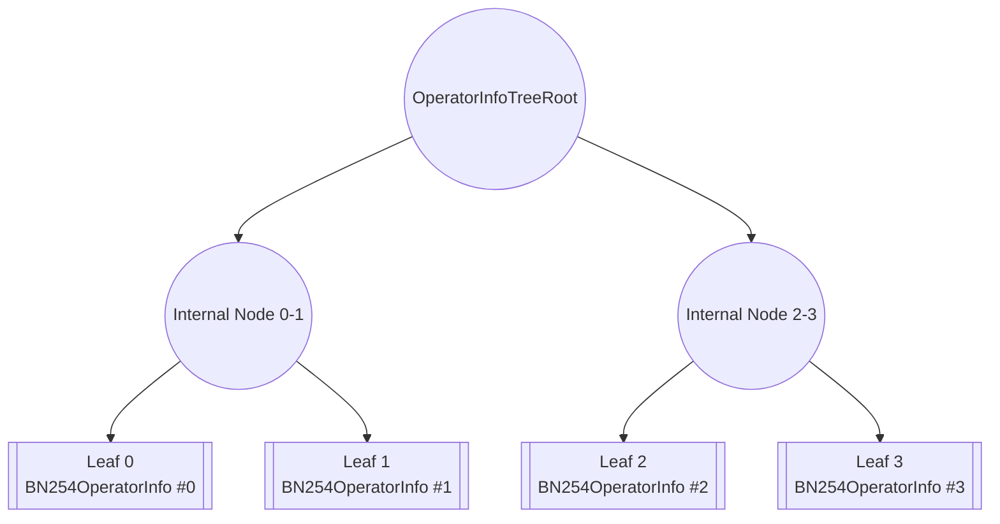

## CertificateVerifier

| File | Type | Proxy |
| -------- | -------- | -------- |
| [`ECDSACertificateVerifier.sol`](../../../src/contracts/multichain/ECDSACertificateVerifier.sol) | Singleton | Transparent proxy |
| [`BN254CertificateVerifier.sol`](../../../src/contracts/multichain/BN254CertificateVerifier.sol) | Singleton | Transparent proxy |
| [`IBaseCertificateVerifier.sol`](../../../src/contracts/interfaces/IBaseCertificateVerifier.sol) | Base interface for all verifiers | |

Libraries and Mixins:

| File | Used By | Notes |
| -------- | -------- | -------- |
| [`ECDSA.sol`](https://github.com/OpenZeppelin/openzeppelin-contracts/blob/v4.9.0/contracts/utils/cryptography/ECDSA.sol) | ECDSACertificateVerifier | ECDSA signature recovery |
| [`SignatureUtilsMixin.sol`](../../../src/contracts/mixins/SignatureUtilsMixin.sol) | ECDSACertificateVerifier | EIP-712 and signature validation |
| [`BN254.sol`](../../../src/contracts/libraries/BN254.sol) | BN254CertificateVerifier | BN254 curve operations |
| [`BN254SignatureVerifier.sol`](../../../src/contracts/libraries/BN254SignatureVerifier.sol) | BN254CertificateVerifier | BLS signature verification |
| [`Merkle.sol`](../../../src/contracts/libraries/Merkle.sol) | BN254CertificateVerifier | Merkle proof verification |
| [`SemVerMixin.sol`](../../../src/contracts/mixins/SemVerMixin.sol) | BN254CertificateVerifier | Semantic versioning |
| [`OperatorSetLib.sol`](../../../src/contracts/libraries/OperatorSetLib.sol) | Both | Operator set key encoding |

---

## Overview

The CertificateVerifier contracts are responsible for verifying certificates from an offchain task, on-chain. The operatorSet tables are updated by the [`OperatorTableUpdater`](./OperatorTableUpdater.md) to. These contracts support two signature schemes: ECDSA for individual signatures and BN254 for aggregated signatures.

Both verifiers implement staleness checks based on a `maxStalenessPeriod` to ensure certificates are not verified against outdated operator information. 

*Note: Setting a max staleness period to 0 enables certificates to be confirmed against any `referenceTimestamp`*. 

---

## ECDSACertificateVerifier

The `ECDSACertificateVerifier` implements ECDSA signature verification where each operator signs individually. For a given operatorSet, it stores the list of all operators and their corresponding weights. 

### Update Table
The `operatorTableUpdater` will update the via a merkle proof of the table against the `globalTableRoot`. See [`operatorTableUpdater`](./OperatorTableUpdater.md#updateoperatortable) for more information. 

#### `updateOperatorTable`

```solidity
/**
 * @notice A struct that contains information about a single operator
 * @param pubkey The address of the signing ECDSA key of the operator and not the operator address itself.
 * This is read from the KeyRegistrar contract.
 * @param weights The weights of the operator for a single operatorSet
 * @dev The `weights` array can be defined as a list of arbitrary groupings. For example,
 * it can be [slashable_stake, delegated_stake, strategy_i_stake, ...]
 * @dev The `weights` array should be the same length for each operator in the operatorSet.
 */
struct ECDSAOperatorInfo {
    address pubkey;
    uint256[] weights;
}

/**
 * @notice updates the operator table
 * @param operatorSet the operatorSet to update the operator table for
 * @param referenceTimestamp the timestamp at which the operatorInfos were sourced
 * @param operatorInfos the operatorInfos to update the operator table with
 * @param operatorSetConfig the configuration of the operatorSet
 * @dev only callable by the operatorTableUpdater for the given operatorSet
 * @dev The `referenceTimestamp` must be greater than the latest reference timestamp for the given operatorSet
 */
function updateOperatorTable(
    OperatorSet calldata operatorSet,
    uint32 referenceTimestamp,
    ECDSAOperatorInfo[] calldata operatorInfos,
    OperatorSetConfig calldata operatorSetConfig
) external;
```

Updates the operator table with new `operatorInfos` and `operatorSetConfig`. All operators and weights are written to storage. 

*Effects*:
* Stores the number of operators at `_numOperators[operatorSetKey][referenceTimestamp]`
* Stores each operator info at `_operatorInfos[operatorSetKey][referenceTimestamp][index]`
* Updates `_latestReferenceTimestamps[operatorSetKey]` to `referenceTimestamp`
* Updates `_operatorSetOwners[operatorSetKey]` to `operatorSetConfig.owner`
* Updates `_maxStalenessPeriods[operatorSetKey]` to `operatorSetConfig.maxStalenessPeriod`
* Emits a `TableUpdated` event

*Requirements*:
* Caller MUST be the `operatorTableUpdater`
* The `referenceTimestamp` MUST be greater than the latest reference timestamp


### Certificate Verification
The contract supports 3 verification patterns:
1. [Basic verification](#verifycertificate) - Returns the signed stakes for further processing
2. [Nominal verification](#verifycertificatenominal) - Verifies against absolute stake thresholds
3. [Proportional verification](#verifycertificateproportion) - Verifies against percentage-based thresholds

#### `verifyCertificate`

```solidity
/**
 * @notice A ECDSA Certificate
 * @param referenceTimestamp the timestamp at which the certificate was created
 * @param messageHash the hash of the message that was signed by operators
 * @param sig the concatenated signature of each signing operator
 */
struct ECDSACertificate {
    uint32 referenceTimestamp;
    bytes32 messageHash;
    bytes sig;
}

/**
 * @notice verifies a certificate
 * @param operatorSet the operatorSet to verify the certificate for
 * @param cert a certificate
 * @return signedStakes amount of stake that signed the certificate for each stake
 * type. Each index corresponds to a stake type in the `weights` array in the `ECDSAOperatorInfo`
 */
function verifyCertificate(
    OperatorSet calldata operatorSet,
    ECDSACertificate memory cert
) external returns (uint256[] memory signedStakes);
```

Verifies an ECDSA certificate by checking individual signatures from operators. Each individual operator must sign off on a `signableDigest` given by [`calculateCertificateDigest`](#calculatecertificatedigest).

*Process*:
* Validates the certificate timestamp against staleness requirements
* Computes the EIP-712 digest for the certificate
* Parses concatenated signatures and recovers signers
* For each recovered signer:
  * Verifies the signer is a registered operator
  * Adds the operator's weights to signed stakes
* Returns the total signed stakes

*Requirements*:
* The certificate MUST NOT be stale (based on `maxStalenessPeriod`)
* The root at `referenceTimestamp` MUST be valid (not disabled)
* The operator table MUST exist for the `referenceTimestamp`
* Signatures MUST be ordered by signer address (ascending)
* All signers MUST be registered operators
* Each signature MUST be valid

#### `verifyCertificateNominal`

```solidity
/**
 * @notice verifies a certificate and makes sure that the signed stakes meet
 * provided portions of the total stake on the AVS
 * @param operatorSet the operatorSet to verify the certificate for
 * @param cert a certificate
 * @param totalStakeNominalThresholds the nominal amount of total stake that
 * the signed stake of the certificate should meet. Each index corresponds to 
 * a stake type in the `weights` array in the `ECDSAOperatorInfo`
 * @return Whether or not the certificate is valid and meets thresholds
 */
function verifyCertificateNominal(
    OperatorSet calldata operatorSet,
    ECDSACertificate memory cert,
    uint256[] memory totalStakeNominalThresholds
) external returns (bool);
```

Verifies that a certificate meets specified nominal (absolute) stake thresholds for each stake type.

*Process*:
* Performs the same verification as `verifyCertificate` to get signed stakes
* Compares signed stakes against absolute thresholds
* Returns true only if all thresholds are met

*Requirements*:
* All requirements from `verifyCertificate`
* `signedStakes.length` MUST equal `totalStakeNominalThresholds.length`
* For each stake type: `signedStakes[i] >= totalStakeNominalThresholds[i]`

#### `verifyCertificateProportion`

```solidity
/**
 * @notice verifies a certificate and makes sure that the signed stakes meet
 * provided portions of the total stake on the AVS
 * @param operatorSet the operatorSet to verify the certificate for
 * @param cert a certificate
 * @param totalStakeProportionThresholds the proportion, in BPS, of total stake that
 * the signed stake of the certificate should meet. Each index corresponds to 
 * a stake type in the `weights` array in the `ECDSAOperatorInfo`
 * @return Whether or not the certificate is valid and meets thresholds
 */
function verifyCertificateProportion(
    OperatorSet calldata operatorSet,
    ECDSACertificate memory cert,
    uint16[] memory totalStakeProportionThresholds
) external returns (bool);
```

Verifies that a certificate meets specified proportion thresholds as a percentage of total stake for each stake type.

*Process*:
* Performs the same verification as `verifyCertificate` to get signed stakes
* Calculates the total stakes for the operator set
* Compares signed stakes against proportion thresholds
* Returns true only if all thresholds are met

*Requirements*:
* All requirements from `verifyCertificate`
* `signedStakes.length` MUST equal `totalStakeProportionThresholds.length`
* For each stake type: `signedStakes[i] >= (totalStakes[i] * totalStakeProportionThresholds[i]) / 10000`

### Utility Functions

#### `calculateCertificateDigest`

```solidity
/**
 * @notice Calculate the EIP-712 digest for a certificate
 * @param referenceTimestamp The reference timestamp
 * @param messageHash The message hash
 * @return The EIP-712 digest
 * @dev This function is public to allow offchain tools to calculate the same digest
 * @dev Note: This does not support smart contract based signatures for multichain
 */
function calculateCertificateDigest(
    uint32 referenceTimestamp,
    bytes32 messageHash
) external view returns (bytes32);
```

Computes the EIP-712 structured data hash for ECDSA certificate signing. This digest is what operators must sign to create a valid certificate.

*Returns*:
* EIP-712 digest using domain separator and certificate type hash

---

## BN254CertificateVerifier

The `BN254CertificateVerifier` implements BN254 signature verification. BN254 signatures enable signature aggreagtion for larger operatorSets. It uses merkle proofs to cache nonsigners to for efficient stake table transport.

### Update Table
The `operatorTableUpdater` will update the table via a merkle proof against the `globalTableRoot`. Unlike ECDSA which stores individual operators, BN254 stores aggregated data and a merkle root of operator stakes.

#### `updateOperatorTable`

```solidity
/**
 * @notice A struct that contains information about a single operator
 * @param pubkey The G1 public key of the operator.
 * @param weights The weights of the operator for a single operatorSet.
 * @dev The `weights` array can be defined as a list of arbitrary groupings. For example,
 * it can be [slashable_stake, delegated_stake, strategy_i_stake, ...]
 */
struct BN254OperatorInfo {
    BN254.G1Point pubkey;
    uint256[] weights;
}


/**
 * @notice A struct that contains information about all operators for a given operatorSet
 * @param operatorInfoTreeRoot The root of the operatorInfo tree. Each leaf is a `BN254OperatorInfo` struct
 * @param numOperators The number of operators in the operatorSet.
 * @param aggregatePubkey The aggregate G1 public key of the operators in the operatorSet.
 * @param totalWeights The total weights of the operators in the operatorSet.
 *
 * @dev The operatorInfoTreeRoot is the root of a merkle tree that contains the operatorInfos for each operator in the operatorSet.
 * It is calculated in this function and used by the `IBN254CertificateVerifier` to verify stakes against the non-signing operators
 *
 * @dev Retrieval of the `aggregatePubKey` depends on maintaining a key registry contract or using the core `KeyRegistrar` contract.
 * See `BN254TableCalculatorBase` in the middleware repo for an example implementation.
 * 
 * @dev The `totalWeights` array should be the same length as each individual `weights` array in `operatorInfos`.
 */
struct BN254OperatorSetInfo {
    bytes32 operatorInfoTreeRoot;
    uint256 numOperators;
    BN254.G1Point aggregatePubkey;
    uint256[] totalWeights;
}

/**
 * @notice updates the operator table
 * @param operatorSet the operatorSet to update the operator table for
 * @param referenceTimestamp the timestamp at which the operatorInfos were sourced
 * @param operatorSetInfo the operatorInfos to update the operator table with
 * @param operatorSetConfig the configuration of the operatorSet
 * @dev only callable by the operatorTableUpdater for the given operatorSet
 * @dev The `referenceTimestamp` must be greater than the latest reference timestamp for the given operatorSet
 */
function updateOperatorTable(
    OperatorSet calldata operatorSet,
    uint32 referenceTimestamp,
    BN254OperatorSetInfo memory operatorSetInfo,
    OperatorSetConfig calldata operatorSetConfig
) external onlyTableUpdater;
```

Updates the operator table with new `operatorSetInfo` and `operatorSetConfig`. 

*Effects*:
* Stores `operatorSetInfo` at `_operatorSetInfos[operatorSetKey][referenceTimestamp]` containing:
  * `operatorInfoTreeRoot` - Merkle root of all operator information, each leaf is a `BN254OperatorInfo`
  * `numOperators` - Total number of operators
  * `aggregatePubkey` - Aggregate BN254 public key
  * `totalWeights` - Sum of all operator weights
* Updates `_latestReferenceTimestamps[operatorSetKey]` to `referenceTimestamp`
* Updates `_operatorSetOwners[operatorSetKey]` to `operatorSetConfig.owner`
* Updates `_maxStalenessPeriods[operatorSetKey]` to `operatorSetConfig.maxStalenessPeriod`
* Emits a `TableUpdated` event

*Requirements*:
* Caller MUST be the `operatorTableUpdater`
* The `referenceTimestamp` MUST be greater than the latest reference timestamp

### Certificate Verification
The contract supports 3 verification patterns:
1. [Basic verification](#verifycertificate-1) - Returns the signed stakes for further processing
2. [Nominal verification](#verifycertificatenominal-1) - Verifies against absolute stake thresholds
3. [Proportional verification](#verifycertificateproportion-1) - Verifies against percentage-based thresholds

#### `verifyCertificate`

```solidity
/**
 * @notice A BN254 Certificate
 * @param referenceTimestamp the timestamp at which the certificate was created
 * @param messageHash the hash of the message that was signed by operators and used to verify the aggregated signature
 * @param signature the G1 signature of the message
 * @param apk the G2 aggregate public key
 * @param nonSignerWitnesses an array of witnesses of non-signing operators
 */
struct BN254Certificate {
    uint32 referenceTimestamp;
    bytes32 messageHash;
    BN254.G1Point signature;
    BN254.G2Point apk;
    BN254OperatorInfoWitness[] nonSignerWitnesses;
}

/**
 * @notice verifies a certificate
 * @param operatorSet the operatorSet that the certificate is for
 * @param cert a certificate
 * @return signedStakes amount of stake that signed the certificate for each stake
 * type. Each index corresponds to a stake type in the `totalWeights` array in the `BN254OperatorSetInfo`. 
 */
function verifyCertificate(
    OperatorSet memory operatorSet,
    BN254Certificate memory cert
) external returns (uint256[] memory signedStakes);
```

Verifies a BN254 certificate by checking the aggregated signature against the operator set's aggregate public key. *Note: This function is non-view because the non-signers are cached in storage.*. See [cachingMechanism](#caching-mechanism) for more information.

*Process*:
* Validates the certificate timestamp against staleness requirements
* Initializes signed stakes with total stakes from the operator set
* Processes non-signer witnesses:
  * Verifies merkle proofs for non-signers (or uses cached data)
  * Subtracts non-signer stakes from total signed stakes
  * Aggregates non-signer public keys
* Calculates signer aggregate public key by subtracting non-signers from total
* Verifies the BLS signature using pairing checks

*Requirements*:
* The certificate MUST NOT be stale (based on `maxStalenessPeriod`)
* The root at `referenceTimestamp` MUST be valid (not disabled)
* The operator set info MUST exist for the `referenceTimestamp`
* All merkle proofs MUST be valid
* The BLS signature MUST verify correctly

#### `verifyCertificateNominal`

```solidity
/**
 * @notice verifies a certificate and makes sure that the signed stakes meet
 * provided nominal stake thresholds
 * @param operatorSet the operatorSet that the certificate is for
 * @param cert a certificate
 * @param totalStakeNominalThresholds the nominal amount of stake that
 * the signed stake of the certificate should meet. Each index corresponds to 
 * a stake type in the `totalWeights` array in the `BN254OperatorSetInfo`. 
 * @return whether or not certificate is valid and meets thresholds
 */
function verifyCertificateNominal(
    OperatorSet memory operatorSet,
    BN254Certificate memory cert,
    uint256[] memory totalStakeNominalThresholds
) external returns (bool);
```

Verifies that a certificate meets specified nominal (absolute) stake thresholds for each stake type.

*Process*:
* Performs the same verification as `verifyCertificate` to get signed stakes
* Compares signed stakes against absolute thresholds
* Returns true only if all thresholds are met

*Requirements*:
* All requirements from `verifyCertificate`
* `signedStakes.length` MUST equal `totalStakeNominalThresholds.length`
* For each stake type: `signedStakes[i] >= totalStakeNominalThresholds[i]`

*Note*: This function has state-changing effects due to non-signer caching

#### `verifyCertificateProportion`

```solidity
/**
 * @notice verifies a certificate and makes sure that the signed stakes meet
 * provided portions of the total stake on the AVS
 * @param operatorSet the operatorSet that the certificate is for
 * @param cert a certificate
 * @param totalStakeProportionThresholds the proportion, in BPS,of total stake that
 * the signed stake of the certificate should meet. Each index corresponds to 
 * a stake type in the `totalWeights` array in the `BN254OperatorSetInfo`. 
 * @return whether or not certificate is valid and meets thresholds
 */
function verifyCertificateProportion(
    OperatorSet memory operatorSet,
    BN254Certificate memory cert,
    uint16[] memory totalStakeProportionThresholds
) external returns (bool);
```

Verifies that a certificate meets specified proportion thresholds as a percentage of total stake for each stake type.

*Process*:
* Performs the same verification as `verifyCertificate` to get signed stakes
* Retrieves the total stakes from the stored operator set info
* Compares signed stakes against proportion thresholds
* Returns true only if all thresholds are met

*Requirements*:
* All requirements from `verifyCertificate`
* `signedStakes.length` MUST equal `totalStakeProportionThresholds.length`
* For each stake type: `signedStakes[i] >= (totalStakes[i] * totalStakeProportionThresholds[i]) / 10000`

*Note*: This function has state-changing effects due to non-signer caching

### Caching Mechanism

```solidity
/**
 * @notice A witness for an operator
 * @param operatorIndex the index of the nonsigner in the `BN254OperatorInfo` tree
 * @param operatorInfoProof merkle proofs of the nonsigner at the index. Empty if operator is in cache.
 * @param operatorInfo the `BN254OperatorInfo` for the operator. Empty if operator is in cache
 */
struct BN254OperatorInfoWitness {
    uint32 operatorIndex;
    bytes operatorInfoProof;
    BN254OperatorInfo operatorInfo;
}
```

The `BN254CertificateVerifier` requires merkle proofs of nonSigning operators. When an operator is proven against an `operatorInfoTreeRoot` for the first time, it will be stored in the `operatorInfos` mapping so it doesn’t need to be proven for future `referenceTimestamps`. This results in the stake table of all proven operators being cached over time for a given `operatorSet's` table. Once cached, future `certificates` do not need to pass in a proof for the `nonSigner`. 


