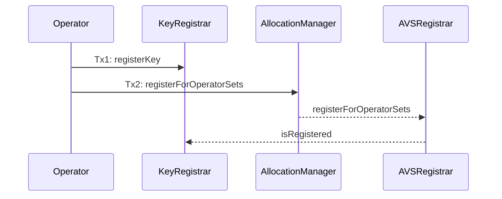
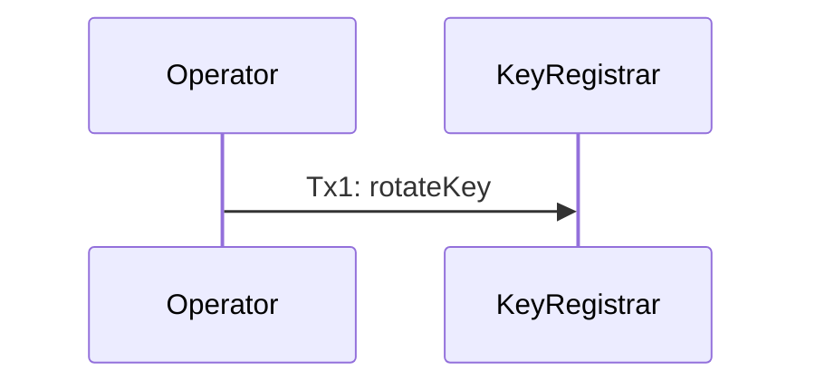

# KeyRegistrar

| File | Type | Proxy |
| -------- | -------- | -------- |
| [`KeyRegistrar.sol`](../../src/contracts/permissions/KeyRegistrar.sol) | Singleton | Transparent proxy |

The `KeyRegistrar` manages cryptographic keys for operators across different operator sets. It supports both ECDSA and BN254 key types and ensures global uniqueness of keys across all operator sets. It also supports scheduled key rotation with an AVS-configurable minimum activation delay.

Key features:
* **Per-OperatorSet Configuration**: Each operator set must be configured with a specific curve type before keys can be registered
* **Global Key Registry**: Keys are globally unique - once registered, a key cannot be reused across operatorSets or operators

Keys are stored in a 2-way mapping:
1. (operator, operatorSet) to key
2. keyHash to operator address

See [usage patterns](#usage-patterns) below on user flows. 

---

## Operator Set Configuration

An AVS must configure the operator set with a specific curve type.

### `configureOperatorSet`

```solidity
/**
 * @notice Configures an operator set with curve type and minimum rotation delay
 * @param operatorSet The operator set to configure
 * @param curveType Type of curve (ECDSA, BN254)
 * @param minDelaySeconds Minimum scheduled rotation delay in seconds
 * @dev Only authorized callers for the AVS can configure operator sets
 * @dev Reverts for:
 *      - InvalidPermissions: Caller is not authorized for the AVS (via the PermissionController)
 *      - InvalidCurveType: The curve type is not ECDSA or BN254
 *      - ConfigurationAlreadySet: The operator set is already configured
 * @dev Emits the following events:
 *      - OperatorSetConfigured
 *      - MinKeyRotationDelaySet
 */
function configureOperatorSet(OperatorSet memory operatorSet, CurveType curveType, uint32 minDelaySeconds) external;
```

Configures an operator set to use a specific cryptographic curve type and sets the minimum allowed delay for scheduled rotations. This must be called before any keys can be registered for the operator set. 
*Note: Registering for an operatorSet in the core protocol does not require a key to be registered. However, the AVS may have logic that gates registration based on a key being registered in the `KeyRegistrar`.*

*Effects*:
* Sets the curve type for the specified operator set
* Sets the minimum scheduled rotation delay for the operator set
* Emits `OperatorSetConfigured` and `MinKeyRotationDelaySet`

*Requirements*:
* Caller MUST be authorized for the AVS (via the `PermissionController`)
* The operator set MUST NOT already be configured
* The curve type MUST be either ECDSA or BN254

---

## Key Registration

Key registration is segmented by curve type: ECDSA and BN254. 

### ECDSA Key Registration

#### `registerKey` (ECDSA)

```solidity
/**
 * @notice Registers a cryptographic key for an operator with a specific operator set
 * @param operator Address of the operator to register key for
 * @param operatorSet The operator set to register the key for
 * @param pubkey Public key bytes. For ECDSA, this is the address of the key. For BN254, this is the G1 and G2 key combined (see `encodeBN254KeyData`)
 * @param signature Signature proving ownership. For ECDSA this is a signature of the `getECDSAKeyRegistrationMessageHash`. For BN254 this is a signature of the `getBN254KeyRegistrationMessageHash`.
 * @dev Can be called by operator directly or by addresses they've authorized via the `PermissionController`
 * @dev There exist no restriction on the state of the operator with respect to the operatorSet. That is, an operator
 *      does not have to be registered for the operator in the `AllocationManager` to register a key for it
 * @dev For ECDSA, we allow a smart contract to be the pubkey (via ERC1271 signatures), but note that the multichain protocol DOES NOT support smart contract signatures
 * @dev Reverts for:
 *      - InvalidPermissions: Caller is not the operator or authorized via the PermissionController
 *      - OperatorSetNotConfigured: The operator set is not configured
 *      - KeyAlreadyRegistered: The operator is already registered for the operatorSet in the KeyRegistrar
 *      - InvalidKeyFormat: For ECDSA: The key is not exactly 20 bytes
 *      - ZeroAddress: For ECDSA: The key is the zero address
 *      - KeyAlreadyRegistered: For ECDSA: The key is already registered globally by hash
 *      - InvalidSignature: For ECDSA: The signature is not valid
 *      - InvalidKeyFormat: For BN254: The key data is not exactly 192 bytes
 *      - InvalidSignature: For BN254: The signature is not exactly 64 bytes
 *      - ZeroPubkey: For BN254: The G1 point is the zero point
 *      - InvalidSignature: For BN254: The signature is not valid
 *      - KeyAlreadyRegistered: For BN254: The key is already registered globally by hash
 * @dev Emits the following events:
 *      - KeyRegistered: When the key is successfully registered for the operator and operatorSet
 */
function registerKey(
    address operator,
    OperatorSet memory operatorSet,
    bytes calldata pubkey,
    bytes calldata signature
) external;
```

There ARE NO restrictions on the state of the operator with respect to the operatorSet. That is, an operator does not have to be registered for the operator in the `AllocationManager` to register a key for it. The contract supports the ERC1271 signature scheme. However, **note that the multichain protocol DOES NOT support smart contract signatures**.  

For ECDSA keys:
- `pubkey`: 20 bytes representing the Ethereum address
- `signature`: EIP-712 signature from the key's private key. Signature is over [`getECDSAKeyRegistrationMessageHash`](#getecdsakeyregistrationmessagehash)

*Effects*:
* Registers the key for the operator in the specified operator set
* Adds the key to the global registry
* Associates the key hash with the operator address
* Emits a `KeyRegistered` event with curve type ECDSA

*Requirements*:
* Caller MUST be the operator or authorized via the `PermissionController`
* The operatorSet MUST be configured
* The operator MUST NOT be already registered for the operatorSet in the `KeyRegistrar`
* The key MUST be exactly 20 bytes
* The key MUST NOT be the zero address
* The key MUST NOT already be registered globally (by hash)
* The signature MUST be valid

#### `getECDSAKeyRegistrationMessageHash`

```solidity
/**
 * @notice Returns the message hash for ECDSA key registration, which must be signed by the operator when registering an ECDSA key
 * @param operator The operator address
 * @param operatorSet The operator set
 * @param keyAddress The address of the key
 * @return The message hash for signing
 */
function getECDSAKeyRegistrationMessageHash(
    address operator,
    OperatorSet memory operatorSet,
    address keyAddress
) external view returns (bytes32);
```

Returns the message hash that must be signed over for ECDSA key registration. 


### BN254 Key Registration

BN254 keys registration requires passing in G1 and G2 points.

#### `registerKey` (BN254)

```solidity
/**
 * @notice Registers a cryptographic key for an operator with a specific operator set
 * @param operator Address of the operator to register key for
 * @param operatorSet The operator set to register the key for
 * @param pubkey Public key bytes. For ECDSA, this is the address of the key. For BN254, this is the G1 and G2 key combined (see `encodeBN254KeyData`)
 * @param signature Signature proving ownership. For ECDSA this is a signature of the `getECDSAKeyRegistrationMessageHash`. For BN254 this is a signature of the `getBN254KeyRegistrationMessageHash`.
 * @dev Can be called by operator directly or by addresses they've authorized via the `PermissionController`
 * @dev There exist no restriction on the state of the operator with respect to the operatorSet. That is, an operator
 *      does not have to be registered for the operator in the `AllocationManager` to register a key for it
 * @dev For ECDSA, we allow a smart contract to be the pubkey (via ERC1271 signatures), but note that the multichain protocol DOES NOT support smart contract signatures
 * @dev Reverts for:
 *      - InvalidPermissions: Caller is not the operator or authorized via the PermissionController
 *      - OperatorSetNotConfigured: The operator set is not configured
 *      - KeyAlreadyRegistered: The operator is already registered for the operatorSet in the KeyRegistrar
 *      - InvalidKeyFormat: For ECDSA: The key is not exactly 20 bytes
 *      - ZeroAddress: For ECDSA: The key is the zero address
 *      - KeyAlreadyRegistered: For ECDSA: The key is already registered globally by hash
 *      - InvalidSignature: For ECDSA: The signature is not valid
 *      - InvalidKeyFormat: For BN254: The key data is not exactly 192 bytes
 *      - InvalidSignature: For BN254: The signature is not exactly 64 bytes
 *      - ZeroPubkey: For BN254: The G1 point is the zero point
 *      - InvalidSignature: For BN254: The signature is not valid
 *      - KeyAlreadyRegistered: For BN254: The key is already registered globally by hash
 * @dev Emits the following events:
 *      - KeyRegistered: When the key is successfully registered for the operator and operatorSet
 */
function registerKey(
    address operator,
    OperatorSet memory operatorSet,
    bytes calldata pubkey,
    bytes calldata signature
) external;
```
There are restrictions on the state of the operator with respect to the operatorSet. That is, an operator does not have to be registered for the operator in the `AllocationManager` to register a key for it. 

For BN254 keys:
- `pubkey`: [Encoded](#encodebn254keydata) BN254 key data containing G1 and G2 points
- `signature`: BN254 signature proving ownership over a set [digest](#getbn254keyregistrationmessagehash)

*Effects*:
* Registers the BN254 key for the operator in the specified operator set
* Adds the key hash to the global registry
* Emits a `KeyRegistered` event with curve type BN254

*Requirements*:
* Caller MUST be the operator or authorized via the `PermissionController`
* The operatorSet MUST be configured
* The operator MUST NOT be already registered for the operatorSet in the `KeyRegistrar`
* The key MUST be exactly 192 bytes 
* The signatures MUST be exactly 64 bytes
* The key MUST contain valid G1 and G2 points
* The G1 point MUST NOT be the zero point
* The key MUST NOT already be registered globally (by hash)
* The signature MUST be valid

#### `encodeBN254KeyData`

```solidity
/**
 * @notice Encodes the BN254 key data into a bytes array
 * @param g1Point The BN254 G1 public key
 * @param g2Point The BN254 G2 public key
 * @return The encoded key data
 */
function encodeBN254KeyData(
    BN254.G1Point memory g1Point,
    BN254.G2Point memory g2Point
) external pure returns (bytes memory);
```

Utility function to properly encode BN254 key data for registration.

#### `getBN254KeyRegistrationMessageHash`

```solidity
/**
 * @notice Returns the message hash for BN254 key registration, which must be signed by the operator when registering a BN254 key
 * @param operator The operator address
 * @param operatorSet The operator set
 * @param keyData The BN254 key data
 * @return The message hash for signing
 */
function getBN254KeyRegistrationMessageHash(
    address operator,
    OperatorSet memory operatorSet,
    bytes calldata keyData
) external view returns (bytes32);
```

Returns the message hash that must be signed over for BN254 key registration. 

---

## Key Deregistration

### `deregisterKey`

```solidity
/**
 * @notice Deregisters a cryptographic key for an operator with a specific operator set
 * @param operator Address of the operator to deregister key for
 * @param operatorSet The operator set to deregister the key from
 * @dev Can be called by the operator directly or by addresses they've authorized via the `PermissionController`
 * @dev Keys remain in global key registry to prevent reuse
 * @dev Reverts for:
 *      - InvalidPermissions: Caller is not authorized for the operator (via the PermissionController)
 *      - OperatorStillSlashable: The operator is still slashable for the AVS
 *      - OperatorSetNotConfigured: The operator set is not configured
 *      - KeyNotFound: The operator does not have a registered key for this operator set
 * @dev Emits the following events:
 *      - KeyDeregistered: When the key is successfully deregistered for the operator and operatorSet
 */
function deregisterKey(address operator, OperatorSet memory operatorSet) external;
```

Removes an operator's key from the specified operator set. Note that the key remains in the global registry to prevent reuse.

*Effects*:
* Removes the key from the operator's record for the operator set
* Emits a `KeyDeregistered` event
* The key remains in the global registry

*Requirements*:
* Caller MUST be authorized for the operator (via the `PermissionController`)
* The operator MUST not be slashable for the AVS, to prevent off-chain race conditions
* The operator set MUST be configured
* The operator MUST have a registered key for this operator set

---

## Usage patterns
The `KeyRegistrar` introduces new operator/avs registration patterns. Note that these registration patterns are **only for AVSs who have opted to use the new [middlewareV2](https://github.com/Layr-Labs/eigenlayer-middleware/tree/dev/docs/middlewareV2) contract architecture.**

### Operator/AVS Registration




### Key Rotation (Scheduled)

Key rotation is scheduled: an operator proposes a new key and an activation timestamp that must be at least the AVS-configured minimum delay in the future. Until activation, getters return the current key. After activation, getters return the new key. Rotation is allowed even if the operator is slashable.




### `rotateKey`

```solidity
/**
 * @notice Schedules a key rotation; the new key becomes active at `activateAt`
 * @param operator Address of the operator whose key is being rotated
 * @param operatorSet The operator set for which the key is being rotated
 * @param newPubkey New public key bytes. For ECDSA, this is the address of the key. For BN254, this is the G1 and G2 key combined (see `encodeBN254KeyData`)
 * @param signature Signature from the new key proving ownership over the appropriate registration message hash
 * @param activateAt timestamp at or after which the new key becomes active; must be at least the AVS-configured minimum delay in the future
 * @dev New key is reserved globally at scheduling time to prevent reuse
 * @dev Reverts for:
 *      - InvalidPermissions: Caller is not authorized for the operator (via the PermissionController)
 *      - OperatorSetNotConfigured: The operator set is not configured
 *      - KeyNotFound: The operator does not have a registered key for this operator set
 *      - PendingRotationExists: A prior rotation is already scheduled and not yet activated
 *      - ActivationTooSoon: `activateAt` <= current time or < (current time + minDelaySeconds)
 *      - InvalidKeyFormat / ZeroPubkey / InvalidSignature: New key data/signature invalid per curve type
 *      - KeyAlreadyRegistered: New key is already registered globally by hash
 * @dev Emits:
 *      - KeyRotationScheduled(operatorSet, operator, curveType, oldPubkey, newPubkey, activateAt)
 */
function rotateKey(
    address operator,
    OperatorSet memory operatorSet,
    bytes calldata newPubkey,
    bytes calldata signature,
    uint64 activateAt
) external;
```

This function runs full validation and signature checks for the new key according to the configured curve type. The old key remains globally registered and cannot be reused elsewhere. The new key is globally reserved upon scheduling and becomes the active key after `activateAt`.

Requirements
- Caller is the `operator` or authorized via the `PermissionController`
- `operatorSet` configured with a curve type
- `operator` has a registered key for `operatorSet`
- No pending rotation exists
- `activateAt` > now and `activateAt` >= now + `minDelaySeconds`
- New key format and signature are valid for the configured curve
- New key hash is not already globally registered

Effects
- Records `pendingKey` and `pendingActivateAt` for the operator in the `operatorSet`
- Reserves the new key in the global registry immediately
- Emits `KeyRotationScheduled`

Notes
- Before `activateAt`, getters (`getECDSAKey`, `getBN254Key`, `getKeyHash`) return values for the current key
- After `activateAt`, getters resolve to the new key. `finalizeScheduledRotation` can be called (by anyone) to compact storage; it returns `true` if a rotation was finalized

#### `finalizeScheduledRotation`

```solidity
/**
 * @notice Finalizes a scheduled rotation if its activation time has passed, compacting storage
 * @param operator Address of the operator
 * @param operatorSet The operator set
 */
function finalizeScheduledRotation(address operator, OperatorSet memory operatorSet) external;
```

This optional helper collapses pending rotation data after activation; getters already return the correct active key based on time.