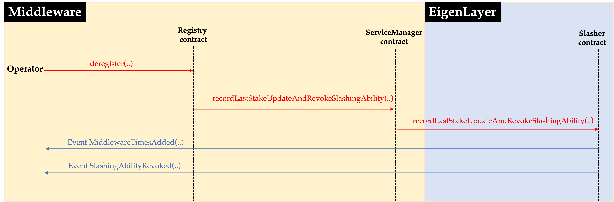
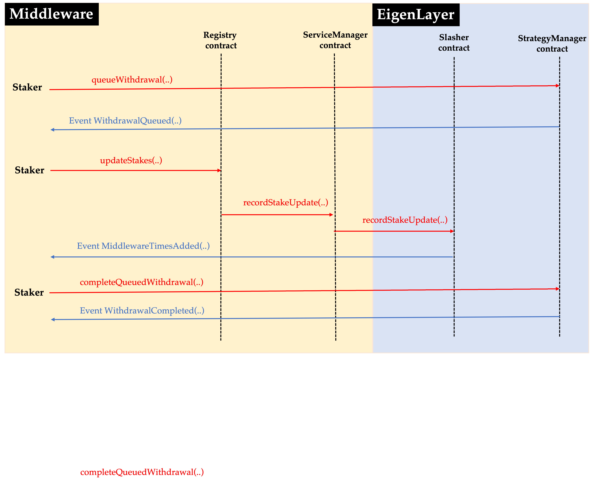
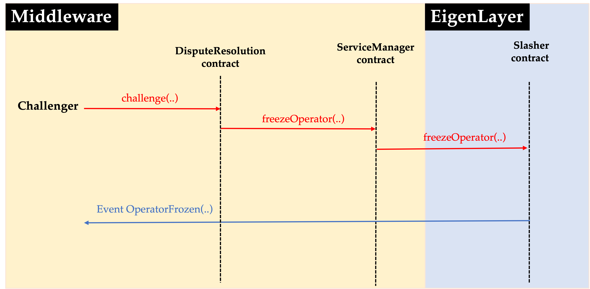

# Introduction
In designing EigenLayer, we aspired to make minimal assumptions about the structure of middlewares built on top of it. If you are getting started looking at the EigenLayer codebase, the Slasher contract contains most of the logic that actually mediates the interactions between EigenLayer and middlewares. Additionally, there is a general-purpose /middleware/ folder, which contains code that can be extended, used directly, or consulted as a reference in building middleware on top of EigenLayer.

## Important Terminology
### Tasks
A task in EigenLayer is the discretized unit of work that operators commit to doing when serving a middleware.  
### Strategies
A strategy in EigenLayer, its most simple form, is a contract that stakers can use to deposit and delegate their assets to middlewares on EigenLayer. 
### Quorums
Each BLSRegistry defines one or two “quorums”; each operator for the middleware may have stake in EigenLayer that falls into either (or both) quorum(s). Each quorum is essentially defined by two vectors: a vector of “Strategies” of interest (in practice this ends up being tokens of interest) and a vector of “weights” or “multipliers”, which define whether certain strategies are weighed more heavily than others within the quorum (e.g. if the middleware desires to give 2x power to a specific token over another token). In the contract code these vectors are condensed into a single array of `StrategyAndWeightingMultiplier` structs. The ServiceManager.owner() has the ability to edit these arrays at will.

# Assumptions Make About Middlewares
1. *Discretization of Services into "Tasks"*: EigenLayer assumes that services manage tasks. In other words, it is assumed that services discretize commitments undertaken by operators, with each task defining the time period for which the service's operators' stakes are placed "at stake", i.e. potentially subject to slashing. Examples of tasks could include a “DataStore” in EigenDA, or posting a state root of another blockchain for a bridge service, etc. Think: what do I want ETH validators to sign off on?

2. *Stake is “At Stake” on Tasks for a Finite Duration*: It is assumed that every task (eventually) resolves. Each operator places their stake in EigenLayer “at stake” on the tasks that they perform. In order to “release” the stake (e.g. so the operator can withdraw their funds), these tasks need to eventually resolve. It is recommended, but not required that tasks have a known duration when they are instantiated.
We believe that on the order of 2 weeks is the longest reasonable duration for a task to keep funds “at stake”. This is not strictly enforced, but builders of middlewares should recognize that longer durations on tasks impose significant negative externalities on the stakers of EigenLayer, and may disincentivize stakers opting-in to serving their application. Since the window is not strictly enforced, lengthening the duration e.g. while a challenge process is ongoing may be acceptable to stakers; ultimately it is up to the stakers and operators in EigenLayer to decide what they are OK with.

3. *Services Slash Only Objectively Attributable Behavior*: EigenLayer is built to support slashing as a result of an on-chain-checkable, objectively attributable action. Middlewares SHOULD slash in EigenLayer only for such provabe and attributable behavior. It is expected that operators will be very hesitant to opt-in to services that slash for other types of behavior, and other services may even choose to exclude operators who have opted-in to serving middlewares with such “subjective slashing conditions”, as these slashing conditions present a significant challenge for risk modeling, and may be perceived as more dangerous in general.
Some examples of on-chain-checkable, objectively attributable behavior: double-signing a block in Ethereum, but NOT inactivity leak; proofs-of-custody in EigenDA (or Ethereum after Danksharding is activated), but NOT a node ceasing to serve data; a node in a light-node-bridge middleware signing an invalid block from another chain, but NOT the node failing to sign for a brief period.

4. *Single Point-of-Interaction for Services and EigenLayer*: It is assumed that services have a single contract that coordinates the service’s communications sent to EigenLayer. This contract – referred to as the ServiceManager – informs EigenLayer of operator registration, updates, and deregistration, as well as signaling to EigenLayer when an operator should be slashed (frozen). Middlewares have full control over how they split up the actual logic involved, but are expected to route all calls to EigenLayer through a single contract. While technically possible, middlewares SHOULD NOT use multiple contracts to interact with EigenLayer, as this will impose additional burden on stakers and operators in EigenLayer when they are withdrawing or deregistering.

## Integration with EigenLayer Contracts:
In this section, we will explain various API interfaces that EigenLayer provides which are essential for middlewares to integrate with EigenLayer. 

### *Opting into middleware*
In order for any EigenLayer operator to be able to opt-in to a middleware, EigenLayer provides two APIs: `optIntoSlashing(..)` and `recordFirstStakeUpdate(..)`. The sequential flow for opting into a middleware using these two APIs is as follows:
1. The operator first opts into slashing by calling the API `optIntoSlashing(..)` in EigenLayer's Slasher contract, where it has to specify the address of the middleware's ServiceManager contract in the argument. This step results in the operator giving permission to the middleware to slash the operator via EigenLayer, if the operator is ever proven to have engaged in adversarial behavior while responding to middleware's task. Successful call to the API `optIntoSlashing(..)` emits the `OptedIntoSlashing(..)`.
2. Next, the operator needs to register with middleware to be able to respond to the tasks in the middleware. Towards that end, the middleware needs to provide a means for operator to register with it - this can be done by using the API `recordFirstStakeUpdate(..)`. In our proposed design of middleware contracts on how to integrate with EigenLayer, the middleware's Registry contract provides a registration endpoint that calls on the `recordFirstStakeUpdate(..)` in the middleware's ServiceManager contract which in turn calls the API `recordFirstStakeUpdate(..)` in EigenLayer's Slasher contract. On successful execution of this API call, the event `MiddlewareTimesAdded(..)` is emitted and the operator has to start serving the tasks from the middleware.

The following figure illustrates the above flow: 

### *Deregistering from middleware*
In order for any EigenLayer operator to be able to de-register from a middleware, EigenLayer provides the API `recordLastStakeUpdateAndRevokeSlashingAbility(..)`. Essentially, in order for an operator to de-register from a middleware, the operator has to call `recordLastStakeUpdateAndRevokeSlashingAbility(..)` in the middleware's ServiceManager contract which in turn accesses the API `recordLastStakeUpdateAndRevokeSlashingAbility(..)` in EigenLayer's Slasher contract. One important thing to note is that in order to access this API, the information on the latest block number until which the operator is required to serve the middleware needs to be passed. The middleware's ServiceManager contract makes this information accessible via `latestServeUntilBlock(..)`. By calling the API `recordLastStakeUpdateAndRevokeSlashingAbility(..)`, it is ensured that the operator remains slashable only until this latest block number.

The following figure illustrates the above flow in which the operator calls on a `deregister(..)` function in the Registry contract that first accesses `latestServeUntilBlock(..)` and then `recordLastStakeUpdateAndRevokeSlashingAbility(..)` in the middleware's ServiceManager contract.

### *Staker opting-in with a middleware*
In order for any staker to participate in responding to the tasks from the middleware without running the middleware's off-chain software container themself, the staker can pursue delegation. The sequential flow for delegation process is as follows:
1. The staker first has to delegate its stake to an EigenLayer operator who is opted-in to that middleware and that they trust (based on their own due diligence). The staker can accomplish this by calling the API `delegateTo(..)` in the DelegationManager contract, where the operator's address is passed as the argument.  
2. Observe that with the staker delegating its stake to the operator, the weight associated with the operator's response to the task in the middleware it has opted-in increases. Therefore, the staker has to notify the middleware about this update. To do so, the operator calls on a `updateStakes(..)` function in the Registry contract that calls `recordStakeUpdate(..)` in the middleware's ServiceManager contract which in turn accesses the API `recordStakeUpdate(..)` in the EigenLayer's Slasher contract. On successful execution of this API call, the event `MiddlewareTimesAdded(..)` is emitted.

The following figure illustrates the above flow: 

### *Staker withdraws*
In order for a staker, who has opted-in to a middleware via delegation, wants to partially withdraw some of its stake or completely stop participating, it has to undelegate its stake from the current operator. Under current design of delegation, whenever the staker partially withdraw some of its stake or completely stop participating, then it affects all the middlewares uniformly that its operator is participating in. The sequential flow is as follows:
1. The staker first has to queue its withdrawal request with EigenLayer. The staker can place this request by calling this API `queueWithdrawal(..)` in the EigenLayer's StrategyManager contract. On successful call to this API, the event `WithdrawalQueued(..)` is emitted.
2. The staker then has to notify all the middlewares that its operator has opted in about its intention to partially withdraw some of its stake or completely stop participating and also record the latest time in the EigenLayer contracts until which the staker is obliged to participate with the current stake. To do this, the staker calls on the `updateStakes(..)` function in the Registry contract that calls `recordStakeUpdate(..)` in the middleware's ServiceManager contract which in turn accesses the API `recordStakeUpdate(..)` in the EigenLayer's Slasher contract.  On successful execution of this API call, the event `MiddlewareTimesAdded(..)` is emitted.
3. After the latest time until which the staker is obliged to participate with the current stake passes, the staker now can complete its queued withdrawal by calling on the API `completeQueuedWithdrawal(..)`.

The following figure illustrates the above flow: 

### *Slashing*
As mentioned above, EigenLayer is built to support slashing as a result of an on-chain-checkable, objectively attributable action. In order for a middleware to be able to slash an operator in an objective manner, the middleware needs to deploy a DisputeResolution contract where anyone would be able to raise a challenge against an EigenLayer operator for its adversarial action. On successful challenge, the DisputeResolution contract calls the `freezeOperator(..)` function in ServiceManager contract which in turn accesses the API `freezeOperator(..)` in the EigenLayer's Slasher contract. On successful execution of this API, the event `OperatorFrozen(..)` is emitted.  

The following figure illustrates the above flow: 

## Guide To Provided Middleware Contracts:
The EigenLayer team has built a set of reusable and extensible contracts for use in middlewares built on top of EigenLayer. These are contained in the general-purpose /middleware/ folder, which contains code that can be extended, used directly, or consulted as a reference in building middleware on top of EigenLayer. There are several basic contracts that all middleware-specific contracts can be built on:
- The *RegistryBase contract* is a basic registry contract that can be used to track operators opted into running a middleware.  Importantly, this base registry contract assumes a maximum of two quorums, where each quorum represents an aggregation of a certain type of stake.  Middlewares may want to weigh their rewards based on the type of stake delegated to their operators and weigh each quorum differently.  
- The *VoteWeigherBase contract* tracks an operator’s “weight” in a given quorum, across all strategies that are associated with that quorum.  This contract also manages which contracts are categorized under which quorums - this includes both removing and adding functionalities as well as changing strategy weights.  

It’s expected that many middlewares will require a quorum of registered operators to sign on commitments. A quorum is a group of stakers who opt into a service while satisfying a particular trait. Examples of a trait could be stETH stakers or native stakers.  To this end, we have developed a set of contracts designed to optimize the cost of checking signatures through the use of a BLS aggregate signature scheme:
- The BLSPublicKeyCompendium simply allows each Ethereum address to register a unique BLS public key; a single BLSPublicKeyCompendium contract can be shared amongst all middlewares using BLS signatures. 
- The BLSRegistry builds upon lower-level (RegistryBase and VoteWeigherBase) contracts, to allow users of EigenLayer to register as operators for a single middleware. Each middleware’s BLSRegistry keeps a historic record of the Aggregate Public Key (APK) of all operators of the middleware. To allow proper encoding of data and aggregation of signatures while avoiding race conditions (e.g. from operators registering or deregistering, causing the current APK to change), each task defines a referenceBlockNumber, which may be briefly in the past when the task is actually confirmed. The BLSRegistry defines an optional whitelister role, which controls whether or not the whitelist is enabled and can edit the whitelist. If the whitelist is enabled, then only addresses that have been whitelisted may opt-in to serving the middleware.
In addition, the BLSRegistry (technically the lower-level RegistryBase which the BLSRegistry inherits from) defines a “minimum stake” for the quorum(s). An operator can only register for the middleware if they meet the minimum requirement for at least one quorum. By default the ServiceManager.owner() has the ability to change the minimum stake requirement(s).

When signatures have been aggregated, they can be submitted to the BLSSignatureChecker, an optimized contract designed expressly for verifying quorums of BLS signers. The caller must provide a small amount of data corresponding to the task to be confirmed, the aggregate signature itself, and a bit of data for each non-signer, that is, the caller must provide data for each operator registered for the service for whom their signature has not been aggregated. The BLSSignatureChecker ultimately returns both the total stake that was present at the specified block number (i.e. the sum of all operator’s stakes) and the total stake that signed; these amounts can then be checked against a quorum condition (e.g. requiring ⅔ stake to sign) before the task is ultimately confirmed.

